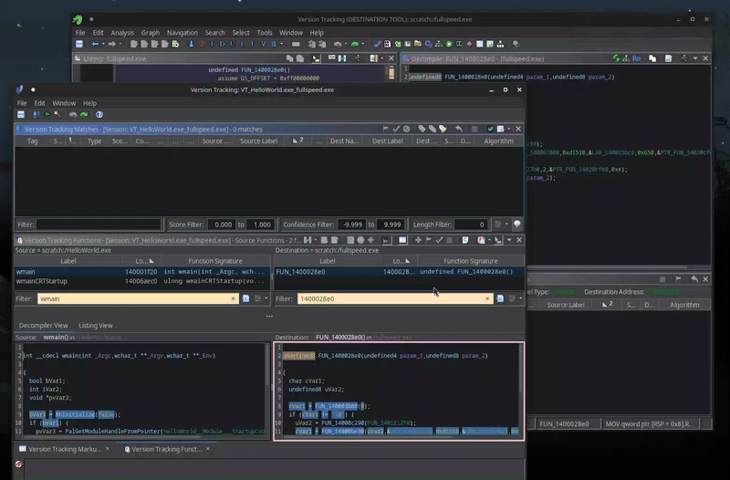
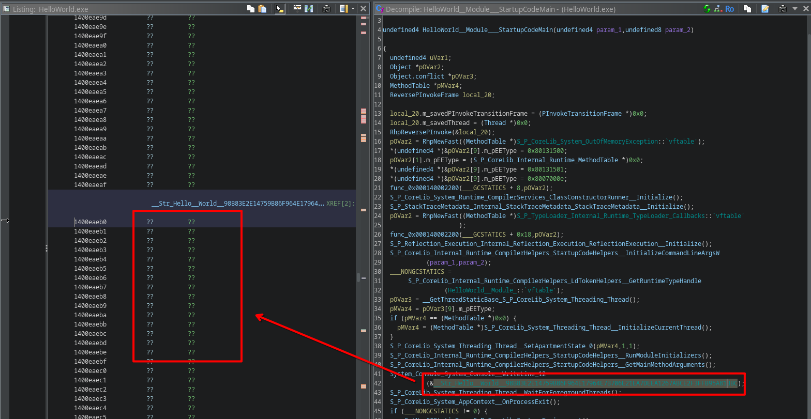
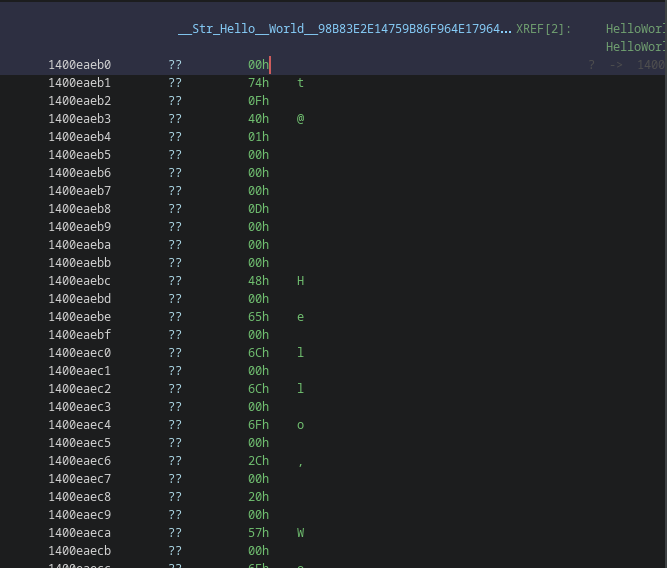

# 7 - fullspeed

**Time spent:** ~1 day

**Tools used:** Ghidra+Scripting, Python+SageMath, C#


Challenge 7 is a really interesting challenge, and also one of the more difficult ones in the series.
You are given a file called `fullspeed.exe`.


At first glance, it doesn't do much.
It just hangs for a while and then spits out a message `err`.

Let's figure out why!

## Orientation

The description of the challenge states this is a .NET file, but decompilers don't recognize it as such.
Looking in a tool such as CFF Explorer, we can see something interesting.


This is an indication that the binary may be a .NET binary that was compiled using [NativeAOT](https://learn.microsoft.com/en-us/dotnet/core/deploying/native-aot/?tabs=windows%2Cnet8) technology.
In short, this means the .NET binary is not compiled to CIL which can be decompiled using e.g., dnSpy or ILSpy, but rather it is compiled directly to machine code into a single file.
This file requires no runtime to be installed; it is a binary with the main program and all its dependencies statically linked together, including the runtime itself.

What does it mean for us? It is going to be a real pain to analyze, especially because there are hardly any tools available that handle these types of files.

In other words, we're in for a long ride with this one.


## Ghidra Project Preparation

To get a feeling of what a NativeAOT binary looks like in Ghidra, I actually did not try to jump into the ocean of unnamed functions too quickly, and went on a quick detour first.

One of the biggest challenges with statically linked binaries like these, is distinguishing library and runtime code from the user code.
Especially when symbols are stripped (as is the case for this binary), this is extra difficult.
To make an educated guess, however, I decided to first create a simple hello world application in C# using NativeAOT, which _does_ contain symbols.

```console
Z:\HelloWorld> dotnet new console
```

This has a simple `Program.cs` with just one line:

```csharp
Console.WriteLine("Hello, world!");
```

To compile with NativeAOT enabled, you first need to add a special tag to the generated `.csproj` file:

```xml
<Project Sdk="Microsoft.NET.Sdk">

  <PropertyGroup>
    <OutputType>Exe</OutputType>
    <TargetFramework>net8.0</TargetFramework>
    <ImplicitUsings>enable</ImplicitUsings>
    <Nullable>enable</Nullable>

    <!-- Add this line: -->
    <PublishAot>true</PublishAot>
  </PropertyGroup>

</Project>
```

Then we can run:
```console
Z:\HelloWorld> dotnet publish -r win-x64 -c Release
```

After a while you'll get a NativeAOT executable in the `bin\Release\net8.0\win-x64\publish` subfolder.

We can now cross-reference similar functions in `HelloWorld.exe` with functions in `fullspeed.exe`.

Using Ghidra's built in Version Tracking feature, you can compare functions from two binaries easily.
For example, here is the main function from `HelloWorld.exe` (left) compared to the one in `fullspeed.exe`  (right).


Once you have found a match, you can then apply the names and types from one binary to another.



Every year I learn a new feature of Ghidra, and every time I am blown away by how easy things are that the competition just doesn't have out of the box.
Sadly, for some reason, I wasn't able to get Ghidra to automatically do this for all of the functions present in the binary, but this semi-automatic approach was good enough for me.

Ghidra rocks!


## Data Rehydration

Another thing we need to deal with is a concept known as data rehydration.

If we look in `HelloWorld.exe`, we see that it has a string `"Hello, World!"` referenced in the call to `System_Console_System_Console__WriteLine_12`.
In Ghidra this was nicely mapped because of the symbols attached to the file.
However, since we also won't have data symbols for `fullspeed.exe`, we need to fix those labels for the challenge ourselves.



The problem is, how do we know what the contents of the strings are without the labels?
The segments that are referenced in the code are uninitialized, so no luck there.

To understand what is going on, we need some more theory on NativeAOT binaries.
At startup of every NativeAOT binary, the program actually doesn't run `Main` first.
Instead it goes through a set of initialization routines.
One of these routines is known as Data Rehydration, which effectively initializes a bunch of data sections, including the section that contains strings.

We need to do the same in our Ghidra project.
There are two ways to do this.
The first one is using dynamic analysis, i.e., run the program and dump the sections.
However, given the success I had with Ghidra's emulator in [challenge 5](../5), I felt like giving the emulator a second spin.
Furthermore, when doing it the emulator way, I ensure that all pointers that are initialized by this routine are valid within my current Ghidra memory space. 

Rehydration of the data sections happens in a runtime function [RehydrateData](https://github.com/dotnet/runtime/blob/06205b54c2092672f5f8423e5f9ba631013e3cd3/src/coreclr/nativeaot/Common/src/Internal/Runtime/CompilerHelpers/StartupCodeHelpers.cs#L247), which is called in [CreateTypeManagers](https://github.com/dotnet/runtime/blob/06205b54c2092672f5f8423e5f9ba631013e3cd3/src/coreclr/nativeaot/Common/src/Internal/Runtime/CompilerHelpers/StartupCodeHelpers.cs#L74), which in turn is called by [InitializeModules](https://github.com/dotnet/runtime/blob/06205b54c2092672f5f8423e5f9ba631013e3cd3/src/coreclr/nativeaot/Common/src/Internal/Runtime/CompilerHelpers/StartupCodeHelpers.cs#L31).

We can therefore just find these same functions (again using the version tracker of Ghidra), and instruct the emulator to run this code and paste in the hydrated data with a simple script, using the following script:

```java
@Override
protected void run() throws Exception {
	// Ask for the relevant data.
	var map = new GhidraValuesMap();
	var rehydrateCallAddress = map.defineAddress("Rehydration Call Address", currentProgram);
	var dataStart = map.defineAddress("Data Start", currentProgram);
	var dataLength = map.defineLong("Data Length");

	var result = askValues("Dehydrated Data Parameters", "Enter dehydrated data params", map);
	var rehydrateCall = result.getAddress(rehydrateCallAddress.getName());
	var start = result.getAddress(dataStart.getName());
	var length = result.getLong(dataLength.getName());

	// Extract hydration address.
	var destination = start.add(getInt(start));
	var destinationEnd = destination.add(length);
	println("Destination: " + destination.toString());

	// Emulate
	var emulator = new EmulatorHelper(currentProgram);

	emulator.writeRegister("RIP", rehydrateCall.getOffset());
	emulator.writeRegister("RCX", start.getOffset());
	emulator.writeRegister("RDX", length);

	emulator.setBreakpoint(rehydrateCall.add(5));
	emulator.run(monitor);

	// Copy over data into new hydrated section.
	var memory = currentProgram.getMemory();
	
	if (!memory.getBlock(destination).getStart().equals(destination))
		memory.split(memory.getBlock(destination), destination);
	memory.split(memory.getBlock(destinationEnd), destinationEnd);
	var block = memory.getBlock(destination);
	memory.convertToInitialized(block, (byte) 0);

	byte[] data = emulator.readMemory(destination, (int) length);
	setBytes(destination, data);

	println("Done!");
}
```

If we fill in the right values...


... we end up with all data hydrated.
However, it is still not really readable as it is just a huge blob of unstructured bytes.



Our string is visible if you squint with your eyes a lot. Let's make it look better such that the decompiler also picks up on it.

Strings in NativeAOT .NET have the following structure:
They start with a pointer to the vtable of the object type (`System.String`).
It is followed by an `uint32` representing the length of the string.
Finally the string contents is appended in its entirety using UTF-16 encoding.

We can create yet another script that applies this knowledge by finding all the string vtable references, and applying this structure.
The full script I came up with can be found in [NativeAotStringsFinder.java](scripts/NativeAotStringsFinder.java), and is a slight modification of [a similar script I released some time ago](https://github.com/Washi1337/ghidra-nativeaot).

Here you can see it in action:


Much better!
We can now do the exact same thing to annotate all strings of `fullspeed.exe` as well.


## String Decryption

When you do this for `fullspeed.exe`, you will actually notice that in one of the main functions it references a bunch of encrypted strings:


The decryption routine, luckily, is not super complicated.
We can therefore write yet another Ghidra script to decrypt and annotate all encrypted strings.


```java
protected void run() throws Exception {
    var address = askAddress("String decrypter function", "Enter address");
    
    var listing = currentProgram.getListing();
    var it = listing
        .getCodeUnitAt(address)
        .getReferenceIteratorTo();

    // Iterate over all incoming call references.
    while (it.hasNext()) {
        var reference = it.next();
        if (reference.getReferenceType() != RefType.UNCONDITIONAL_CALL)
            continue;
            
        var referrerAddress = reference.getFromAddress();
        var lea = referrerAddress.subtract(0xc - 0x5);
        var instruction = listing.getInstructionAt(lea).toString();

        // We are expecting a LEA RCX, [<encrypted string pointer>]
        if (instruction.startsWith("LEA")) {
            // Don't hate me for parsing out the operand like this plz!
            var addr = address.getAddress(instruction.substring("LEA RCX,[".length(), instruction.length() - 1));
            var length = getInt(addr.add(8));

            // Decrypt!
            var hexString = new String(getBytes(addr.add(0xc), length*2), StandardCharsets.UTF_16LE);
            byte[] data = HexFormat.of().parseHex(hexString);
            var decrypted = decrypt(data);
            
            println(lea + ": " + decrypted);

            // Add comment!
            this.setPreComment(lea, decrypted);
        }
    }
}

private String decrypt(byte[] s) {
    int key = 0;
    var builder = new StringBuilder();
    for (int i = 0; i < s.length; i++) {
        key = key * 13 + 0x25;
        byte b = (byte) (s[i] ^ key);
        builder.append((char) b);
    }
    return builder.toString();
}
```

After running, the decompilation looks like this:


Much better!


## Dealing with the Method Tables

With all the strings decrypted and the tools to map functions, we now have everything to actually start analyzing the program.

From the first screenshot, we already learn something interesting.
The decrypted strings reference IP address `192.168.56.31337` and port number `31337`.
These values are parsed and moved into some other function somewhere more down the road:


The code allocates an object according with a specific vtable (indicating the type of the object), and then it calls what looks like the actual type constructor.

Which type are we allocating though?

The way I figured this out is by diving into the constructor function and looking for clues such as library strings.
When you do this, you will very quickly find very identifiable strings:


Using a website like [grep.app](https://grep.app/), you can find these strings back in publicly available original source code repositories.
This one in particular is defined in the .NET runtime itself, so it is likely a library function and not user-code.


Further diving into it a bit, you will see that this string is referenced in [TcpClient.cs](https://github.com/dotnet/runtime/blob/075b42d9b251ad2d38684c85b7305fbf349630ce/src/libraries/System.Net.Sockets/src/System/Net/Sockets/TCPClient.cs#L37):


This makes sense, a `TcpClient` needs a host and a port!

We can now use yet another script I released a while ago called [NativeAotMethodTableAnalyzer](https://github.com/Washi1337/ghidra-nativeaot/blob/main/src/NativeAotMethodTableAnalyzer.java).
This one works without any modifications required after rehydration, and is incredibly helpful in renaming and retyping a bunch of local variables and dereferencing the virtual method calls that happen after it.

Repeat this (tedious) annotating process until you can read the code well enough to actually start analyzing semantically.

## Making sense of it all

One of the big functions that probably will stand out after you've annotated everything is the main loop of the program in function `FUN_140108700`:


Clearly, this is some kind of C2 command handler.
However, as expected, messages that we are receiving are encrypted, and  thus need to be decrypted.
`fullspeed.exe` uses a ChaCha20 stream cipher provided by BouncyCastle in `FUN_1401083c0`:


Typically, however, in a secure communication protocol, you first perform a handshake to establish a shared key to use for encryption.
The protocol that `fullspeed.exe` implements is no exception to this.
It so happens to be the case that in `FUN_140107bc0` an elliptic curve is set up, also using BouncyCastle's implementations:


This curve is then used in `FUN_140107ea0`, which is called right before the C2 main loop function:


It starts off by generating a prime of 128 bits, and multiplies it with the generator point defined earlier.
It then sends the resulting coordinates to the C2 server.

Right after it, we receive a point from the server, and multiply our previously generated prime with this new point: 


This is a typical [Elliptic curve-based Diffie-Hellman (ECDH) key exchange](https://en.wikipedia.org/wiki/Elliptic-curve_Diffie%E2%80%93Hellman), where both parties will get their shared key in the form of a point on the elliptic curve.
In this variation, the X coordinate is then hashed using SHA-512, then cut into two pieces which are used as the key and IV in the ChaCha20 algorithm respectively:


Finally, to verify that everything is correct, both parties must exchange the ChaCha20 encrypted version of the word `"verify"`.
If it fails, the program exits.


## A refresher on Diffie Hellman Key Exchange

In the Diffie-Hellman key exchange, the client and server effectively compute a shared point `P` on the curve, based on two other, randomly selected, public points `P1` and `P2`.
These points are generated by the client and server respectively, using the generator point `G` and a random private key that they choose themselves (from now on referred to `d1` and `d2` respectively).
```
P1 = d1 * G
```
```
P2 = d2 * G
```
The two points `P1` and `P2` are then exchanged.
The two parties then compute the shared key by multiplying their own private key with the received public key of the other party.

In other words, the client multiplies their private key with the server's public key:
```
P = d1 * P2
```
This is equivalent to:
```
P = d1 * P2
  = d1 * (d2 * G)
  = (d1 * d2) * G
  = d * G
```

Similarly, the server multiplies their private key with the client's public key:
```
P = d2 * P1
  = d2 * (d1 * G)
  = (d2 * d1) * G
  = d * G
```
Which effectively results in the same shared key.

From an outsider's perspective, we can only observe `P1` and `P2` going over the network.
We also know `G` and the curve itself, these are known constants in the protocol.
We never get to see any trace of `d1` and `d2` however, nor its product `d`,  making the shared key completely private.

The security of Diffie-Hellman is that it is easy to compute `P1 = d1 * G`, but given only `P1` and `G` it is hard to get back `d1`, that is, the discrete log of `P1`.
The best generic algorithm for determining a discrete log boils down to plain bruteforce, which is infeasible for the size of the numbers that are in play here (384 bits).

This assumes, however, everything was set up as it was supposed to be...

## Breaking the Crypto

This is where the fun begins.

The astute reverse engineer may have noticed two interesting properties about our current setup:

1.  The prime that we are generating is 128 bits. 
    These bits were generated using the `SecureRandom` class, and as such, it is way too large to bruteforce.
    However, 128 bits is significantly smaller than the parameters of the curve itself, which are 384 bits.
    This is odd, typically you choose the same size as the parameters of the curve.

2.  Looking at the curve parameters themselves, it so happens to be the case that the order of the generator point `G` in our curve (which is defined as the total number of times you need to add `G` to itself until it wraps around the curve back to the original value of `G` again) is not prime.
    This can be determined using something like SageMath:
    ```python
    from sage.all import *
    
    Q = 30937339651019945892244794266256713890440922455872051984768764821736576084296075471241474533335191134590995377857533
    A = 24699516740398840043612817898240834783822030109296416539052220535505263407290501127985941395251981432741860384780927
    B = 24561086537518854907476957344600899117700350970429030091546712823181765905950742731855058586986320754303922826007424
    GX = 1305488802776637960515697387274764814560693662216913070824404729088258519836180992623611650289275235949409735080408
    GY = 2840284555446760004012395483787208388204705580027573689198385753943125520419959469842139003551394700125370894549378

    E = EllipticCurve(GF(Q), [A,B])
    G = E((GX, GY))

    order = E.order()
    print("Order:", order)
    print("Is prime:", order in Primes())
    ```
    ```
    Order: 30937339651019945892244794266256713890440922455872051984762505561763526780311616863989511376879697740787911484829297
    Is prime: False
    ```

    This is also odd, as typically ECDH requires a prime order.


Curves with a non-prime order open up for something that is known as a [Pohlig-Hellman or Subgroup Attack](https://en.wikipedia.org/wiki/Pohlig%E2%80%93Hellman_algorithm). 
In this attack, we factorize the order in its individual prime factors, use these as new moduli, and then try to find discrete logs of the shared key within the subgroups that are induced by these moduli.
The solutions to each subgroup can then be combined again using the [Chinese Remainder Theorem](https://en.wikipedia.org/wiki/Chinese_remainder_theorem), which finds the exact solution to an equation given a a system of subgroup equations.

We can do this attack with the following code using SageMath:

```python
# From pcap
X1 = 3902729749136290727021456713077352817203141198354795319199240365158569738643238197536678384836705278431794896368793
Y1 = 8229109857867260486993831343979405488668387983876094644791511977475828392446562276759399366591204626781463052691989

X2 = 27688886377906486650974531457404629460190402224453915053124314392088359043897605198852944594715826578852025617899270
Y2 = 20559737347380095279889465811846526151405412593746438076456912255094261907312918087801679069004409625818172174526443

P1 = E((X1, Y1))
P2 = E((X2, Y2))

factors = factor(order)
print("factors:", list(factors))

# Try each subgroup
crt_factors = []
crt_solutions = []
for f, _ in factors:    
    print("Trying factor", f)

    # Divide out the factor
    new_generator = G * (order // f)
    new_target = P1 * (order // f)

    # Try naive discrete log on this order
    current = new_generator
    for i in range(1, f):
        current += new_generator
        if current == new_target:
            print("Found:", i+1)
            crt_solutions.append(i+1)
            crt_factors.append(f)
            break
    else:
        print("Not found!")

# Find solution via crt
d = crt(crt_solutions, crt_factors) 
print("Found d:", d)
```

This ... almost works.
It correctly finds the solutions for each subgroup, except the last one.

```console
factors: [(35809, 1), (46027, 1), (56369, 1), (57301, 1), (65063, 1), (111659, 1), (113111, 1), (7072010737074051173701300310820071551428959987622994965153676442076542799542912293, 1)]
Trying factor 35809
Found: 26132
Trying factor 46027
Found: 27202
Trying factor 56369
Found: 25870
Trying factor 57301
Found: 52801
Trying factor 65063
Found: 26868
Trying factor 111659
Found: 60997
Trying factor 113111
Found: 95883
Trying factor 7072010737074051173701300310820071551428959987622994965153676442076542799542912293
```

Even though we cut the number of bits by quite a margin, the last factor is still way too large to bruteforce, and the script just hangs indefinitely.

However, if we get rid of the last factor temporarily, we get a "partial solution" of 112 bits:

```
Found d_1: 3914004671535485983675163411331184
```

This is where the other identified problem comes into play.
The full prime that was used is only 128 bits.
We just recovered 112 bits.
This means we only have 16 bits of complexity left.
This is easily bruteforceable by a standard computer.

Recall that in the Chinese Remainder Theorem, we obtain a solution in the form:
```
x = a mod (factor1 * factor2 * ... * factorN)
```

However, we didn't quite compute it for all factors.
Instead, we obtained a solution that looks like this:

```
x' = a mod (factor1 * factor2 * ... * factor[N-1])
```

The modulus can be thought of as a remainder, which is another way of saying that you're subtracting out all the integer multiples of the divisor and returning what's left of it.
Therefore, to guess the final 16 bits of the key, we therefore need to figure out how often we need to add `(factor1 * factor2 * ... * factor[N-1])` back to the result to get a solution that uses the full modulus:

```python
# Find partial solution via crt
d_1 = crt(crt_solutions, crt_factors) 
print("Found d_1:", d_1)

# Brutefore remainder
p = product(crt_factors)
for i in tqdm.tqdm(range(2**16)):
    if (d_1 + i * p) * G == P1:
        print("Found", i)
        break
else:
    print("Not found")
```

The final script can be found in [solve.py](https://scripts/solve.py).

On a standard computer, this only takes like a minute or two:

```
d: 168606034648973740214207039875253762473
```

Great!


## Replay and Win

All that is left is reimplementing the ChaCha20 logic and decrypting the traffic.
My implementation can be found in [EmulatedServer](https://github.com/Washi1337/ctf-writeups/blob/master/writeups/flare-on/2024/7/scripts/EmulatedServer).

Running it reveals all the traffic in plaintext:
```
verify
verify
ls
=== dirs ===
secrets
=== files ===
fullspeed.exe

cd|secrets
ok
ls
=== dirs ===
super secrets
=== files ===

cd|super secrets
ok
ls
=== dirs ===
.hidden
=== files ===

cd|.hidden
ok
ls
=== dirs ===
wait, dot folders aren't hidden on windows
=== files ===

cd|wait, dot folders aren't hidden on windows
ok
ls
=== dirs ===
=== files ===
flag.txt

cat|flag.txt
RDBudF9VNWVfeTB1cl9Pd25fQ3VSdjNzQGZsYXJlLW9uLmNvbQ==
exit
```

The last message obviously is a base64 string.
Converting it back...


... reveals the flag!


## Final Words

Phew... That was a tough nut to crack!

In this challenge, two very hard concepts were combined.
First, NativeAOT, which is on its own very difficult/time consuming to reverse engineer.
And secondly, the cryptography in the end is definitely not for the faint of heart.
During the competition, this was also very clearly reflected by the scoreboard and the number of DMs I received during the competition from various people getting stuck :).

Nonetheless, I immensely enjoyed this challenge though.
It is definitely one of my favorite challenges in the entire series this year.
It also gave me some ideas for making some better tooling for NativeAOT.
Who knows, hopefully I'll get to that at some point.
