# 8 - clearlyfake

**Time spent:** ~3 hours

**Tools used:** Javascript, Block Explorer, Python, and a lot of Random Luck&#8482;

Challenge 8 is a web-3 challenge.
The ideas behind it could have been interesting, but at the moment I played this one it was really weird and felt really broken.
Later, after "solving" they seemed to have updated the challenge.
Hence, this writeup may not be the most representative of how you _should_ have solved it.

In any case, here we go..


## Orientation

In this challenge, you're given an obfuscated Javascript file.
However, it is not something trusty [de4js](https://lelinhtinh.github.io/de4js/) cannot solve:

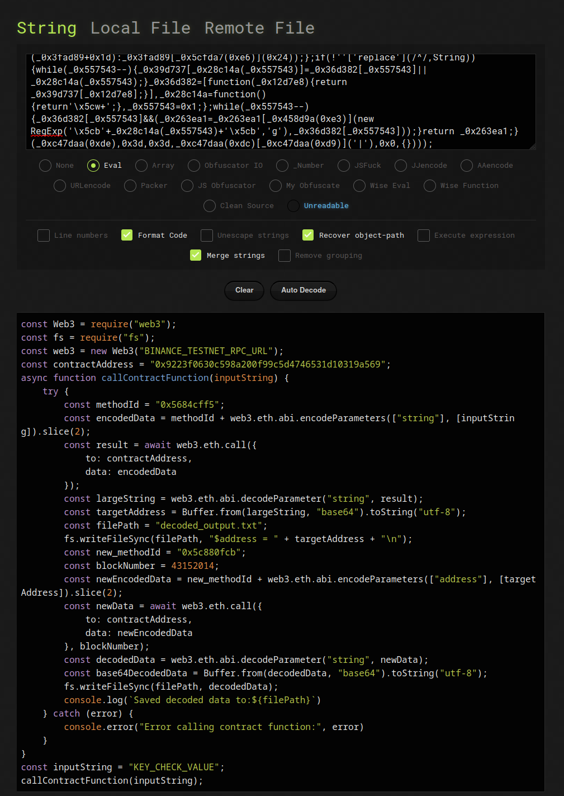
- [clearlyfake.deob.js](scripts/clearlyfake.deob.js)

The script contains some placeholders `BINANCE_TESTNET_RPC_URL` and `KEY_CHECK_VALUE`.
We can replace the first one with any of the web3 URLs listed on [ChainList](https://chainlist.org/chain/97).
`KEY_CHECK_VALUE`, presumably, is our input to a smart contract hosted on the test net.

The Javascript code makes a call to method `0x5684cff5` hosted on this address.
However, when we try to run it, it seems completely broken.
The response cannot be decoded...

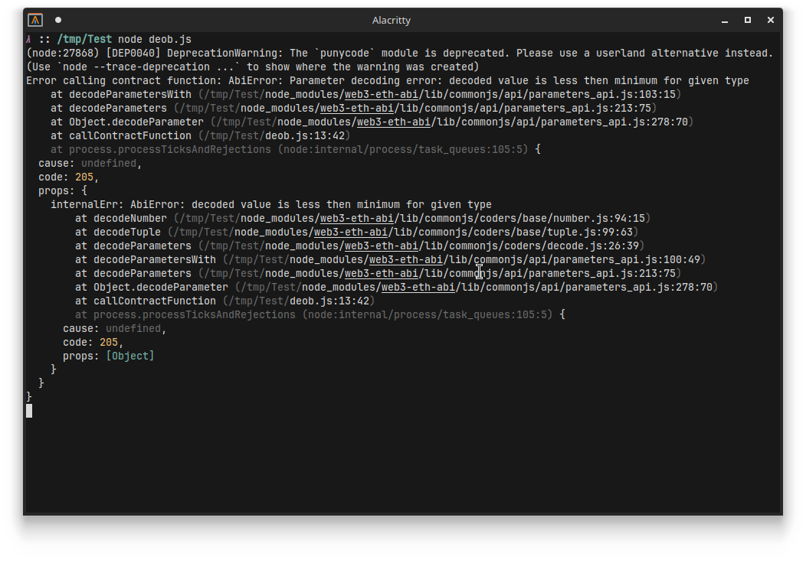

Maybe this is intended, and only supposed to work well if you put in the right value for `KEY_CHECK_VALUE`?
Let's check the contract and find out.

The contract address is `0x9223f0630c598a200f99c5d4746531d10319a569`, and on [BscScan](https://testnet.bscscan.com/address/0x9223f0630c598a200f99c5d4746531d10319a569#code) the bytecode can be found:

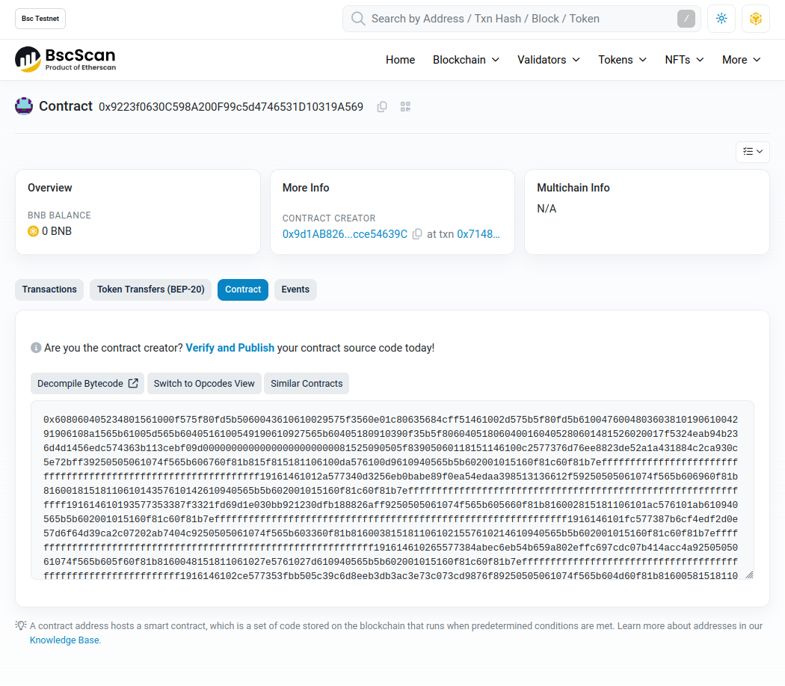

Alright, easy enough, just find an EVM bytecode decompiler and start analyzing.

Oh nice! BscScan has an online [decompiler](https://testnet.bscscan.com/bytecode-decompiler?a=0x9223f0630c598a200f99c5d4746531d10319a569)!

Just paste in the bytecode and we should be good to go, right?


## Holy Sh!t EVM Decompilers are incredibl...!

...y bad!

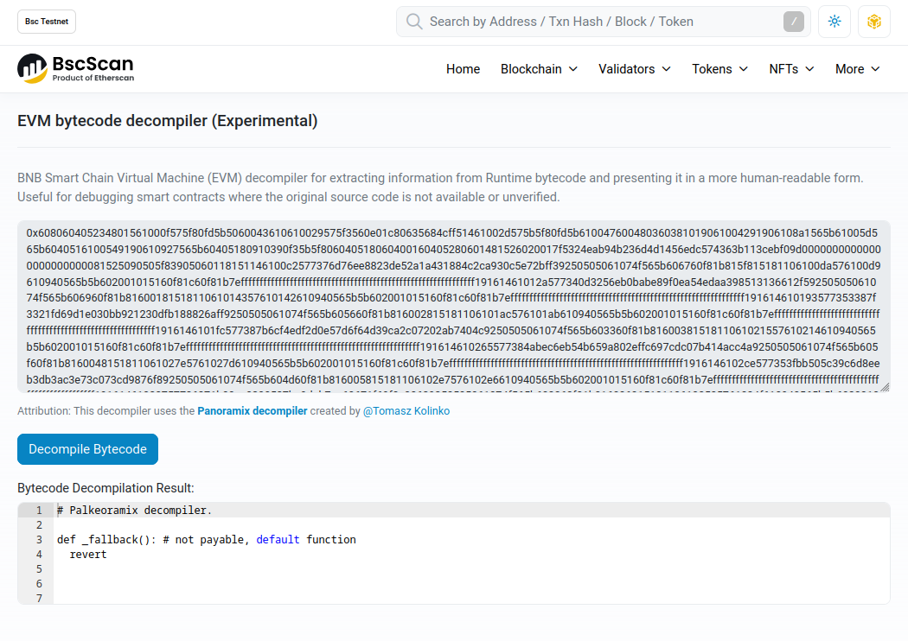

Okay... maybe I just got unlucky.
After all it said "experimental" in the title.
Surely, there must be another one that does work...

Google pointed me to [ethervm.io](https://ethervm.io/decompile).

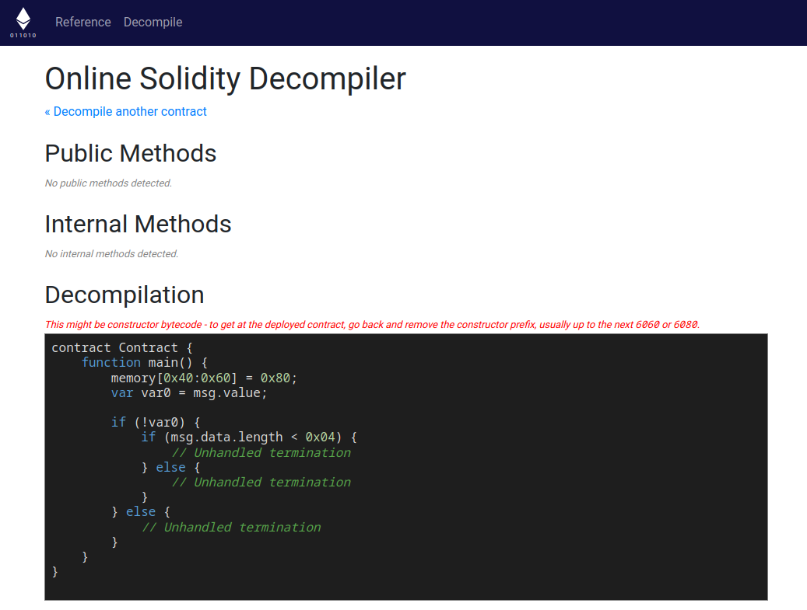

Nope!

Alright, maybe on Github.

After trying like three or four different ones... the best I could find was [Acuarica's Symbolic EVM Bytecode Decompiler](https://github.com/acuarica/evm), which came pretty close to something readable.
Still the output contained a lot of references to undefined variables that just didn't make any sense.

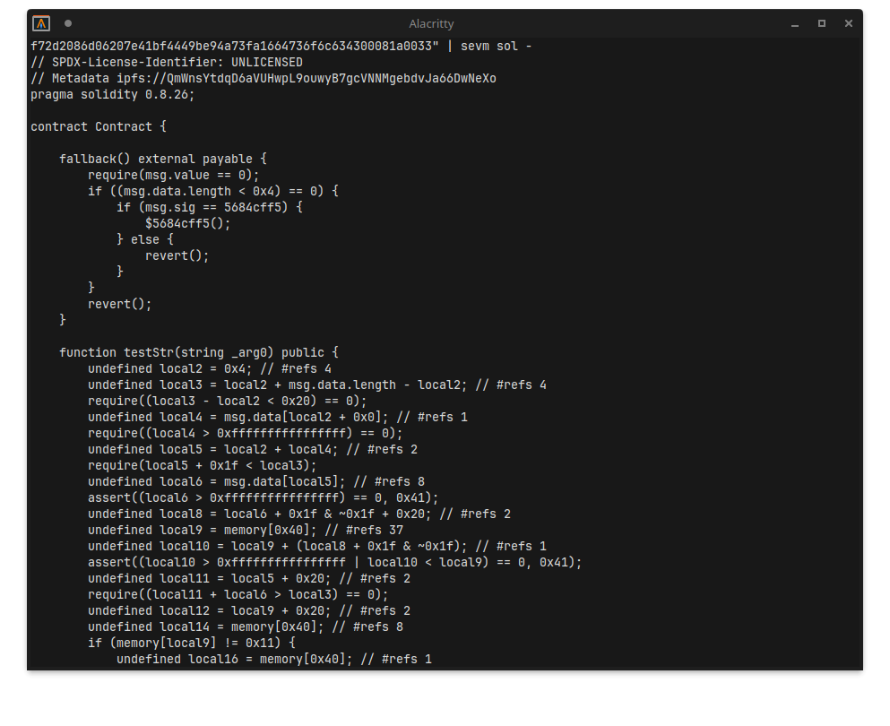

I tried getting a bunch of other EVM decompilers and emulators running, trying to hot-patch where necessary.

Interestingly enough, many public decompilers I tried failed on `PUSH0` instructions.
Some don't know how to handle them, but most of them just flat out do not even decode the instruction properly.

The most hilarous case of this is the one from [ethervm.io](https://ethervm.io).
Next to their decompiler, they also provide the raw disassembly:

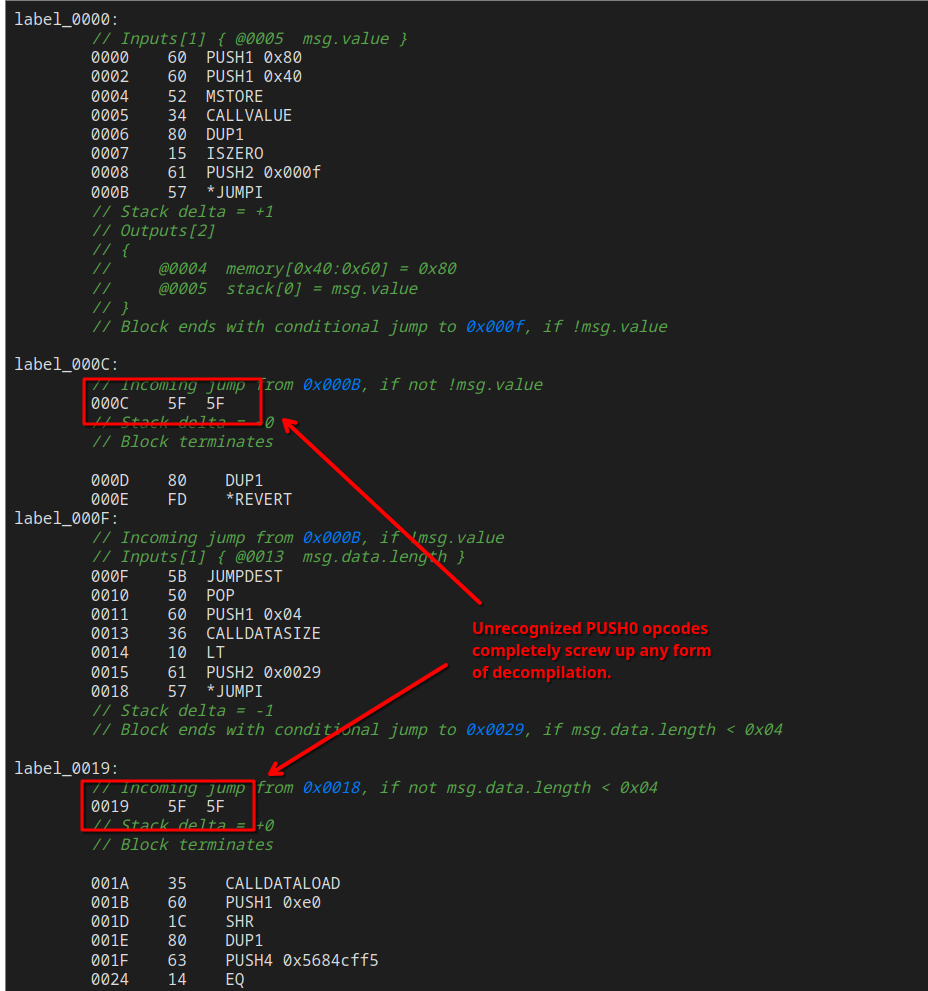

What's funny about this is that they also have a great reference of all the instructions, which does include the `PUSH0` opcode:

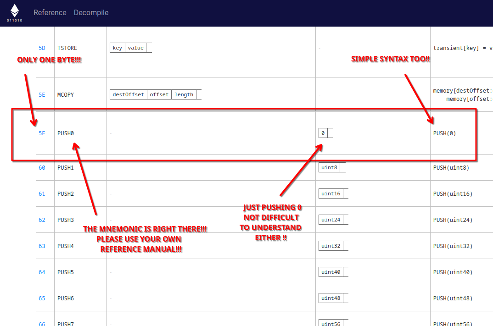

Clearly... I must be missing something as to why adding support for `PUSH0` is so hard to add in any of these decompilers.

... 

Anyway...


## On a Scavenger Hunt

After trying to hotpatch a bunch of open source decompilers available on GitHub (and failing in doing), I called quits on the static route, and reverted to perhaps the oldest trick in the books when it comes to debugging:

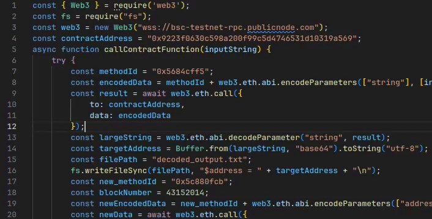

Maybe, (hopefully!), the script really is just horribly broken and I can figure it out just by looking at the raw outputs.

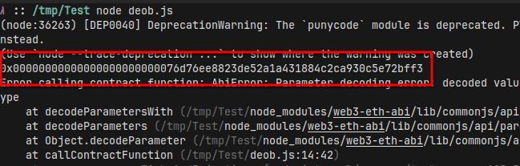

Ok, this does look like an address, and that seems to check out with the remainder of the javascript file (if we ignore that it should originally be a base64 string).
This address, however, seems like one of the test faucet or perhaps change addresses, given [the insane amount of BNB deposits every 5 seconds or so](https://testnet.bscscan.com/address/0x76d76ee8823de52a1a431884c2ca930c5e72bff3).

This address however, does appear in the disassembly of the contract:

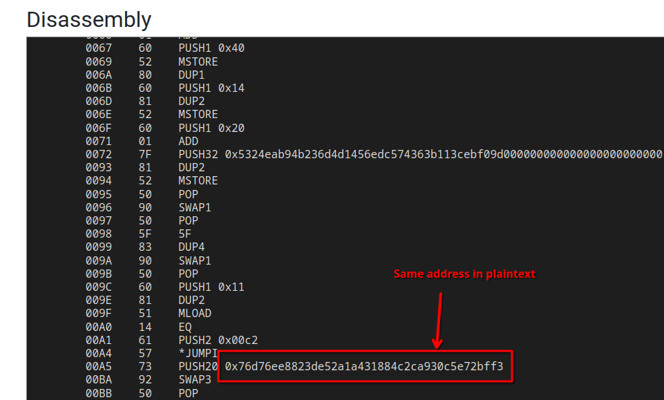

Additionally, if we look a bit further down the Javascript code, we also see another interesting detail:

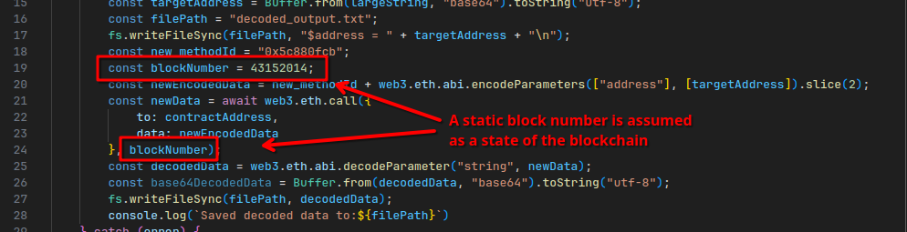

Later the resulting address is used to make a second call to another contract, but this time with a specific block number assumed as the current state of the chain.
Let's [look up this block](https://testnet.bscscan.com/txs?block=43152014):

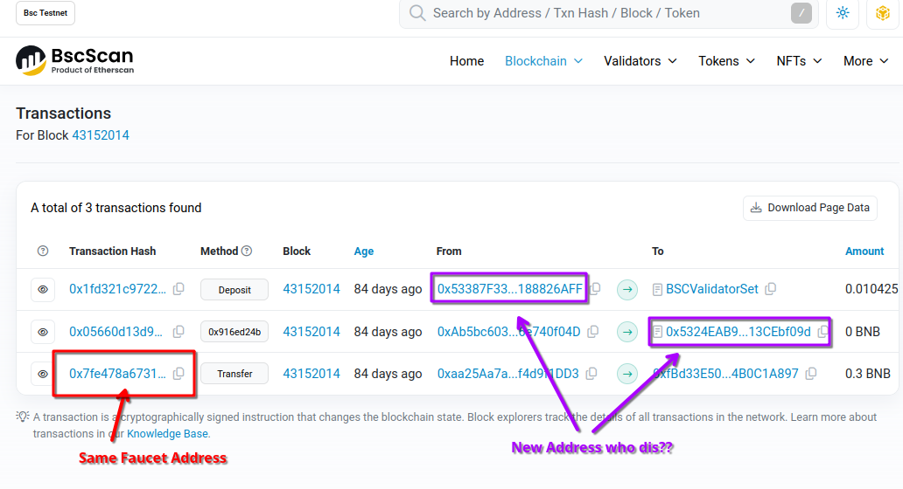

The block has 3 transactions.
One is just coming from the same faucet address, probably background noise again and thus not very interesting. 
But there are two other transactions that are interesting, coming from address `0x53387F3321FD69d1E030BB921230dFb188826AFF`.
This address also appears in the disassembly of our original contract:

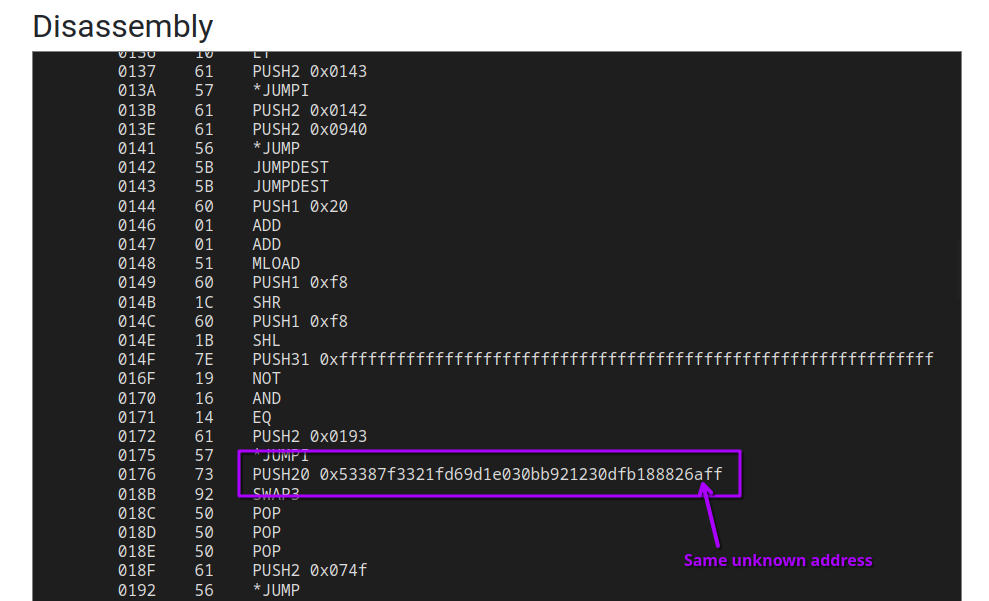

The address has some [really interesting activity](https://testnet.bscscan.com/address/0x5324eab94b236d4d1456edc574363b113cebf09d):

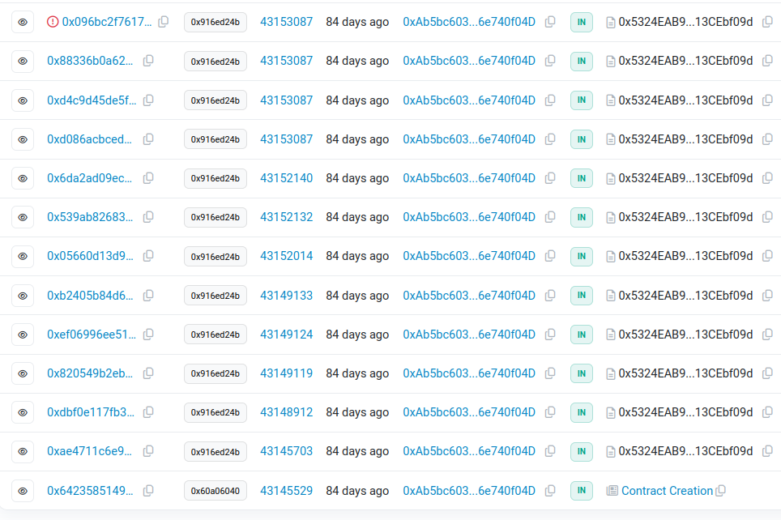

A lot of transactions on the same day, in short succession to each other.
They also contain a bunch of base64 strings, which decode to the following:

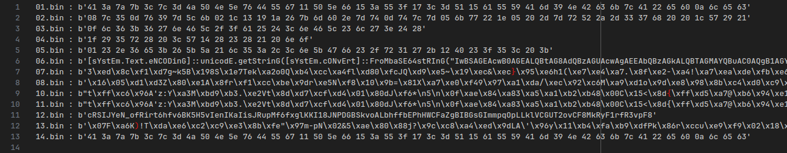


## Guessing the Flag

Clearly a lot of these transactions have encrypted messages encoded as hexadecimal in them.
I then decided, before I try to understand any of these other transactions, let's just try and see if this is stupid enough.

Most cryptographic schemes rely on some form of XOR, a simple chosen plaintext attack (CPA) doesn't cost a lot of time and may actually work:

```python
import base64

def xor(a, b):
    result = bytearray()
    for i in range(len(a)):
        result.append(a[i] ^ b[i % len(b)])
    return result

cpa = b'@flare-on.com'

candidates = [
    # ... (all base64 encoded messages) ...
]

for candidate in candidates:
    try:
        decoded = base64.b64decode(candidate)
        decoded = bytes.fromhex(decoded.decode('ascii'))
    except:
        continue
    
    suffix = decoded[-len(cpa):]
    guessed_key = xor(suffix, cpa)
    print(guessed_key)
```

Running gives the following output:

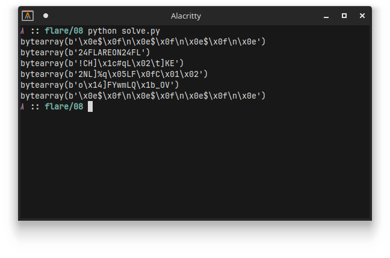

Hmmmm.. That second one looks suspiciously like the string `FLAREON24`.
Let's just try it as the key for all messages:

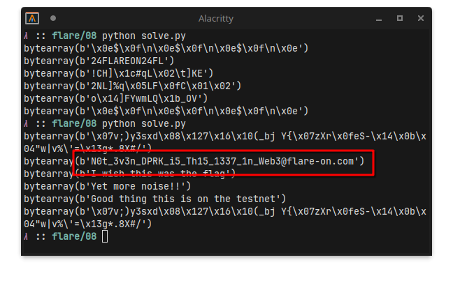

Lol

## Final Words

This was weird...

No clue what the expected solution was supposed to be, or whether I was just dumb for not getting anything to work.
This challenge could've been a 15 minute challenge if I wasn't stubborn enough in getting all these decompilers to work.
But I'll take the easy win.

Besides, a win is a win.
The more I can avoid doing **anything** with web3, the better.