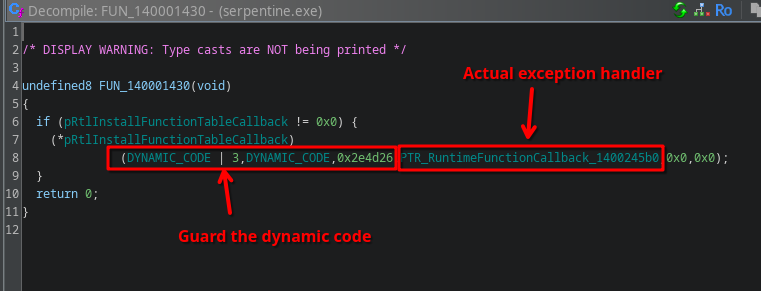
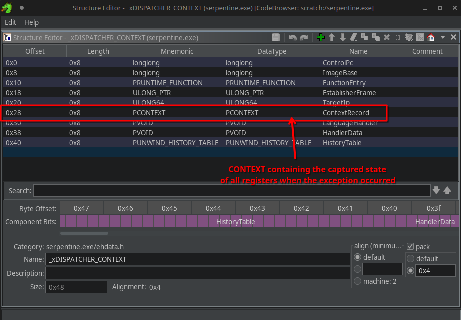
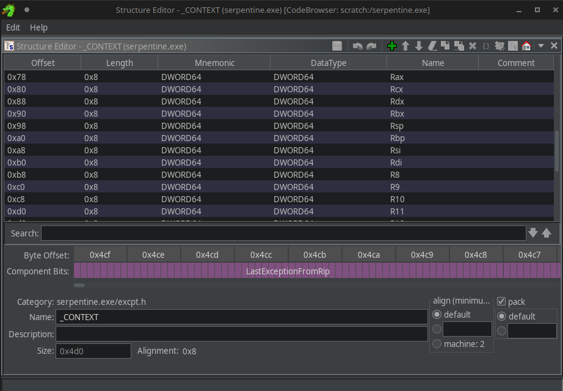

# 9 - serpentine

**Time spent:** 4 days

**Tools used:** Ghidra, x64dbg, C, Python, Z3

Challenge 9 is arguably the most difficult challenge of this year, and this was reflected in the scoreboard.
Most people, if they got far into the series, got really stuck on 9.
And for good reason.
It takes a lot of effort and creativity to get through it all, making this probably one of the most involved challenges I have done in a good while.

I got asked a lot about this challenge during and after the competition.
I also am pretty sure I did not solve it in the way most people solved it.
My solution is mostly static, while many others have used dynamic approaches instead.
So to answer most of the questions about this challenge, I have put in some extra time (and text) into making this writeup hopefully as detailed as possible.

## Orientation

The program itself is very simple.
It asks for an input key in its first command line argument.
Provide the right key, you get the flag:


Except nothing makes sense in this binary.

The first thing that should scare you is that the binary is a whopping **8MiB** in size.
For a "simple" program like this, that is never good news.

Secondly, the actual verification of the key does not happen in statically compiled code, but instead in dynamically allocated code:


The code is initialized in a TLS callback, and it is huge:


OK no problem, just copy the static code into a new buffer in Ghidra, and decompile it right?


... except the code starts with a `HLT` instruction?
This is a privileged instruction that cannot run in user-mode without triggering an exception.
x64dbg also doesn't seem to like it much.
Trying to step over the `HLT` doesn't make us jump to the next instruction, but instead move forward to another `HLT` instruction.
And the next one... and the next one...


Program runs fine though, even though it has a bunch of `EXCEPTION_PRIV_INSTRUCTION`s being thrown around, how is this possible?


## Exception Handlers

The conclusion here that we must take, is that the program must be handling the exceptions somehow.
There are a couple ways to handle exceptions in a Windows executable, and throughout the binary there are some fake red herring exception handlers registered:


None of these are triggered upon the execution of the `HLT` instruction.
The real exception handler is much more sneaky.
In `FUN_140001430`, an indirect call to `RtlInstallFunctionTableCallback` is made:



[RtlInstallFunctionTableCallback](https://learn.microsoft.com/en-us/windows/win32/api/winnt/nf-winnt-rtlinstallfunctiontablecallback) installs a callback that is called whenever an exception occurs within the provided code boundaries.
The callback's task is, given the address where an exception occurred, find the corresponding [RUNTIME_FUNCTION](https://learn.microsoft.com/en-us/windows/win32/api/winnt/ns-winnt-runtime_function) structure.
If it is found, this structure describes a range within the dynamic code that the faulting instruction was part of, and, more importantly, it contains a pointer to a structure known as [UNWIND_INFO](https://learn.microsoft.com/en-us/cpp/build/exception-handling-x64?view=msvc-170#struct-unwind_info) describing **how** the exception should be handled, and in particular, where the code handling the exception is located.

If we look at the callback that is registered in this challenge, we see the following:


The callback always returns a `RUNTIME_FUNCTION` that exactly guards 1 byte, the current `HLT` instruction, and thus will always handle every `HLT` using this callback.
Furthermore, the unwind data associated is referenced by a relative offset stored as a single byte right after the `HLT` instruction, almost as if it is an "operand" of the `HLT` instruction.

Putting this to the test, if we look at our first `HLT` instruction at the beginning of the dynamic code, we can see the "operand" of this `HLT` is `0x46`:


Going to the corresponding UnwindData address at `0 + 2 + 0x46 = 0x48`, we see in the unwind data that the exception handler is located at address `0x98`:


This means we should be able to treat the `HLT` instruction as a `JMP BASE+0x98`.

We can verify this in x64dbg, if we set a breakpoint on exactly this address, we can see that after single-stepping over the first `HLT` instruction the debugger indeed stops at this location:


Success!


## Self-Modifying Code:

But this is not where it ends.

Right off the bat we see at this next instruction a `CALL`.
This function looks really weird and broken though in the decompiler:


Likely, this is some handcrafted assembly.

Using single stepping in x64dbg, we can actually see it's not just handcrafted, but this is also self-modifying:


The dynamic code is littered with calls to self-modifying code.
Lucky for us, they all follow more or less the same pattern:

- The first 7 instructions decrypt a single x86 instruction (in the GIF: `MOV R11,0x10add7f49`)
- Then this single instruction is executed,
- Finally, the instruction is garbled up again by the remaining instructions before returning to a hardcoded address, which always happens to be exactly `<address of CALL instruction> + <size of decrypted instruction>`.

In other words, these calls are the result of outlined x86 instructions that are hidden behind some encryption.

To revert this, all we need to do is simulate the exact same behavior up until the instruction is decrypted, and patch the calls with the decoded instruction.
We don't actually have to understand exactly how this decryption works.
We can just write a script in Ghidra that looks up all these call instructions, then emulates the first 7 instructions of the called function using Ghidra's built-in emulator, and then just read out the next instruction.

```java
Address address = // address to CALL instruction.

/* ... */

var emulator = new EmulatorHelper(currentProgram);
emulator.writeRegister("RIP", address.getOffset());

// step into instruction decrypter
emulator.step(monitor);
var decrypterAddress = emulator.getExecutionAddress();

/* ... */

// Emulate instructions responsible for decryption.
for (int i = 0; i < 7; i++) {
    emulator.step(monitor);
}

// Clear and force re-decoding of next instruction.
var startAddress = emulator.getExecutionAddress();

byte[] newCode = emulator.readMemory(startAddress, 50);
listing.clearCodeUnits(startAddress, startAddress.add(newCode.length), true);
setBytes(startAddress, newCode);
disassemble(startAddress);

// Read next decoded instruction.
var instruction = listing.getInstructionAt(startAddress);

/* ... */
```

Then it's just a matter of inlining the newly decoded instruction, overwriting the original `CALL` instruction:

```java
if (!instruction.toString().startsWith("JMP")) {
    // Inline, there should be exactly enough space.
    byte[] actualCode = getBytes(startAddress, (int) endAddress.subtract(startAddress));
    listing.clearCodeUnits(address, address.add(actualCode.length + 10), true);
    setBytes(address, actualCode);
    disassemble(address);

    return address.add(actualCode.length);
} else {
    // HACK: jmp's operands are relative to the current RIP so we cannot 
    // just inline the jmp instruction. Instead, we patch the call to a 
    // jump to the jmp to retain the current RIP.
    listing.clearCodeUnits(address, address.add(5), true);
    setByte(address, (byte) 0xE9); // JMP
    setInt(address.add(1), (int) startAddress.subtract(address.add(5))); // Address
    disassemble(address);

    return address;
}
```
The only edge-case we need to handle are instructions that have operands relative to the current value of `RIP`.
Inlining those instructions would mess up their operands.
Nothing to worry though, for these instructions we can instead patch the original `CALL` with a `JMP` to the decrypted code, which works out because `JMP` and `CALL` have the same x86 instruction size.
Additionally, extra lucky for us as well is that this edge-case for `JMP` instructions in this challenge.

If you follow this procedure, you can deobfuscate all `CALL`s pretty swiftly:


The full script can be found in [SerpentineDeobfuscator.java](scripts/SerpentineDeobfuscator.java)


## Understanding [R9+0x28]:

However, the code still doesn't decompile quite right.
The code still looks very obfuscated, makes use of weird registers like `MXCSR`, and also references some unknown pointers.

In particular, the unknown pointer that keeps coming back is `[R9+0x28]`:


`R9` is never really assigned explicitly before, yet appears somewhere within every exception handler, so where does it come from?
Something must be wrong about our current interpretation of exception handling.

To understand what is happening here, we must take a step back and understand how _exactly_ exception handlers are called.
Sadly, the Windows operating system is closed-source, but there is an open-source reimplementation of the Windows called [ReactOS](https://reactos.org/) that aims to be NT-kernel compatible, and it turns out that this is an absolute gold mine when it comes to finding anything related to the inner workings of Windows itself as well.

In particular, if we look at [sdk/lib/rtl/amd64/unwind.c:L781](https://github.com/reactos/reactos/blob/325d74c30f30b4b6fb66c78d0ec7c7291fa516d3/sdk/lib/rtl/amd64/unwind.c#L781) (the code implementing exception unwinding on ReactOS), we can see exactly how our exception handlers are called:

```c
/* ... */

/* Loop all nested handlers */
do
{
    /// TODO: call RtlpExecuteHandlerForUnwind instead
    /* Call the language specific handler */
    Disposition = ExceptionRoutine(ExceptionRecord,
                                    (PVOID)EstablisherFrame,
                                    ContextRecord,
                                    &DispatcherContext);

    /* ... */
```

Recall that in the [x86 64-bit system ABI](https://learn.microsoft.com/en-us/cpp/build/x64-calling-convention?view=msvc-170), `R9` is used as the fourth parameter in a function call.
In other words, `R9` contains a `DispatcherContext`.
Looking at the definition of this structure in Ghidra, we can see at offset `0x28` a `PCONTEXT` field is defined:



The context contains the state of all the registers that were captured when the exception occurred:



In other words, in the following example, `[R9 + 0x28]` first obtains this `CONTEXT` object, and then afterwards the original register at offset `0xe0` within this `CONTEXT` object, which happens to be `R13`:


## Understanding Unwind Codes

If this wasn't involved enough for you already, this challenge has one extra detail to make interpreting these handlers even more difficult.

The exception unwinder on Windows actually may perform some additional modifications to the `CONTEXT` before handing it over to the exception handler.
This is in the process of **virtual unwinding**, implemented by a function called `RtlVirtualUnwind`.

Without going into too much detail, virtual unwinding involves storing and interpreting an array of `UNWIND_CODE`s in the `UNWIND_INFO` structure of the exception handler.
Originally, they are used to fix up the stack and base pointers that were saved in the function prologue.
There are a handful of opcodes, [MSDN has some good documentation on it](https://learn.microsoft.com/en-us/cpp/build/exception-handling-x64?view=msvc-170#struct-unwind_code), there is [an excellent article about their exact workings by CodeMachine](https://codemachine.com/articles/x64_deep_dive.html), and of course, ReactOS also [implements these opcodes which we can use for reference](https://github.com/reactos/reactos/blob/325d74c30f30b4b6fb66c78d0ec7c7291fa516d3/sdk/lib/rtl/amd64/unwind.c#L537-L621).

It so happens to be the case that this challenge (ab)uses not only the exception handlers themselves, but also partially has moved the actual code into these arrays of unwind codes.

Taking a look at the handler stored at `BASE+0x146`, we can see for example the following unwinding code:


Which would roughly translate to the following pseudo-C:

```c
// UWOP_PUSH_MACHFRAME 0
RSP = *(uint64_t*) (RSP + 0x18);

// UWOP_ALLOC_LARGE 4
RSP += 4;

// UWOP_PUSH_NONVOL 13
R13 = *(uint64_t*) (RSP);
RSP += 8;
```


## Do You Even Lift Bro? 

The unwind codes and the references to the _original_ registers from the `CONTEXT` object makes it difficult to automatically generate the right x86 code to hotpatch every `HLT` instruction with.
But even if we did this correctly, the code would still look terrible and uninterpretable.
There is still a lot of obfuscation going on, including weird stack operations and a lot of mutated expressions.
Ideally we don't want to deal with any of that.

If only there was a thing that would allow us to introduce new "registers" and write new code easily, without having to write the x86 ourselves...

... 

Wait, we all know what this thing is that we're looking for.
In fact, we programmers use it every day.

It's called a **compiler**!

If we can translate the code in just the right way such that we can transpile everything in a very basic form of C, then we can just let `GCC` do all the complicated register allocations, stack manipulations, and more importantly, optimizations without having to do anything ourselves!

First, let's introduce C variables for all registers involved:
```c
uint64_t RAX = 0;
uint64_t RCX = 0;
uint64_t RDX = 0;
uint64_t RBX = 0;
uint64_t RSP = 0;
uint64_t RBP = 0;
uint64_t RSI = 0;
uint64_t RDI = 0;
uint64_t R8 = 0;
uint64_t R9 = 0;
uint64_t R10 = 0;
uint64_t R11 = 0;
uint64_t R12 = 0;
uint64_t R13 = 0;
uint64_t R14 = 0;
uint64_t R15 = 0;
uint64_t MXCSR = 0;
```

Since every exception handler essentially does a context-switch and references the **original** values of each register, we're also going to need a copy for each register storing their original value before such a context switch:

```c
uint64_t RAX_old = 0;
uint64_t RCX_old = 0;
uint64_t RDX_old = 0;
uint64_t RBX_old = 0;
uint64_t RSP_old = 0;
uint64_t RBP_old = 0;
uint64_t RSI_old = 0;
uint64_t RDI_old = 0;
uint64_t R8_old = 0;
uint64_t R9_old = 0;
uint64_t R10_old = 0;
uint64_t R11_old = 0;
uint64_t R12_old = 0;
uint64_t R13_old = 0;
uint64_t R14_old = 0;
uint64_t R15_old = 0;
uint64_t MXCSR_old = 0;
```

This allows us to translate every x86 instruction into some basic C representation.
For example, a `MOV` maps perfectly to a simple C assignment:

```c
// 133702ad: MOV R10,-0x46c88b59
R10 = -0x46c88b59;
```

Arithmetic is also not difficult, we can just generate statements like so:
```c
// 133702b4: ADD R10,0x47b805e5
R10 += 0x47b805e5;
```

Stack operations like `PUSH` and `POP` are interesting, as they both write to a memory slot pointed to by `RSP` and then update `RSP` afterwards.
We can simulate this by allocating a virtual "stack" variable; a simple `char[]` with some arbitrary size, stored as a local variable.
We can then let our virtual `RSP` variable point to the last "element" stored on this stack.

```c
char stack1[0x10000];
RSP = (uint64_t) &stack1[0x10000 - 8];
```

`PUSH` and `POP` are then simply just modifications on this "stack":

```c
// 133700a2: PUSH R11
RSP -= 8;
*(uint64_t*) (RSP) = R11;

// 133700a4: PUSH 0x73775436
RSP -= 8;
*(uint64_t*) (RSP) = 0x73775436;

// 133700a9: PUSH 0x68a04c43
RSP -= 8;
*(uint64_t*) (RSP) = 0x68a04c43;

// 133700ae: PUSH 0x12917ff9
RSP -= 8;
*(uint64_t*) (RSP) = 0x12917ff9;
```

To handle the `HLT` instructions, we first need to simulate the unwind codes.
For example:

```c
// 0x00: PushMachframe 0
RSP = *(uint64_t*) (RSP + 0x18);

// 0x00: AllocLarge 4
RSP += 4;

// 0x00: PushNonVol 13
R13 = *(uint64_t*) (RSP);
RSP += 8;
```

Then save all the registers to perform the context switch:
```c
// save current state
RAX_old = RAX;
RCX_old = RCX;
RDX_old = RDX;
RBX_old = RBX;
RSP_old = RSP;
RBP_old = RBP;
RSI_old = RSI;
RDI_old = RDI;
R8_old = R8;
R9_old = R9;
R10_old = R10;
R11_old = R11;
R12_old = R12;
R13_old = R13;
R14_old = R14;
R15_old = R15;
MXCSR_old = MXCSR;
```

And finally, allocate the new "stack frame":
```c
// allocate new stack
char stack2[0x10000];
RSP = (uint64_t) &stack2[0x10000 - 8];
```

The cool thing about all of this, is that this is incredibly straightforward to generate these statements.
The only thing we need to take into account is that if we're using values from the `CONTEXT` in `[R9+0x28]`, we need to map them to the right old register:

```c
// 133701a7: MOV RBP,qword ptr [R9 + 0x28]
// switch to context pointer RBP

// 133701ab: MOV RDI,qword ptr [RBP + 0xe0]
RDI = *((uint64_t*) (&R13_old));
```

Automate this generation in a script (see [SerpentineTranspile.java](scripts/SerpentineTranspile.java)), and you get some incredibly ugly looking code:


However, if you recompile everything with `GCC -O1`, all that gets optimized away (including our virtual stack operations!), and you get near clean code in Ghidra:


Thank you GCC devs for 35+ years of compiler optimization advancements!


## Understanding the Lookup Tables

The challenge has one more trick up its sleeves when it comes to making the code hard to read.

You may have noticed in Ghidra's output there are some weird pointers referenced.
These pointers are actually lookup tables that implement various 8-bit binary operations:


Arguably the easiest one to recognize is the XOR table stored at `140094ac0`. 
A reference to `DAT_140094ac0[x][y]` will thus hold the result of `x ^ y`.
For example, here is the sub table with all the results for the expression `19 ^ y`:


The hardest ones to recognize are probably the carry and borrow tables, as they contain a lot of zeroes and ones usually and look very weird if you've never seen them before.
It took me a full day to realize that this for example is a carry table for `209 + y`:


Once you apply the names, the code becomes even more clear:


If you squint a little, you can actually see the lookups form not just 8-bit operations, but implement 32-bit operations broken up into individual 8-bit operations that are neatly shifted and OR'ed together (notice the `<< 8`, `<< 0x10`, `<< 0x18`):


Thus, the long list of garbage code is actually nothing more than a huge list of very simple linear operations, that all need to add up to 0.


## Getting the Flag

This is where the tediousness really comes into play.
There are 32 repetitions of this, and it is a real pain to extract all these operations easily.
For me, I used a bunch of regular expressions, manual copying, and lots of painful verifying of all my constants.
I wish my approach was more structured than it was, but here we are.

Eventually you end up with a set of constraints that look a bit like this:


We can throw Z3 at it, the final script can be found in [solve.py](scripts/solve.py).

For some reason, I couldn't get some of the stages to work.
I must have made some mistakes in my recompilation, regular expressions or similar.
It was not a big problem though, there is enough overlap within the blocks that it didn't matter:


Pasting it into the challenge, and you get the flag:


## Final Words

This challenge was in many ways awesome and painful at the same time.
It presented a really interesting problem to solve, with clever use of unwind codes and on-the-fly instruction encryption/decryption.

In my opinion, however, the challenge was way too long.
I understand the goal was perhaps to make a lot of things automated but 32 of the same thing is not really fun to do.
After 3-4 blocks you get it and it gets old really quick after that.
There's nothing new to reverse, just getting the next operations and constants to add to your SMT solver and rinse and repeat.
It made it very tempting to straight up just quit.
I think the challenge would've been more than fine if it was just 5 layers deep max.
More layers != always better :).