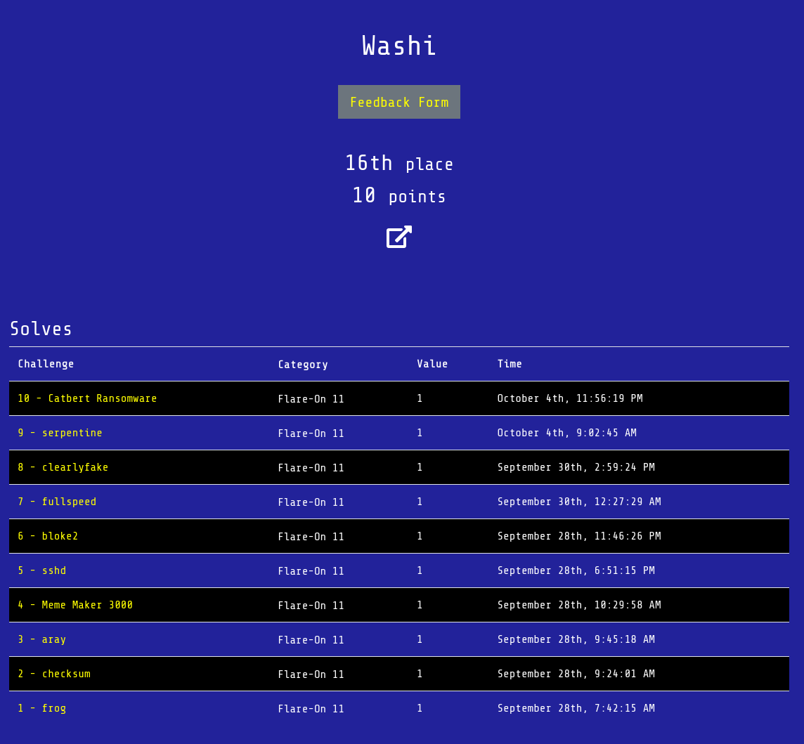

# Flare-On 2024

This directory contains write-ups with my solutions for Flare-On 2024 that was hosted by Google Cloud Security / Mandiant from September 27 to November 8 2024. 

## Table of Contents

- [1 - frog](1)
- [2 - checksum](2)
- [3 - aray](3)
- [4 - FLARE Meme Maker 3000](4)
- [5 - sshd](5)
- [6 - bloke2](6)
- [7 - fullspeed](7)
- [8 - clearlyfake](8)
- [9 - serpentine](9)
- [10 - Catbert Ransomware](10)

## Binaries
Download the binaries [here](http://flare-on.com/files/Flare-On11_Challenges.zip).

## Bragging rights

