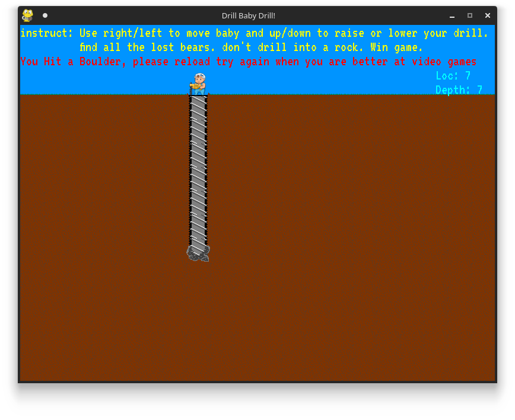
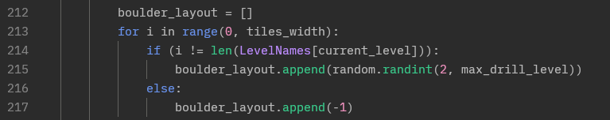
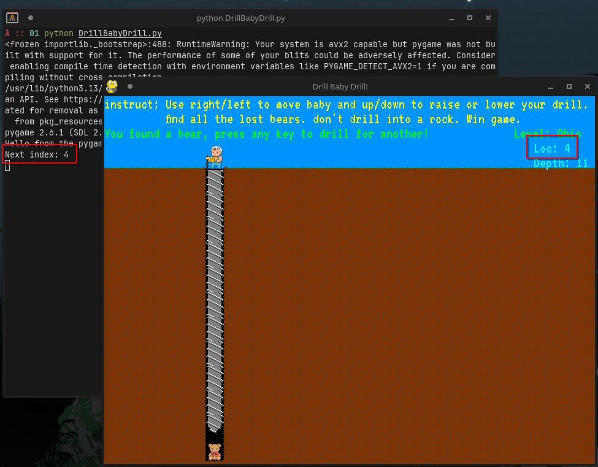
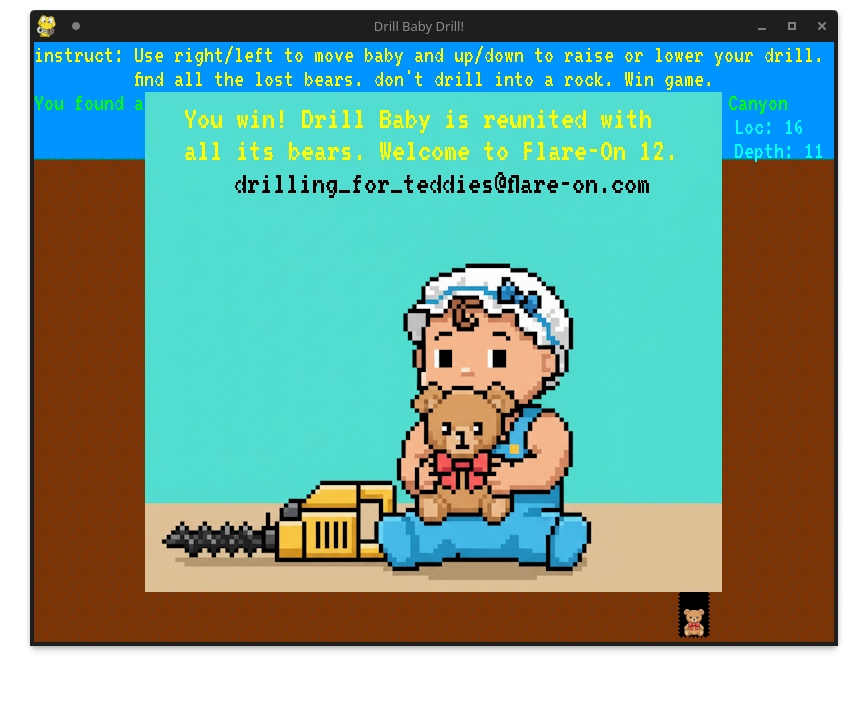

# 1 - Drill Baby Drill!

**Time spent:** 5 minutes

**Tools used:** Python

This year's CAPTCHA challenge is a game where you have to drill for "lost bears" in the ground.
If you hit a builder instead of reaching till the end, you lose the game and have to start over again:

The program is written in Python, and all the source code is available in plaintext.
Particularly, if we look at the code that is responsible for setting up the builders in each level at line 212, we see that the `boulder_layout` array holds for each column the depth each boulder is placed.

We also see that there is a special value `-1` set for exactly 1 column.
If we print out the index of this `-1` for every level, we find that a bear is at this exact index:

Repeat this process a few times for all the levels and you get the flag:

