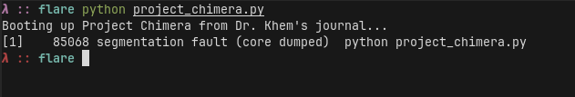
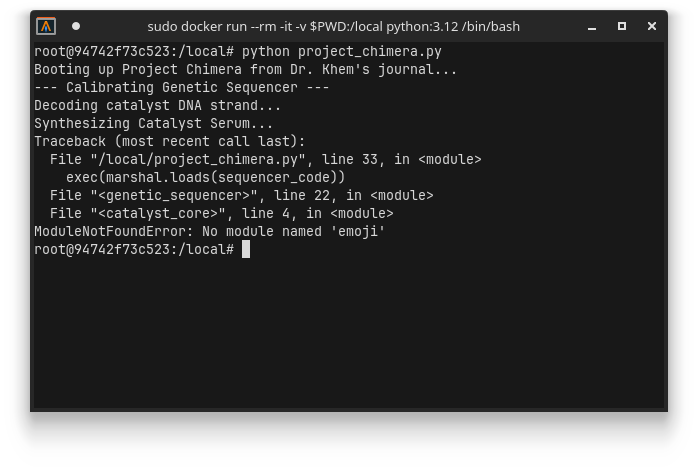
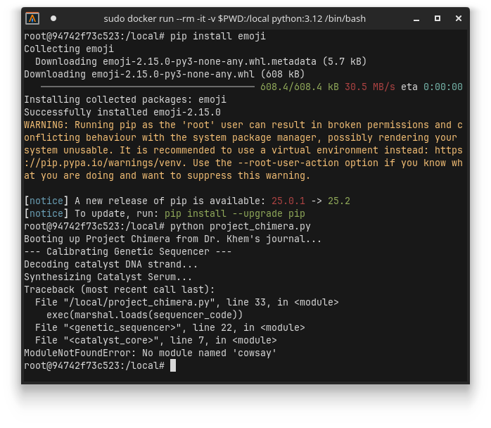
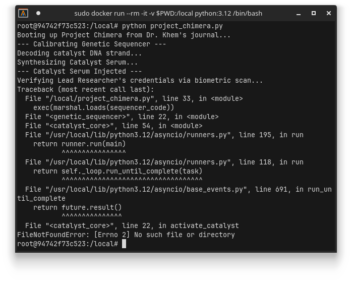
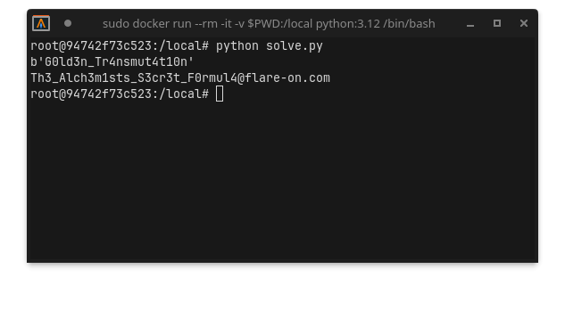

# 2 - project_chimera

**Time spent:** ~1 hour

**Tools used:** Python

Challenge 2 is a matryoshka-style Python file, with many loader stages.
You are presented with a file that is seemingly just a couple lines of Python code:

```python
import zlib
import marshal

# These are my encrypted instructions for the Sequencer.
encrypted_sequencer_data = # ... long encrypted bytes string ...

print(f"Booting up {f"Project Chimera"} from Dr. Khem's journal...")
# Activate the Genetic Sequencer. From here, the process is automated.
sequencer_code = zlib.decompress(encrypted_sequencer_data)
exec(marshal.loads(sequencer_code))
```

## Orientation

The hardest part of this challenge is actually getting this thing to run.
When I was doing this challenge, I was running the latest and greatest Python 3.13, which did not work:



At first I thought this was on my end and wasted a good amount of time trying to fix it, when in reality if you just run it with Python 3.12 (e.g., via a docker instance) things just work fine:



Well.. almost, it now tells us it needs a package `emoji`.
OK no problem, just install with `pip`:



Great.. more packages to install...
This process of installing the next package and rerunning repeats for a few more packages until you finally get to a different type of error:



I guess we need to actually start reading the code if we want to fix anything.


## Dumping and Decompiling

I decided to change the code in the original file as follows:

```python
encrypted_sequencer_data = # ... long bytes string

sequencer_code = zlib.decompress(encrypted_sequencer_data)
x = marshal.loads(sequencer_code)
pyc_data = importlib._bootstrap_external._code_to_timestamp_pyc(x)
with open('stage1.pyc', 'wb') as f:
    f.write(pyc_data)
```

This is a neat trick that allows you to dump the marshalled code object into a `pyc` file.
A `pyc` file is a compiled file that Python decompilers like [pylingual](https://pylingual.io) can understand.

You'll find that after decompiling the bytecode, it is basically just yet another stage with yet another marshalled python code object.

```python
import base64
import zlib
import marshal
import types
encoded_catalyst_strand = # ... another long byte string ...
print('--- Calibrating Genetic Sequencer ---')
print('Decoding catalyst DNA strand...')
compressed_catalyst = base64.b85decode(encoded_catalyst_strand)
marshalled_genetic_code = zlib.decompress(compressed_catalyst)
catalyst_code_object = marshal.loads(marshalled_genetic_code)
print('Synthesizing Catalyst Serum...')
catalyst_injection_function = types.FunctionType(catalyst_code_object, globals())
catalyst_injection_function()
```

Nothing to worry, just repeat the same trick.

```python
# ...

encoded_catalyst_strand = x.co_consts[2] # byte string index in code object
stage2 = zlib.decompress(base64.b85decode(encoded_catalyst_strand))
x = marshal.loads(stage2)
pyc_data = importlib._bootstrap_external._code_to_timestamp_pyc(x)
with open('stage2.pyc', 'wb') as f:
    f.write(pyc_data)
```

Disassembling/decompiling this reveals yet another very similar layer. Just repeat the process...

```python
# ...

stage3 = x.co_consts[3]
pyc_data = importlib._bootstrap_external._code_to_timestamp_pyc(stage3)
with open('stage3.pyc', 'wb') as f:
    f.write(pyc_data)
```


Eventually, you get to something that looks a bit more like real code.

```python
import os, sys
import emoji
import random
import asyncio
import cowsay
import pyjokes
import art
from arc4 import ARC4

async def activate_catalyst():
    LEAD_RESEARCHER_SIGNATURE = b'm\x1b@I\x1dAoe@\x07ZF[BL\rN\n\x0cS'
    ENCRYPTED_CHIMERA_FORMULA = b'r2b-\r\x9e\xf2\x1fp\x185\x82\xcf\xfc\x90\x14\xf1O\xad#]\xf3\xe2\xc0L\xd0\xc1e\x0c\xea\xec\xae\x11b\xa7\x8c\xaa!\xa1\x9d\xc2\x90'
    print('--- Catalyst Serum Injected ---')
    print("Verifying Lead Researcher's credentials via biometric scan...")
    current_user = os.getlogin().encode()
    user_signature = bytes((c ^ i + 42 for i, c in enumerate(current_user)))
    await asyncio.sleep(0.01)
    status = 'pending'
    if status == 'pending':
        if user_signature == LEAD_RESEARCHER_SIGNATURE:
            art.tprint('AUTHENTICATION   SUCCESS', font='small')
            print('Biometric scan MATCH. Identity confirmed as Lead Researcher.')
            print('Finalizing Project Chimera...')
            arc4_decipher = ARC4(current_user)
            decrypted_formula = arc4_decipher.decrypt(ENCRYPTED_CHIMERA_FORMULA).decode()
            cowsay.cow('I am alive! The secret formula is:\n' + decrypted_formula)
        else:
            # ... snip ...
            sys.exit(1)
    else:
        # ... snip ...

asyncio.run(activate_catalyst())
```

Here we see that there are some interesting hardcoded constants `LEAD_RESEARCHER_SIGNATURE` and `ENCRYPTED_CHIMERA_FORMULA`.
The first one seems to be a user name that we need to match with our current username after some basic XOR encryption.
The second seems to be the encrypted flag, as it is decrypted after the match is successful.


## Getting the flag

All we have to do is now reverse the operations that are specified in this file.
This is simple because XOR and additions are revertible with zero problems.
We just need to add a few parentheses to ensure the order of operations is reversed.

```python
LEAD_RESEARCHER_SIGNATURE = b'm\x1b@I\x1dAoe@\x07ZF[BL\rN\n\x0cS'

user_signature = bytes(((c ^ (i + 42) & 0xff for i, c in enumerate(LEAD_RESEARCHER_SIGNATURE))))
print(user_signature)
```

We can then just repeat the RC4 process on the encrypted data:

```python
ENCRYPTED_CHIMERA_FORMULA = b'r2b-\r\x9e\xf2\x1fp\x185\x82\xcf\xfc\x90\x14\xf1O\xad#]\xf3\xe2\xc0L\xd0\xc1e\x0c\xea\xec\xae\x11b\xa7\x8c\xaa!\xa1\x9d\xc2\x90'

from arc4 import ARC4
arc4_decipher = ARC4(user_signature)
decrypted_formula = arc4_decipher.decrypt(ENCRYPTED_CHIMERA_FORMULA).decode()
print(decrypted_formula)
```



... which reveals the flag!
