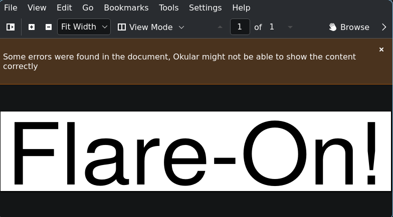
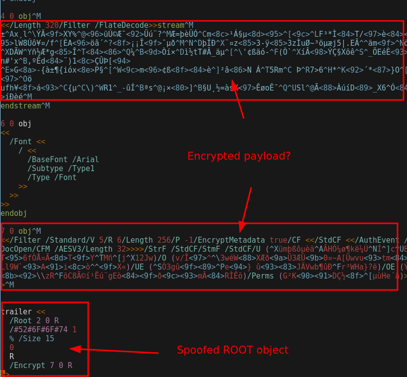
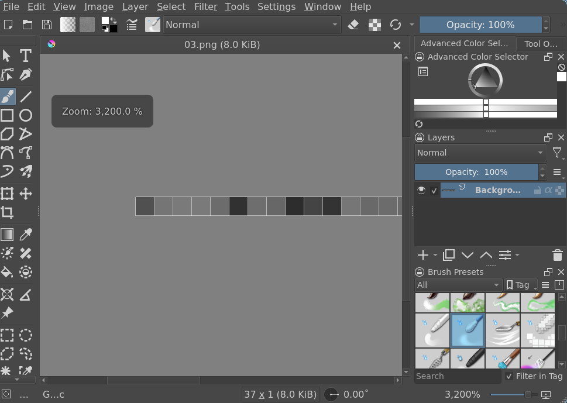

# 3 - pretty_devilish_file

**Time spent:** ~2.5 hours

**Tools used:** qpdf, Python

Challenge 3 is probably my least favorite challenge of this year.
It is very much a guessing game on what you need to do and what tools you need to use.

You are served a horribly broken PDF file which behaves differently in different PDF readers, that contains the text "Flare-On!".
Okular so happens to be one of the few that is actually able to dispay it:




## Finding the Hidden Data

Looking into the file itself, the file seems to be intentionally "obfuscated" (for the lack of a better term), and there is some encrypted payload present.



I wish I had a nice and structured way of solving this challenge, but it really came down to painstakingly trying out all the tools I could find on Google, until finally finding one that eventually works.

For me that was [qpdf](https://github.com/qpdf/qpdf):

```
$ qpdf --decrypt pretty_devilish_file.pdf output.pdf
```

This gives us a way cleaner PDF file, that also reveals a hidden compressed image:


Carving out this image using a hex editor, we can inflate the buffer

```python
import zlib

compressed = bytes.fromhex("78 9C C5 52 3B 4F 03 31 0C DE FD 2B C2 04 0C 55 9C C4 8E 93 91 BE 68 25 24 A8 7A 12 03 62 C8 E3 32 01 52 99 F8 F9 E4 7A 65 42 CC D8 B2 2D BF E2 CF 56 4E CA 1B AB B0 B3 99 D4 A2 EB F2 0E CB BD D2 CF CA 89 DE 29 A3 57 47 7D AF 97 4F 2B 15 F4 83 22 0E 7A FB 02 FA 6E F7 05 7A BD 1A E0 75 BF 86 D6 6A 68 6D 44 44 83 94 C8 53 24 7F 76 0C E2 D9 CE 82 BD 2E 23 92 BB E4 FE 91 5B 2B 13 A0 8C 61 C6 66 79 8A 1A 33 61 2C D4 43 72 C1 EC F0 6F F2 48 28 18 E6 0E 4B F3 B2 68 31 22 5F 36 FF 4D D2 F3 DC 3B 83 63 27 E2 B3 CF D2 67 90 F3 42 C2 22 FD 42 A9 57 85 9F DB B9 86 58 98 AA 23 34 B5 E4 DC 72 2C 2E D4 1C 92 D4 6A 3D 27 6B 38 8E B1 46 E2 84 C1 77 3C 2E B8 94 72 65 3B 32 3A 2A 56 68 64 31 12 C7 E6 72 A9 AD 24 C6 86 A9 85 2E FD ED 31 06 5F 3C B1 0F 65 9A 1D 61 B3 57 07 05 70 82 E5 00 5A 19 42 35 34 30 E7 DF 31 54 B8 D9 BE A5 CF 71 F1 F8 71 75 7B 0D 9B 01 0E F0 0D E0 1C 80 3D")

print(zlib.decompress(compressed))
```

This reveals some bitmap image data:

```
b"q 612 0 0 10 0 -10 cm\nBI /W 37/H 1/CS/G/BPC 8/L 458/F[\n/AHx\n/DCT\n]ID\nffd8ffe000104a46494600010100000100010000ffdb00430001010101010101010101010101010101010101010101010101010101010101010101010101010101010101010101010101010101010101010101010101010101ffc0000b080001002501011100ffc40017000100030000000000000000000000000006040708ffc400241000000209050100000000000000000000000702050608353776b6b7030436747577ffda0008010100003f00c54d3401dcbbfb9c38db8a7dd265a2159e9d945a086407383aabd52e5034c274e57179ef3bcdfca50f0af80aff00e986c64568c7ffd9\nEI Q \n\nq\nBT\n/ 140 Tf\n10 10 Td\n(Flare-On!)'\nET\nQ\n"
```

We can carve out again the compressed pixel data and turn it into an image file:

```python
from PIL import Image
from io import BytesIO

s= bytes.fromhex("ffd8ffe000104a46494600010100000100010000ffdb00430001010101010101010101010101010101010101010101010101010101010101010101010101010101010101010101010101010101010101010101010101010101ffc0000b080001002501011100ffc40017000100030000000000000000000000000006040708ffc400241000000209050100000000000000000000000702050608353776b6b7030436747577ffda0008010100003f00c54d3401dcbbfb9c38db8a7dd265a2159e9d945a086407383aabd52e5034c274e57179ef3bcdfca50f0af80aff00e986c64568c7ffd9")
im = Image.open(BytesIO(s))
im.save('result.png')
```

This gives us a teeny tiny image.


Zooming in we can see it is a small 1-pixel tall image of seemingly random shades of gray:



This screams steganography to me.
We can try interpreting some of the pixel colors as bytes:

```python
for i in range(37):
    print(chr(im.getpixel((i,0))), end='')
```

Which reveals the flag:

```
Puzzl1ng-D3vilish-F0rmat@flare-on.com
```

## Final Words

I don't like these challenegs.
It's pure luck that I found the right PDF reader and the right steganography decoding.
I wasted a good amount of time just guessing what the author wants rather than actually reversing something and testing your skills.

Yea this type of challenge I would preferably not have again.
