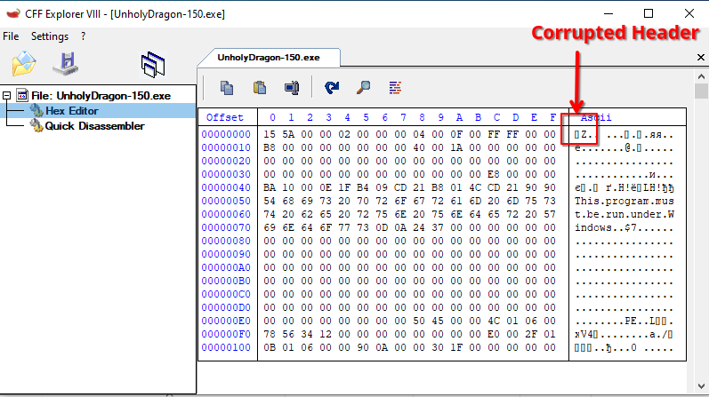
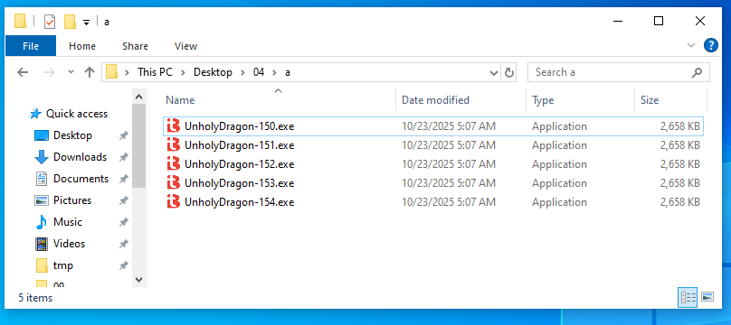
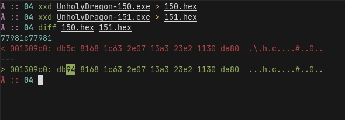
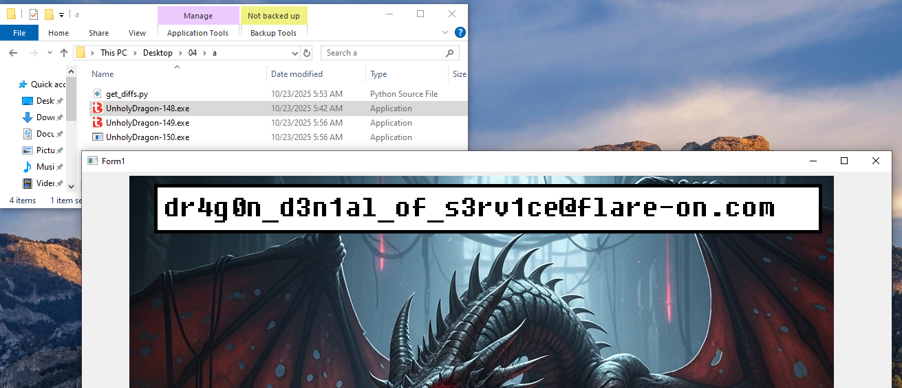

# 4 - UnholyDragon

**Time spent:** ~1 hour

**Tools used:** Python

Challenge 4 is a weird one.
I am not sure what the exact solution was supposed to be.

It starts of with the fact that this file is not runnable:


Opening it in CFF explorer reveals that indeed this is not a valid executable file, as it does not start with the typical `MZ` magic:



Patching the header back to `MZ` reveals two things.

First, the executable has an icon, which happens to be the default icon for applications compiled by the [twinBASIC](https://twinbasic.com/) compiler.

Secondly, now that it is a valid binary again, we can run it.
When we do this, this binary creates 4 copies of itself:



4 exact copies? Not exactly! Comparing the files we see that each file differs in exactly one byte at some seemingly random location:



Furthermore, we see that the file seems to be counting up.

This made me think, what happens if we rename the file such that it has the suffix `-0.exe` instead of `-150.exe`.


This results in many files being generated, some of them actually giving us some visual feedback, including random error messages and blank form windows popping up.
The interesting part of this, is that the chain stops at exactly 150 again, also with the exact same problem of the MZ header being corrupted.
Whatever change the program applies, it seems to be deterministically ending up again at corrupting the MZ header at 150.

I decided to see what bytes exactly change.

```python
base_name = "UnholyDragon-{}.exe"
first = 0
with open(base_name.format(first), "rb") as f:
    last = f.read()
for i in range(first+1, 151):
    with open(base_name.format(i), "rb") as f:
        current = f.read()
    for j in range(len(current)):
        if current[j] != last[j]:
            print(f"{i} has change at {j:#08x} ({last[j]:#02x} -> {current[j]:#02x})")
    last = current
```

```
Z:\> python .\get_diffs.py
1 has change at 0x16a3e0 (0x38 -> 0xc8)
2 has change at 0x02732f (0x3d -> 0x4b)
3 has change at 0x157cf1 (0x30 -> 0xd6)
4 has change at 0x014c93 (0x3c -> 0x50)
5 has change at 0x145654 (0xfb -> 0x20)
6 has change at 0x0025a3 (0xf9 -> 0x98)
7 has change at 0x132f64 (0xc0 -> 0x11)
...
148 has change at 0x0126ef (0x65 -> 0x6)
149 has change at 0x1430b1 (0xf3 -> 0x21)
150 has change at 0x000000 (0x4d -> 0x15)
```

The changes themselves don't really immediately struck me as a pattern (e.g., a simple XOR with a constant or similar), but the real test I wanted to do was to see if the offset or difference is related to the index of the binary, and, more importantly, whether operations are their own reverse.
This way, if I could apply the patches in reverse, I would be getting the supposed "original" binary.

To test this theory, I first tried renaming one working binary 149 to 148, and ran this renamed 148 a second time.

But once I did this, this randomly popped up:



I mean I'll take it but also... wat?

I don't really know why this worked.
I guess sometimes just fucking around a bit will get you very far..
