# 5 - ntfsm

**Time spent:** ~2 hour

**Tools used:** Ghidra

Challenge 5 is where we finally start reversing real binaries for this year.
You are presented with an executable of a whopping 16MB large.
Rather than diving into the code immediately, let's first get a feeling of what this thing is doing.


## Orientation

Running the binary without any parameters reveals two things.
Firstly, the program expects a password as the first commandline argument.
Secondly, there seems to be some interesting extra flag `-r` seemingly to reset the challenge "in case of weird behavior":


Typing in a password reveals that this password needs to be 16 characters long.

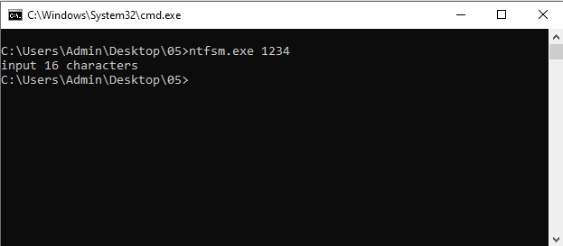

Typing 16 characters makes the program spasm out, show a bunch of new terminal windows to open and close, as well as pop up many message boxes with the text `"Hello there, Hacker!"`, before finally printing the text `wrong!`.

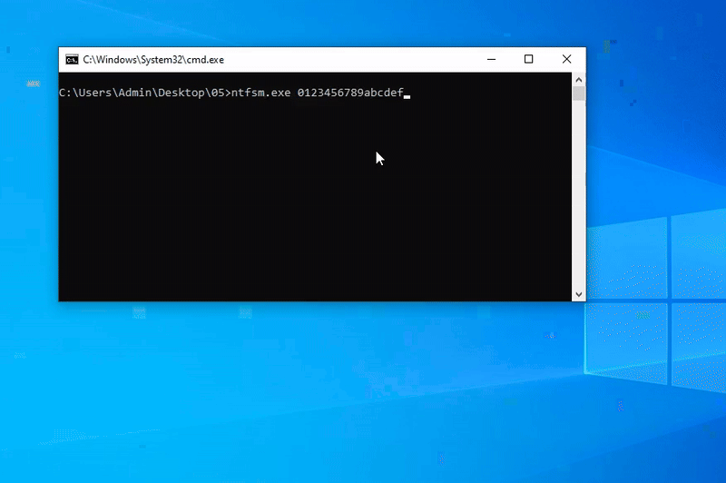

If you know anything about NTFS, the challenge name kind of implies already what may be going on.
NTFS has some interesting features, including [Alternate Data Streams](https://owasp.org/www-community/attacks/Windows_alternate_data_stream).
And indeed, after running the binary once with a 16 character password, you can run `dir /R` to reveal that 4 other data streams are created next to the binary:

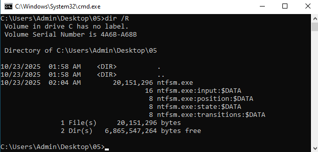

The names of these alternate data streams seem to indicate this is some kind of state machine.
But without knowing what this state machine looks like, we probably won't get much further than this.

Time to open Ghidra.


## Finding the State Machine

Given the pre-work that we just did, we have a fairly good sense of what to look for.
We want to find references to the names of the alternate data streams (i.e., `"input"`, `"position"`, `"state"` and `"transitions"`), as well as some APIs that write to files.

This turns out to be very straight forward, as these strings are immediately used in the main function of the program (`14000c0b0`):

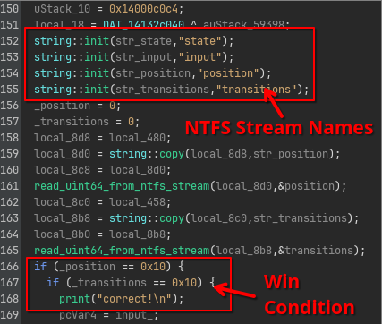

In this code, we can immediately identify based on the read function calls that the `position` and `transitions` data streams are merely containing a single `uint64`.
Furthermore, based on the if statements that follow that the win condition for this challenge is to make the values of both the `position` and `transitions` streams 16 (`0x10`).

A little further down we also see that `state` is also just an `uint64`:

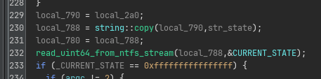

And as expected, this state variable is used to index into an `STATES` array (`140c687b8`) to handle the current state.

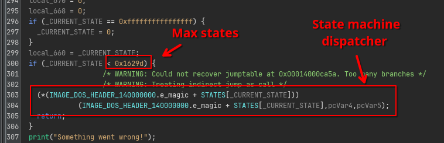

This state array is a bunch of RVAs that all point to the function implementing the code handling the current state:

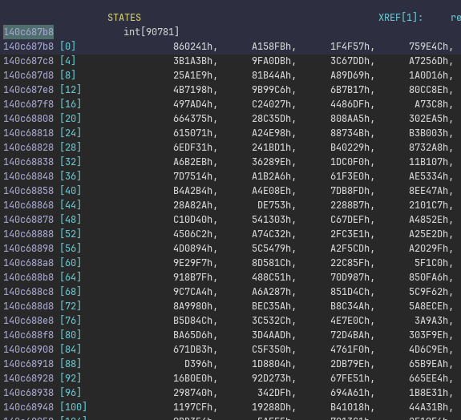

But there are 90781 states, way too many to explore on our own.
How do we navigate this?


## Reversing a Single State

When the number of states is this large, my initial intuition is always that this is not something we want to do manually.
However, more importantly, it is also very likely that the challenge author also did not make this many states manually either.
In other words, there must be a pattern that we can recognize and use to our advantage.
Therefore, let's just explore the first state and see if there are any similarities with other states.

If we look at state 0 (RVA `860241` and thus at `140860241`), we see that the decompiler has a bit of trouble understanding exactly what is going on.

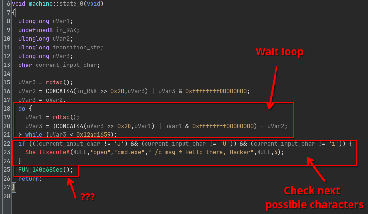

First, we see the state starts with a waiting loop that spins for some time.
Then, the state checks the current character for some options (in this case `J`, `U` or `i`).
Finally, it ends with a function call... except this is not really a function call.
If we look in the listing, we actually see this is a `JMP` instruction treated as a `CALL` by Ghidra's analyzer:

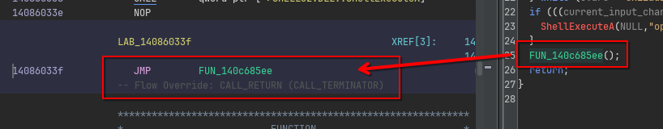

This happens sometimes when the control flow is "unusual enough" to Ghidra that it cannot resolve it to normal control flow structures like if statements, switches or loops.
Nothing to worry about though, we can adjust this by forcing Ghidra to treat this JMP as a branch, by right clicking on the instruction, and using `Modify Instruction Flow...` to force it as a `BRANCH` instead:

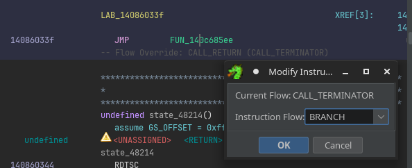

Now the code looks much cleaner:

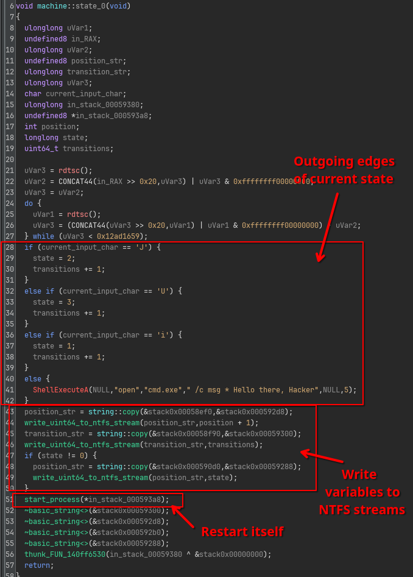

This code reveals some very important facts.

First, we see that the outgoing edges for this state 0 are now very clearly defined:
  - `J` points to state `2`
  - `U` points to state `3`
  - `i` points to state `1`.
  -  Anything else will result in a message `"Hello there, Hacker"` as we've seen before in our initial orientation step, and we remain in state `0`.

The second important fact here is that `transitions` variable is only updated when one of the outgoing edges is actually taken.
Recall from earlier that we needed both `position` and `transitions` to be equal to 10.
This implies we should never hit the `else` block of this long if chain.
This also means that, to get to our good boy message, we need to type in a password of 16 characters that result in exactly 16 valid transitions to be made in the state machine.


## Exploring the State Space

This challenge now has turned into a classic search problem that you can find in any CompSci algorithms course.
We need to parse the entire state machine implied by all edges, and use a search algorithm like Breath-First-Search to find all paths that are exactly 16 characters long.
We can all do this in a Ghidra script.

First, we need to extract the entry points of all state handler functions in the binary.
This is easy, because they are hardcoded in the huge array:

```java
final var ADDRESS_STATES = currentProgram
    .getAddressFactory()
    .getAddress("0x140c687b8");

var memory = currentProgram.getMemory();
var rvas = new int[90781];
memory.getInts(ADDRESS_STATES, rvas);
```

Second, we need to draw the edges between the states.
This means that for each state function, we need to extract the outgoing edges.
The key point here is to recognize that all relevant code for this looks more or less the same.
For example, the if statements look like the following:

```c
CMP        byte ptr [RSP + 0x3bb8c], 0x4a  // 'J'
JZ         LAB_1408602ce
CMP        byte ptr [RSP + 0x3bb8c], 0x55  // 'U'
JZ         LAB_1408602ef
CMP        byte ptr [RSP + 0x3bb8c], 0x69  // 'i'
JZ         LAB_1408602ad
JMP        LAB_140860310
```

Additionally, inside each referenced block, we should be seeing code that sets the `state` variable:

```c
MOV qword ptr [RSP + 0x58d30], <next state>
```

We can then start at state 0, find these instruction patterns and extract the outgoing edges, and add the newly discovered states to our stack until we discover no more new states.

```java
private HashMap<Integer, Map<Byte, Integer>> buildGraph(int[] rvas, FunctionManager manager) throws Exception {
    var machine = new HashMap<Integer, Map<Byte, Integer>>(); // state -> (byte -> state)
    var agenda = new Stack<Integer>();

    // Start exploring at state 0
    agenda.push(0);

    println("Parsing machine...");
    while (!agenda.isEmpty() && !monitor.isCancelled()) {
        int state = agenda.pop();
        monitor.setMessage("state_%d (total: %d/%d)".formatted(state, machine.size(), rvas.length));
        var address = currentProgram.getImageBase().add(rvas[state]);

        // Make sure there is a function at the address.
        var function = manager.getFunctionAt(address);
        if (function == null) {
            disassemble(address);
            createFunction(address, "state_%d".formatted(state));
        }

        // Parse the states (with pattern matching)
        var nextStates = parseNextStates(address);
        machine.put(state, nextStates);

        // Schedule the newly discovered states for processing.
        for (var entry : nextStates.entrySet()) {
            if (!machine.containsKey(entry.getValue()) && !agenda.contains(entry.getValue())) {
                agenda.push(entry.getValue());
            }
        }
    }
}

private Map<Byte, Integer> parseNextStates(Address address) throws Exception {
    // ...
}
```

This takes a couple seconds to run:

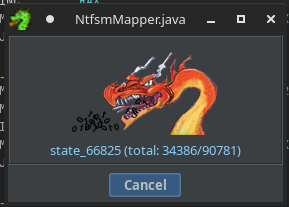

Once we have all the edges drawn, we can simply explore it up to a depth of 16:

```java
class State {
    public int state;
    public String path;

    public State(int state, String path) {
        this.state = state;
        this.path = path;
    }
}

var machine = buildGraph(rvas, manager);

var agenda = new ArrayDeque<State>();
agenda.add(new State(0, ""));

println("Exploring graph");
while (!agenda.isEmpty()) {
    var current = agenda.remove();

    if (current.path.length() == 16) {
        println(current.path);
        continue;
    }

    var transitions = machine.get(current.state);
    for (var transition : transitions.entrySet()) {
        byte c = transition.getKey();
        int target = transition.getValue();

        agenda.add(new State(target, current.path + (char) c));
    }
}
```

It so turns out this has exactly one solution:

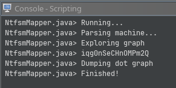

Plugging this in the original program reveals the flag:

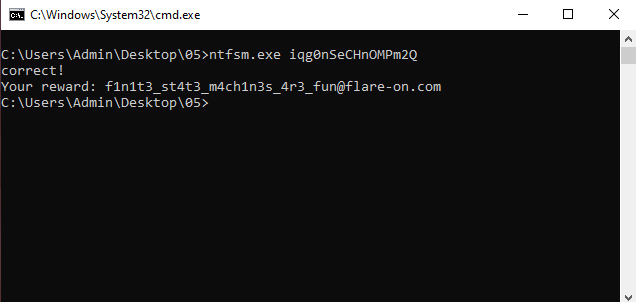
