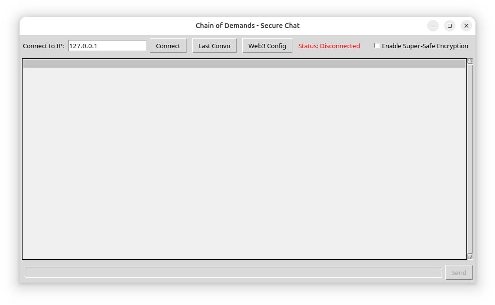
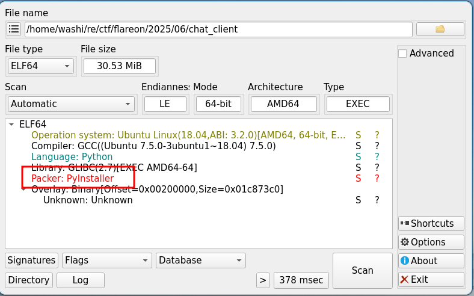
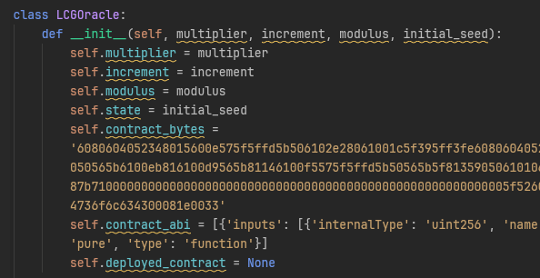
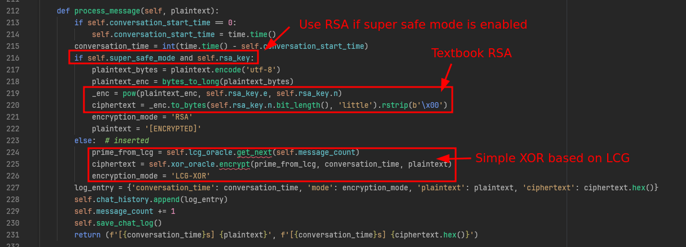

# 6 - Chain of Demands

**Time spent:** 3-4 hours

**Tools used:** Detect-it-Easy, pyinstxtractor, pylingual, Python, Metamask, sage

Challenge 6 is a Web-3 challenge... or well I think it intended to be.
I don't think I did anything substantially really with the Web-3 part, and frankly, I thought it was kind of a pointless extra step in this challenge.
Really, this challenge is more of the obligatory light cryptography challenge of this year, with some bells and whistles:



## Orientation

The program is a Linux ELF binary, taking the shape of a chat client.
There is an interesting button `Last Convo` which seems to contain some messages, some in plaintext and some seemingly encrypted:


A quick DIE check will tell you this is a PyInstaller executable:



As such we can run [pyinstxtractor](https://github.com/extremecoders-re/pyinstxtractor) to extract all the files.
This reveals a `challenge_to_compile.pyc` that likely contains the main code, which we can decompile using [PyLingual](https://pylingual.io).

- [decompiled.py](decompiled.py)

## ~~Understanding~~ Skipping the Web-3 Code

When taking a bird-eye's few of the resulting decompiled code, we can immediately see some obvious things.
For one, the Python code is not really obfuscated and has all the names intact.
In particular, the code is nicely separated into classes with very descriptive names:


Two of these classes, `LCGOracle` and `TripleXOROracle`, are extra interesting, because they seem to be deploying some hardcoded EVM bytecode onto a ethereum-based blockchain.



We could try and decompile the EVM bytecode, but I have had some pretty bad experiences with EVM decomilers (e.g., see [last year's web-3 challenge](../../2024/8/)) and I definitely did not want to go through that again.
Lucky for us, the names of the two contracts already give us a very big hint on what the two contracts may be implementing.
- **LCG** sounds like a [Linear Congruential Generator](https://en.wikipedia.org/wiki/Linear_congruential_generator), and
- **TripleXOR** kind of speaks for itself; it likely XORs three numbers together.

Therefore, instead of analyzing the code, I decided to deploy the contracts on a testnet and just fire it with some example inputs to see if they give me the expected results.
And indeed, with a bit of trial and error of the inputs you can figure out that the contracts really don't implement anything other than the code below:

```python
class LCGOracle:
    # ... (snip) ...

    def get_next_local(self, counter):
        x = self.state
        for i in range(counter):
            x = (self.multiplier * self.state + self.increment) % self.modulus

        return x


class TripleXOROracle:
    # ... (snip) ...

    def encrypt_local(self, prime_from_lcg : int, conversation_time: int , plaintext_bytes: str):
        pt = bytearray(plaintext_bytes.encode('utf-8'))

        # poor-man's version of a zero-pad :-)
        while (len(pt) % (256//8)) != 0:
            pt.append(0)

        result = prime_from_lcg ^ conversation_time ^ int.from_bytes(pt, 'big')
        ciphertext = result.to_bytes(256 // 8, 'big')

        return ciphertext
```

The nice thing about having fully local versions of the same functions is that we can use them however we want without needing any connection to some ethereum blockchain, and we can easily debug things as we go.

So how do these two oracles tie into all of this?


## Breaking the Cryptography

Let's look at how messages are processed in the chat.

If we look into `ChatLogic`, we can see a function called `process_message` which seems to handle all outgoing messages.
It first checks whether we are in "super safe mode" (which can be enabled using the checkbox in the main UI), and encrypts either using textboox RSA or an XOR using the LCG as the key stream:



Assuming that the messages that were sent under "super safe mode" contain the flag, we should figure out how to recover the parameters of the RSA scheme that was used.

Luckily, there is a function conveniently called `generate_rsa_key_from_lcg`, which generates the primes using an LCG with the same initial parameters as the non-super safe mode XOR cipher uses.

```python
    def generate_rsa_key_from_lcg(self):
        print('[RSA] Generating RSA key from on-chain LCG primes...')
        lcg_for_rsa = LCGOracle(self.lcg_oracle.multiplier, self.lcg_oracle.increment, self.lcg_oracle.modulus, self.seed_hash)
        lcg_for_rsa.deploy_lcg_contract()

        # ... (prime generation...)
```

This means, if we can figure out the LCG parameters, we can figure out the RSA parameters as well.
To do this, we are going to exploit a pretty well-known fact about LCGs: They are PRNGs that are not very strong.
In particular, given a sufficiently large sub-sequence of an output of the LCG, is it [possible to calculate the initial parameters](https://security.stackexchange.com/questions/4268/cracking-a-linear-congruential-generator) that were used to generate the sequence.

To recover the LCG sequence, we can refer to the messages that were sent prior to the enabling the super safe mode, and just revert the XOR operations:

```python
def recover_prime(message):
    plaintext = bytearray(message['plaintext'].encode('utf-8'))
    while (len(plaintext) % (256//8)) != 0:
        plaintext.append(0)
    ciphertext = int.from_bytes(bytes.fromhex(message['ciphertext']), 'big')
    conversation_time = message["conversation_time"]
    return conversation_time ^ int.from_bytes(plaintext, 'big') ^ ciphertext

with open("chat_log-orig.json", "rb") as f:
    messages = json.load(f)

lcg_sequence = []
for i, message in enumerate(messages):
    if message['mode'] == "LCG-XOR":
        prime = recover_prime(message)
        print(f"recovered prime_for_lcg {i}: {prime}")
        lcg_sequence.append(prime)
```

This gives us the following output:
```
recovered prime_for_lcg 0: 72967016216206426977511399018380411256993151454761051136963936354667101207529
recovered prime_for_lcg 1: 49670218548812619526153633222605091541916798863041459174610474909967699929824
recovered prime_for_lcg 2: 71280768003266775309606950462778030896956536610993788270598595159221463714935
recovered prime_for_lcg 3: 52374492464889938543708223275193226150102478572181009159069287723157087096395
recovered prime_for_lcg 4: 46151066309228226342793435233510111804521449597151473094879900544455543844821
recovered prime_for_lcg 5: 27616895455297410644582736481740143600211650471053558274523739523026009484149
recovered prime_for_lcg 6: 20017674779830364175685710279350076931283727675441675047445679766035806574277
```

Now it is just a matter of calculating the original LCG parameters.
I used [this sage script](https://github.com/jvdsn/crypto-attacks/blob/master/attacks/lcg/parameter_recovery.py) made by Joachim Vandersmissen to do the attack for me:

```python
lcg_sequence = [ ... ]
m, a, c = attack(lcg_sequence)
print("m:", m)
print("a:", a)
print("c:", c)
```

```
m: 98931271253110664660254761255117471820360598758511684442313187065390755933409
a: 11352347617227399966276728996677942514782456048827240690093985172111341259890
c: 61077733451871028544335625522563534065222147972493076369037987394712960199707
```

Now it is a matter of just copying the RSA prime-generation setup from the original code:

```python
lcg_for_rsa = LCGOracle(a, c, m, lcg_sequence[0])
primes_arr = []
rsa_msg_count = 0
iteration_limit = 10000
iterations = 0
while len(primes_arr) < 8 and iterations < iteration_limit:
    candidate = lcg_for_rsa.get_next(rsa_msg_count)
    rsa_msg_count += 1
    iterations += 1
    if candidate.bit_length() == 256 and isPrime(candidate):
        primes_arr.append(candidate)
        print(f'[RSA]  - Found 256-bit prime #{len(primes_arr)}')

print("RSA primes:", primes_arr)
```

And setting up the RSA parameters:

```python
# Compute N
n = 1
for p_val in primes_arr:
    n *= p_val

# Compute phi(N)
phi = 1
for p_val in primes_arr:
    phi *= p_val - 1

e = 65537

# Compute d
d = pow(e, -1, phi)
print("private exponent:", d)

rsa_key = (n, e, d)
```

This gives us the private exponent!

```
private exponent: 408599050485147133930767233430413978655257612710135153168273990792733332222023383537084343938624888052331140167043994780272420296649631220447629707453032309674071734121420403117626143851136202270671749740801537352380131635644480422741211500961907535268569225180465965401238694907163887762969987647945141703704590213215531211109592147609237999064478525814861748324172051497546372345848605784495504250344645009780532379115238106580664787074369315526193371280752638059770899370467506117875387654047057016750420937132009931690819615841312986782965972346288725209519657101335343465038159566777477566962043163421764943873
```

## Getting the Flag

We can now decrypt each RSA encrypted message:

```python
with open("chat_log-orig.json", "rb") as f:
    messages = json.load(f)

for message in messages:
    if message['mode'] == "RSA":
        ciphertext = int.from_bytes(bytes.fromhex(message['ciphertext']), 'little')
        decrypted = pow(ciphertext, d, n)
        print(decrypted.to_bytes(n.bit_length(), 'big').strip(b'\0'))
```

... revealing the flag:
```
b"Actually what's your email?"
b"It's W3b3_i5_Gr8@flare-on.com"
```

## Final Words

This challenge was a bit strange.
I am not sure what the Web-3 component really added to the whole thing, especially considering you really didn't need much from it.
It really was just a broken crypto challenge.
If it were up to me, the Web-3 part could've been removed and the challenge was probably more fun.
But maybe that's because I just don't like Web-3 all that much in general.

Oh well..
