# 7 - The Boss Needs Help

**Time spent:** ~1 hour

**Tools used:** Wireshark, Ghidra, x64dbg, Python


Challenge 7 is arguably the most (and only) malware-related challenge for this year.
You are given a network capture and an executable that is supposedly responsible for transmitting the captured network traffic.
The task is to figure out what has happened, reverse the protocol and decrypt the network traffic.


## Orientation

Opening the pcap in Wireshark, we can see that effectively the traffic is separated in two parts.
First it performs some kind of handshake by making a HTTP GET request to `twelve.flare-on.com:8000`.
Then it follows up with a series of HTTP POST and GET requests to both `/get` and `/re` hosted on  `theannualtraditionofstaringatdisassemblyforweeks.torealizetheflagwasjustxoredwiththefilenamethewholetime.com:8080`.
We can dump all the objects in the network stream by going to `File > Export Objects... > HTTP`.

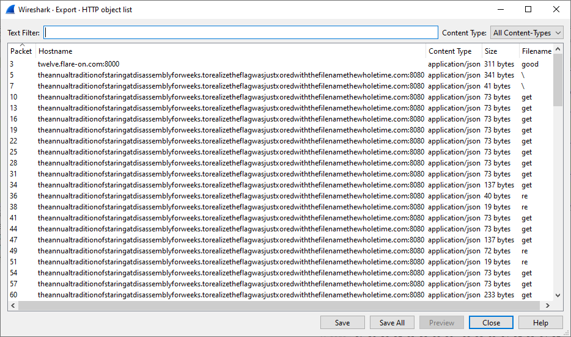

Quickly clicking through these reveals that all of them are JSON files.
More interestingly, we see that most messages are actually the same, only very occasionally the response of a request to `/get` results in a different output:

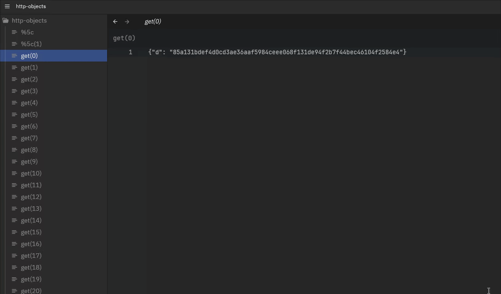

This already tells me a couple of things:
- The protocol is probably very simple encryption-wise, with no running stream cipher keys that change on every message.
- Assuming this is network traffic to a C2 server, the `/get` requests likely are polling for a command. Most responses are very small, only occasionally the response gets larger.
- Additionally, whenever a `/get` results in a bigger response, it is immediately followed by a POST to `/re`.

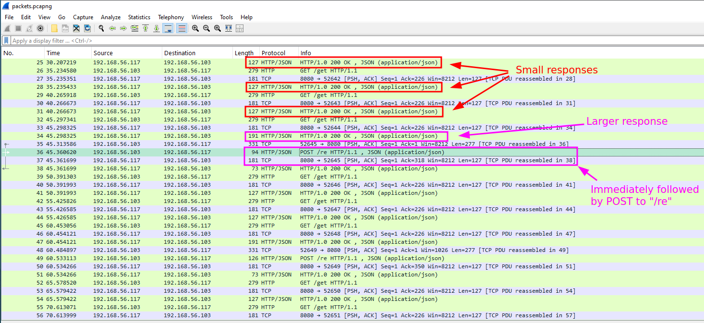
  
- This likely indicates that whenever `/get` actually returns a command to execute, the `/re` endpoint is likely used to send the result to.

We can quickly emulate the server to poke around a bit more.
If we create a folder with a file called `good` that has the exact same response data as is seen in the PCAP, we can quickly spin up a HTTP server using `python -m http.server 8000` to replay the messages (don't forget to add the two host names to your hosts file in `C:\Windows\System32\drivers\etc\hosts`).

If we do this, however, we observe that the program crashes with a JSON error:

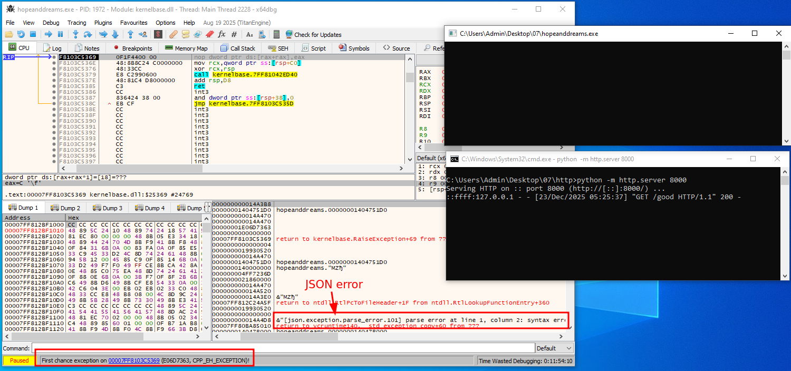

Considering the response is exactly the same, likely this means two things: 
- Since we get a JSON parse error while the response put into the `good` file is valid JSON data, it likely means the program tried to decrypt and interpret the data in the `d` field of the repsonse as JSON as well.
- Since the parse failed, the decryption probably failed as well. Since we sent the exact same response as in the packet capture, the protocol must therefore have some random component (e.g., a time or environment-based parameters) to it that we don't understand yet.

Time to dive into the program!


## Initial Understanding of Code

However, opening the program in Ghidra does not promise a great time.
The code seems to be heavily obfuscated.

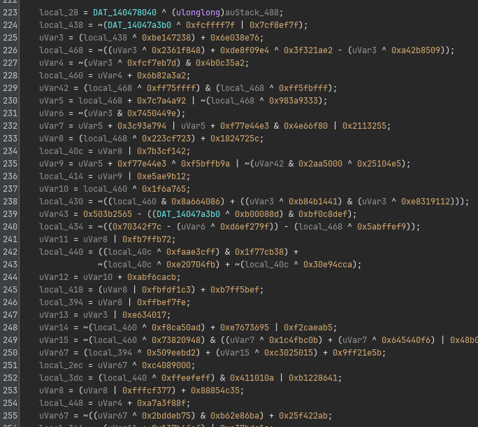

I don't want to read all of that.

Scrolling down a little bit though, we see occasionally a couple calls appearing in between the huge amount of junk:

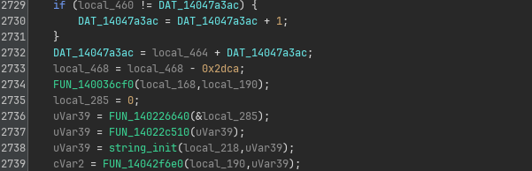

Let's try to figure out which one of these results in some network traffic.

We know that the program at some point makes some connection to `twelve.flare-on.com`, which means the program eventually must call [getaddrinfo](https://learn.microsoft.com/en-us/windows/win32/api/ws2tcpip/nf-ws2tcpip-getaddrinfo) to resolve the host name to an IP.
If we set a breakpoint on this and step through the code of `main`, we can quickly figure out that the call to `FUN_140081590` at `0x140210ee5` eventually makes the call to it.

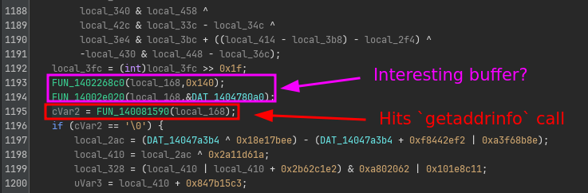

We also see that this function takes in some data as parameter (`local_168`), which is also referenced in the function call right before it.
This other function call references some global buffer `DAT_1404780a0`.
Looking into the debugger, we can see it may be containing our PC's username:

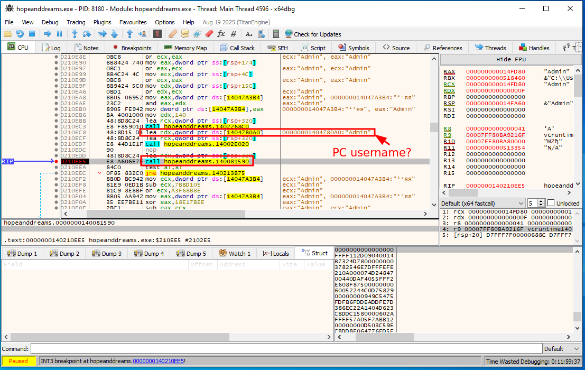

This likely means `FUN_14002e020` is some kind of `strcpy` or `memcpy`.
Cross-referencing on `DAT_1404780a0` reveals that it is also used in `FUN_1400010f0`, which looks like an initialization function, surprisingly not obfuscated at all:

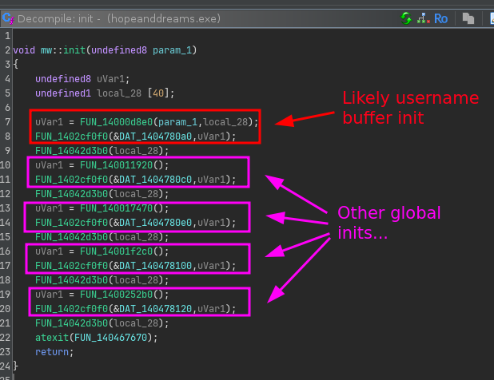

We see that `FUN_14000d8e0` is likely responsible for getting the username.
Let's verify this.

Opening up the function reveals a lot of the same obfuscation as we've seen before.
However, scrolling down we can see that there's indeed a call to `GetUserNameA` somewhere in the middle.

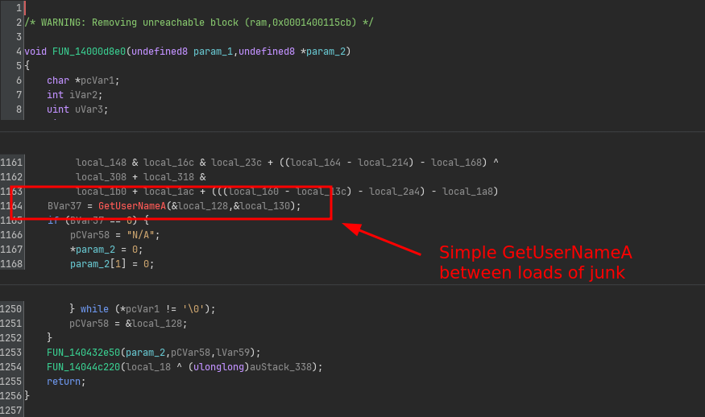

Given that the obfuscated parts of the code looks exactly like all other obfuscated code we've seen so far, this confirms that the obfuscation applied to each function is really not that complicated.
It is basically just the original code, but with a bunch of junk added around it.

```
<junk>
<real statement>
<junk>
<real statement>
<junk>
...
```

Moving forward, we can therefore just assume that most code is completely irrelevant to us, and we should just focus on the important bits like calls to other functions.

With this process, we can quickly figure out the meaning of the other globals as well:

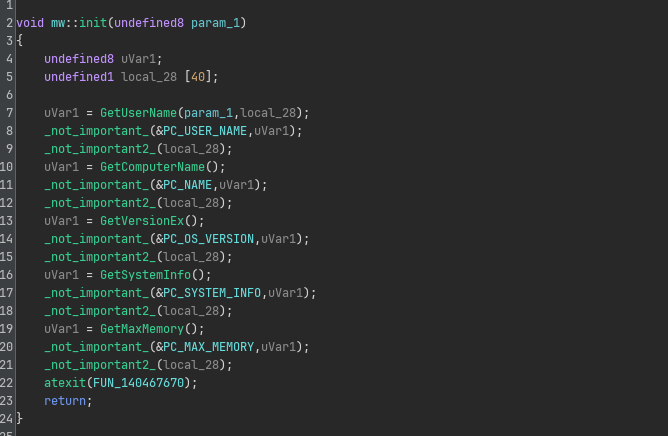


## Initial GET   

Let's restart the program in x64dbg and apply the same process to the handshake handling function (`FUN_140081590`), by just jumping over all the junk blocks every time, and skipping to the next call to see what we observe going in and out of it.
When you do this, you will quickly notice that some of these functions are merely just returning strings.

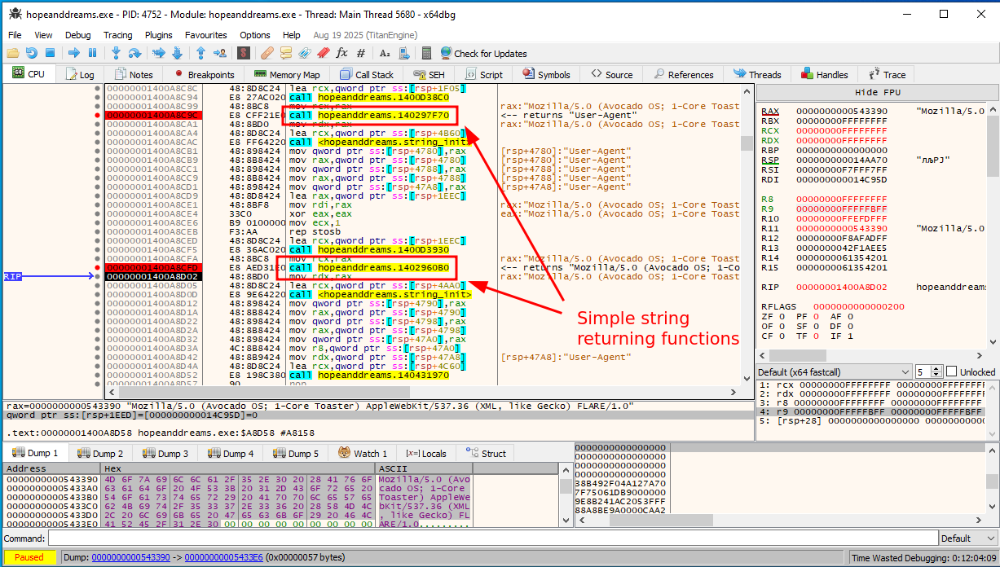

In particular, somewhere down the road, things get interesting when we see a very typical HTTP authorization header being constructed:

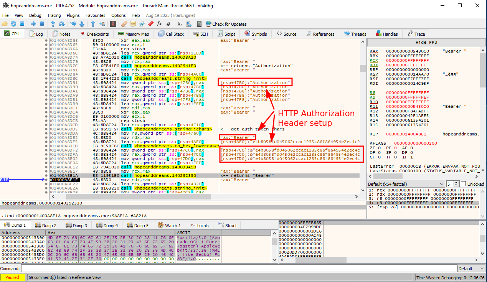

The authorization token here does not match the one found in the PCAP.
Furthermore, it seems that when you run this program a few times, the token changes as well.
This likely means the token is indeed dependent on some environmental parameters.

If we restart the program a second time and go to beginning of the initial handshake function (`FUN_140081590`), we can see the first clue to this.
We see a call to `strftime` which formats the current time in `YYYYmmddHH` format:

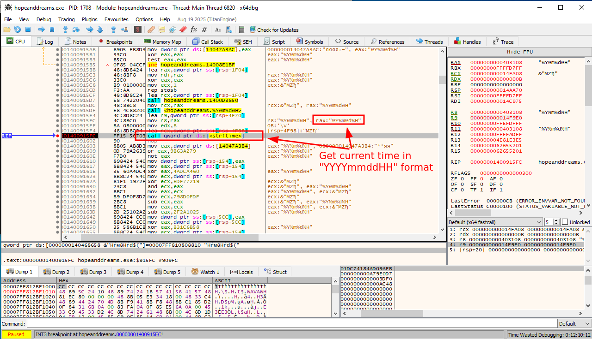

Moving down a bit further, we see that at `0x140098031` the program constructs another string in the format `user@hostname`:

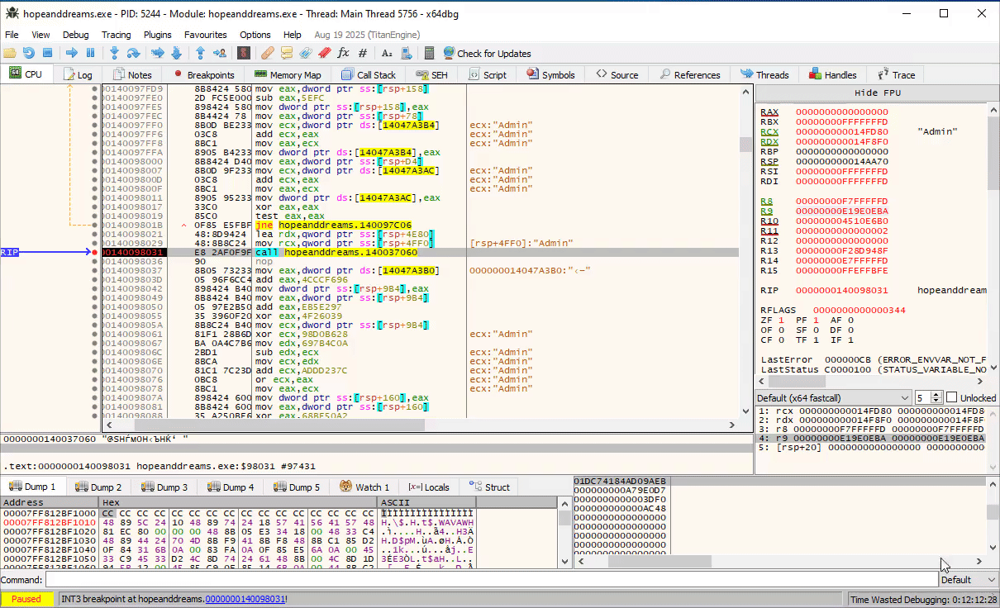

Further down, we see at `0x14009b8c8` the two strings are concatenated:

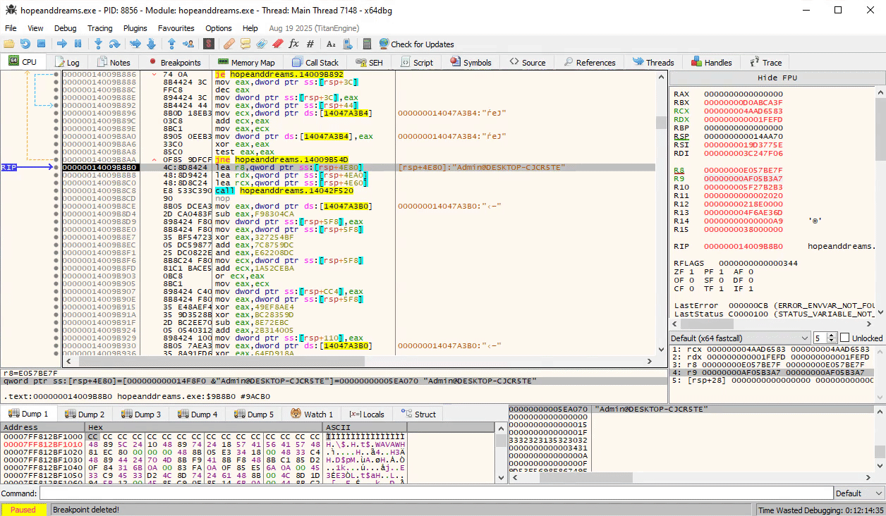

Even further down, we see our concatenated string pop up again around address `0x1400A54B8`, where it is passed into a function `FUN_1400A54B8` that seems to be producing the final authentication token in binary format:

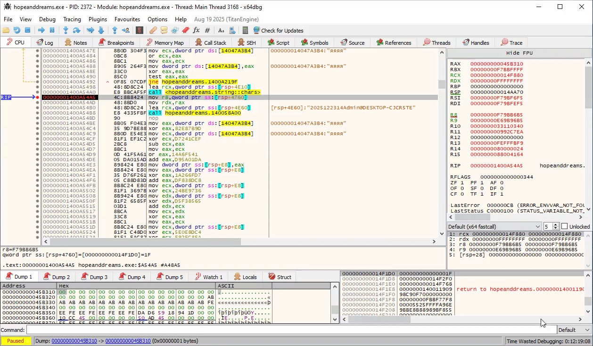

Diving into this function in Ghidra, reveals that this is nothing more than just a simple substitution cipher on a hardcoded table:

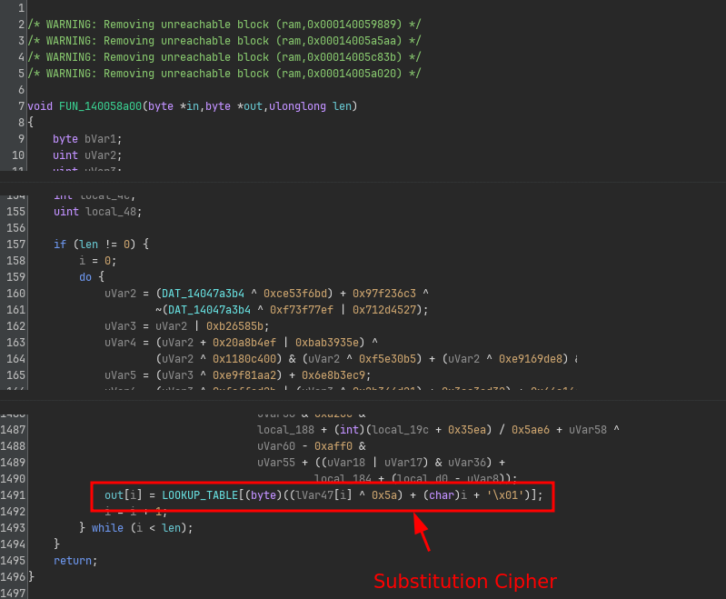

So to summarize the initial handshake of the protocol is equivalent to the following Python code:

```python
import time
import socket
import os

LOOKUP_TABLE =  b'\x52\x09\x6a\xd5\x30\x36\xa5\x38\xbf\x40\xa3\x9e\x81\xf3\xd7\xfb\x7c\xe3\x39\x82\x9b\x2f\xff\x87\x34\x8e\x43\x44\xc4\xde\xe9\xcb\x54\x7b\x94\x32\xa6\xc2\x23\x3d\xee\x4c\x95\x0b\x42\xfa\xc3\x4e\x08\x2e\xa1\x66\x28\xd9\x24\xb2\x76\x5b\xa2\x49\x6d\x8b\xd1\x25\x72\xf8\xf6\x64\x86\x68\x98\x16\xd4\xa4\x5c\xcc\x5d\x65\xb6\x92\x6c\x70\x48\x50\xfd\xed\xb9\xda\x5e\x15\x46\x57\xa7\x8d\x9d\x84\x90\xd8\xab\x00\x8c\xbc\xd3\x0a\xf7\xe4\x58\x05\xb8\xb3\x45\x06\xd0\x2c\x1e\x8f\xca\x3f\x0f\x02\xc1\xaf\xbd\x03\x01\x13\x8a\x6b\x3a\x91\x11\x41\x4f\x67\xdc\xea\x97\xf2\xcf\xce\xf0\xb4\xe6\x73\x96\xac\x74\x22\xe7\xad\x35\x85\xe2\xf9\x37\xe8\x1c\x75\xdf\x6e\x47\xf1\x1a\x71\x1d\x29\xc5\x89\x6f\xb7\x62\x0e\xaa\x18\xbe\x1b\xfc\x56\x3e\x4b\xc6\xd2\x79\x20\x9a\xdb\xc0\xfe\x78\xcd\x5a\xf4\x1f\xdd\xa8\x33\x88\x07\xc7\x31\xb1\x12\x10\x59\x27\x80\xec\x5f\x60\x51\x7f\xa9\x19\xb5\x4a\x0d\x2d\xe5\x7a\x9f\x93\xc9\x9c\xef\xa0\xe0\x3b\x4d\xae\x2a\xf5\xb0\xc8\xeb\xbb\x3c\x83\x53\x99\x61\x17\x2b\x04\x7e\xba\x77\xd6\x26\xe1\x69\x14\x63\x55\x21\x0c\x7d'

timestamp = time.strftime("%Y%m%d%H")
name = os.getlogin()
host = socket.gethostname()

plaintext = f"{timestamp}{name}@{host}"
token = bytes([LOOKUP_TABLE[(ord(c) ^ 0x5a + i + 1) & 0xFF] for i, c in enumerate(plaintext)])

print(token.hex())
```

Given that these operations are all 100% reversible, we can use the original bearer token as seen in the PCAP to recover the original plaintext and thus the environmental data the program was originally running under:

```python
INVERSE_LOOKUP_TABLE = bytearray(len(LOOKUP_TABLE))
for i in range(len(LOOKUP_TABLE)):
    INVERSE_LOOKUP_TABLE[LOOKUP_TABLE[i]] = i

bearer = bytes.fromhex("e4b8058f06f7061e8f0f8ed15d23865ba2427b23a695d9b27bc308a26d") # From PCAP
plaintext = bytes([((INVERSE_LOOKUP_TABLE[b] - (i + 1)) & 0xFF) ^ 0x5a for i, b in enumerate(bearer)]).decode()
timestamp_length = len("YYYYmmddHH")
timestamp = plaintext[:timestamp_length]
[user, host] = plaintext[timestamp_length:].split('@')

print(f"{timestamp=}")
print(f"{user=}")
print(f"{host=}")
```

This gives us the following output:

```
timestamp='2025082006'
user='TheBoss'
host='THUNDERNODE'
```

If we now patch the program (either at runtime or by rewriting some of the x86 code), we can see that indeed the program does not crash anymore with these parameters.
In fact, if you follow the program, you will see that at `0x1400B952A` the response is successfully decrypted now:

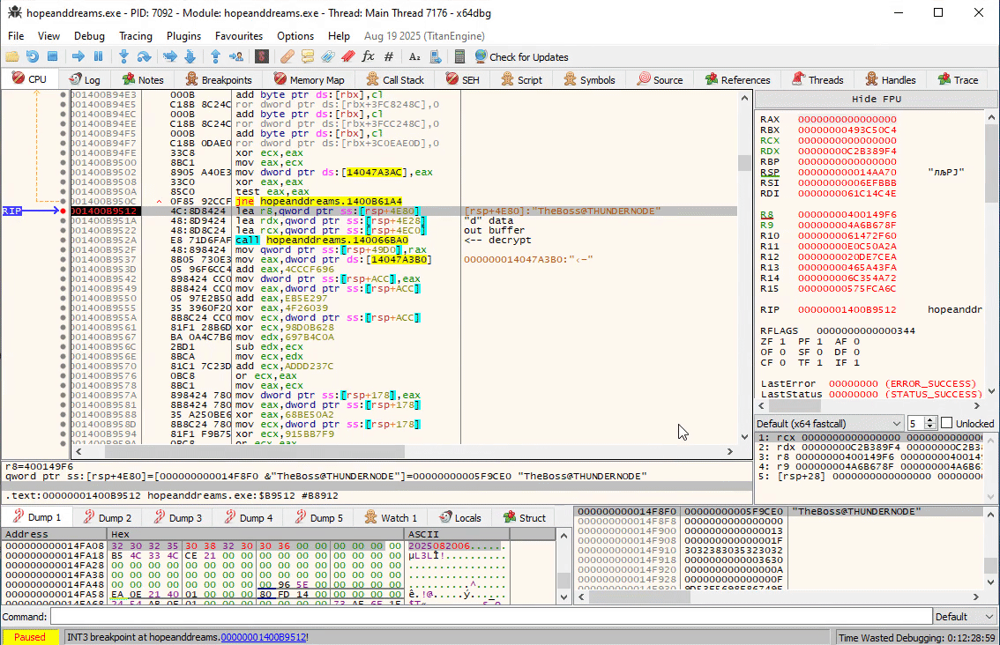

```json
{"sta": "excellent", "ack": "peanut@theannualtraditionofstaringatdisassemblyforweeks.torealizetheflagwasjustxoredwiththefilenamethewholetime.com:8080"}
```

We don't really know the algorithm that was used, but we don't really care.
We have plaintext output which confirms we have replayed the handshake correctly.
We can clearly see the user that connected to our PC is called `peanut` and the next host to connect to is `theannualtraditionofstaringatdisassemblyforweeks.torealizetheflagwasjustxoredwiththefilenamethewholetime.com`.


## First POST

From here on out, it is mostly the same process.
Keep jumping to the next call in x64dbg, follow the breadcrumbs until some meaningful data shows up.

The next big function call in `main` happens at `000000014021E7BB`.
This one has a very similar setup to our initial handshake, with one sneaky difference.
Again, it collects some environmental data including username and hostname, however, this time the `strftime` call (at `0x1400E43BC`) is called with just `%H` as the format specifier:

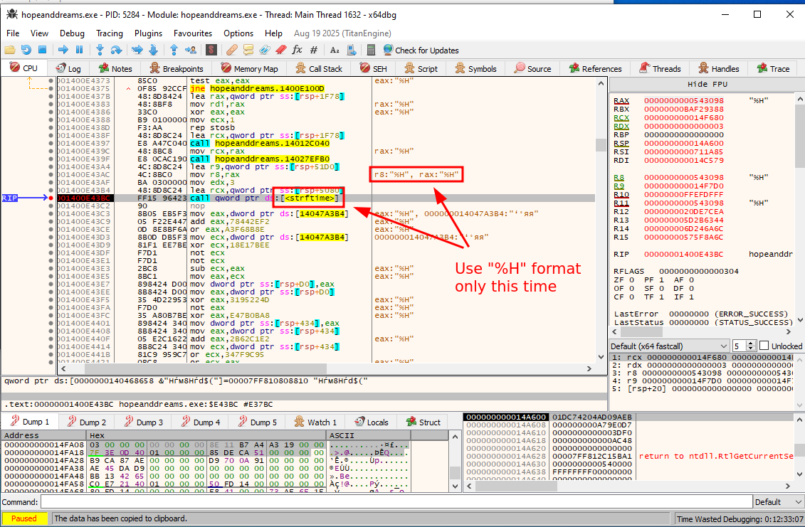

Furthermore, it uses a more complicated key algorithm setup that is equivalent to XORing two SHA-256 hashes together:

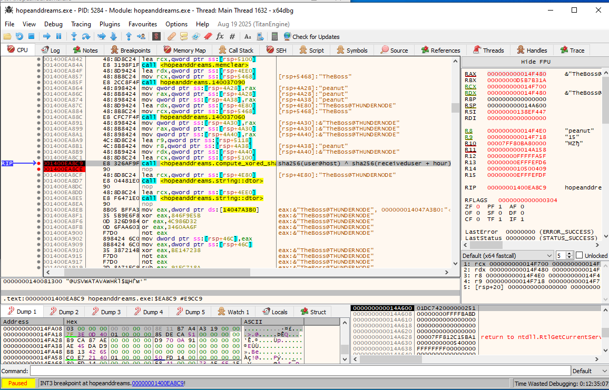

The key derivation is equivalent to the following pseudocode:

```python
sha256(user@host) ^ sha256(receiveduser + hour)
```

For example:
```python
sha256("TheBoss@THUNDERNODE") ^ sha256("peanut06")
```

The expected resulting key is:
```
95 AF 8B 09 5B 74 65 F9 05 9D 03 58 BA CC 22 38 50 40 59 A0 BD 79 B4 9B 67 90 A6 62 0A DD 6D 96
```

This is then finally fed into an AES key expansion algorithm (at `0x1400FE1ED`) with this key, and encrypted using CBC mode with IV = `00 01 02 03 04 05 06 07 08 09 0A 0B 0C 0D 0E 0F` (at `0x140101627`).

Decrypting it is straightforward, just reverse it in Python:

```python
def construct_aes_key(userhost, user, hour: int):
    h1 = hashlib.sha256(userhost.encode()).digest()
    h2 = hashlib.sha256(f"{user}{hour:02}".encode()).digest()
    return bytes(a ^ b for a, b in zip(h1, h2))

def aes_decrypt(encrypted_data: bytes, user, hour) -> bytes:
    iv = bytes.fromhex("00 01 02 03 04 05 06 07 08 09 0A 0B 0C 0D 0E 0F")
    key = construct_aes_key("TheBoss@THUNDERNODE", user, hour)
    cipher = AES.new(key, AES.MODE_CBC, iv=iv)
    return unpad(cipher.decrypt(encrypted_data), 16)
    
data = bytes.fromhex("3b001a3d06733da13984c89fe99ffc936128497575d01feab284eba5da0bd909d11be82b443705dc61cd307635ff27998d65e911837716ed7c190504472831cc78c19f578ff339cfa7e046695a98fcb4bfaf4a586294a86c72113d06733e3542c14dc0451af3fc79b1f1a2e9b26e4723a21a5b632b1d434e51ab070cb53373fcff024ba26f9cfd673284fc47bd768e2262a394559ff0194b9b4103951f14bcb8")

print(aes_decrypt(data, "peanut", 6))
```

This reveals that the second POST message is just a collection of PC metadata sent to the C2:

```json
{"ci":"Architecture: x64, Cores: 3","cn":"THUNDERNODE","hi":"TheBoss@THUNDERNODE","mI":"6137 MB","ov":"Windows 6.2 (Build 9200)","un":"TheBoss"}
```

Since we know our replay is perfect, we can set up a second server (this time hosted on port 8080) that just responds with the expected result.

```python
from flask import Flask

app = Flask(__name__)

@app.route("/", methods=["GET", "POST"])
def post():
    return '{"d": "5134c8a46686f2950972712f2cd84174"}'
```


## C2 loop

Finally, we get to the real meat of the C2 communication. 

I decided to just try decrypting everything with the same scheme as the previous `POST` message.

```python
base_dir = "./dumps/http-objects"
for file in sorted(os.listdir(base_dir)):
    with open(f"{base_dir}/{file}", "rb") as f:
        encrypted_json = json.load(f)
        if "d" not in encrypted_json:
            continue

    encrypted_data = bytes.fromhex(encrypted_json["d"])
    print(f"--- {file} ---")
    try:
        print(aes_decrypt(encrypted_data, user, host, "peanut", 6).decode())
    except ValueError as e:
        print(f"ERROR password {candidate} failed: {e}")
    print()
```

And it turns out, this already decrypts most of the messages:

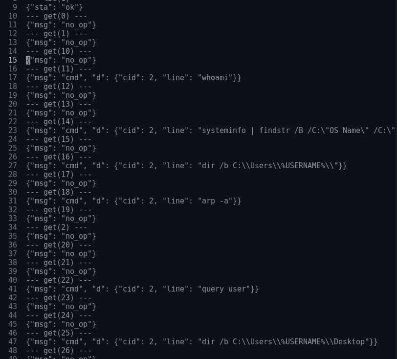

Clearly, our suspicions of this being a remote shell polling for commands are correct.

However, not all messages decrypt properly.
After a while, we see a command with `cid=6`, and after it all further decryptions seem to fail:

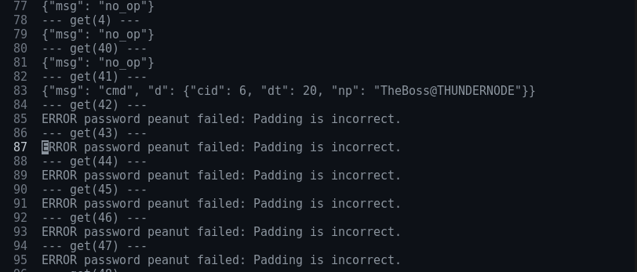

A sudden decryption failure likely means either the encryption algorithm changed, or simply the key changed.

Looking at this command, we see that it contains the string `np` with `"TheBoss@THUNDERNODE"` as a hardcoded value:

```json
{"msg": "cmd", "d": {"cid": 6, "dt": 20, "np": "TheBoss@THUNDERNODE"}}
```

Before diving deep into the code, I decided to just guess that command ID `6` means 'Change password", and that one of the parameters for constructing the key thus had changed to `"TheBoss@THUNDERNODE"`.

I changed the code as follows:

```python
candidate_passwords = ["peanut", "TheBoss@THUNDERNODE"]

base_dir = "./dumps/http-objects"
for file in sorted(os.listdir(base_dir)):
    with open(f"{base_dir}/{file}", "rb") as f:
        encrypted_json = json.load(f)
        if "d" not in encrypted_json:
            continue

    encrypted_data = bytes.fromhex(encrypted_json["d"])
    print(f"--- {file} ---")
    for candidate in candidate_passwords:
        try:
            print(aes_decrypt(encrypted_data, user, host, candidate, 6).decode())
            break
        except ValueError as e:
            print(f"ERROR password {candidate} failed: {e}")
    else:
        print("ERROR Failed to decrypt")
```

Success! 

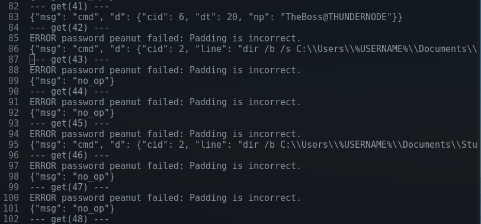

Well.. almost. Seems like there is another password change, this time to `"miami"`:

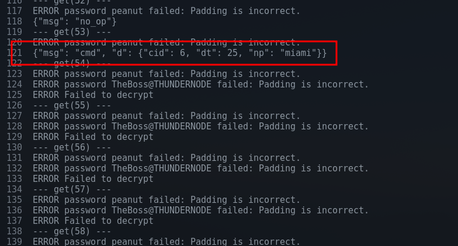

No problem, adding `miami` to our candidate passwords:

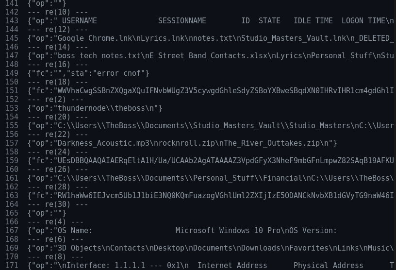

Now [everything is decrypted!](https://github.com/Washi1337/ctf-writeups/tree/master/writeups/flare-on/2025/7/dumps/decrypted)


## Getting the Flag

Browsing through some of the repsonses, we can clearly see some base64 encoded data.

In particular, two pop out immediately.
First, the base64 blob stored in [re(24)](dumps/decrypted/re(24)) is very large, and seems to contain an encrypted ZIP file after decoding.

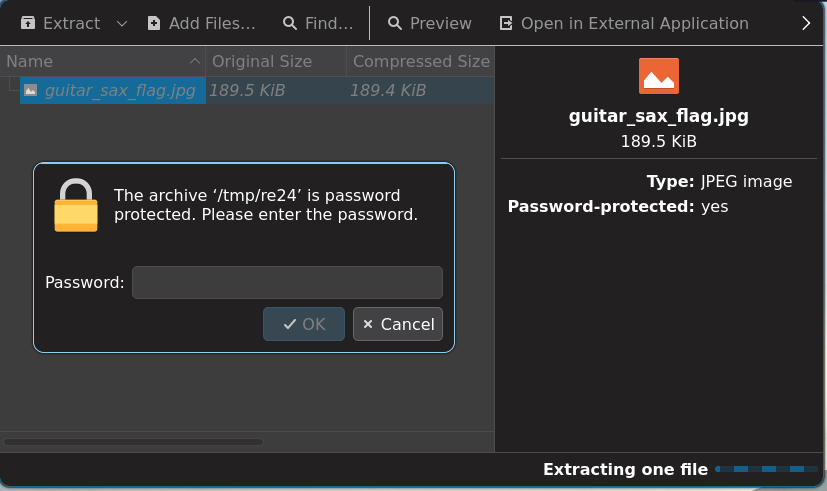

Another base64 blob stored in [re(28)](dumps/decrypted/re(28)) seems to contain passwords:

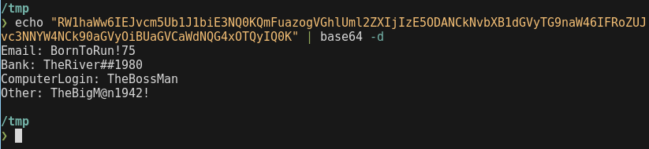

It so turns out `TheBigM@n1942!` works on the ZIP archive...


... revealing the flag!


## Final Words

This was the best challenge in the series.
It was a very nice scavenger hunt of following calls and searching for breadcrumbs in the huge mess of x86 code.
The obfuscation looked very scary at first, but once you realize the pattern that most of it is junk and you can just focus on the calls, the challenge actually becomes fairly straightforward, not requiring any deobfuscation!

As a sidenote, I love that someone actually registered the [http://theannualtraditionofstaringatdisassemblyforweeks.torealizetheflagwasjustxoredwiththefilenamethewholetime.com](http://theannualtraditionofstaringatdisassemblyforweeks.torealizetheflagwasjustxoredwiththefilenamethewholetime.com) domain.
I learned about this after solving the challenge. I don't know if this was done by the organizers, or by someone else, but it redirects to a Rickroll.

Even after finishing flare-on, I still seem to be able to get rickrolled by a challenge.

One more for the [bingo card](https://washi.dev/bingo.html) :).

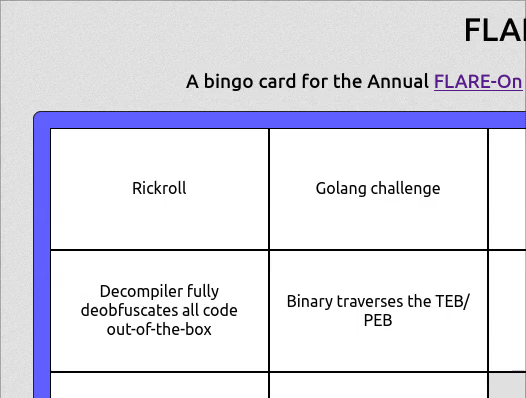
