# 8 - FlareAuthenticator

**Time spent:** ~1 day

**Tools used:** Ghidra, GhidraScript, x64dbg, Python

Challenge 8 is arguably one of the trickiest in the series.
It is a Qt application asking for a 25-digit pass code:

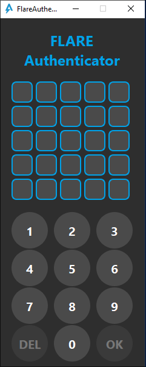

However going to the main function we can already get a taste of how badly obfuscated this entire program is:

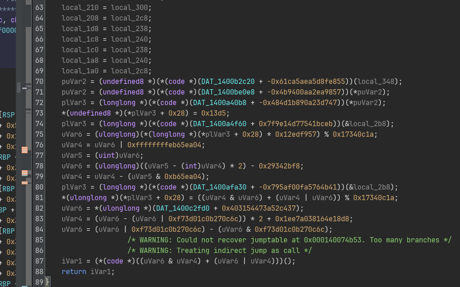

Let's dive into how this obfuscation works.


## Recovering the Control Flow Graph

As the code of this binary seems very fragmented and all over the place, my first goal was to get an idea how control flow is realized.
If we look in the listing of the main function, we can see at the very end "end" a `JMP RAX` instruction:

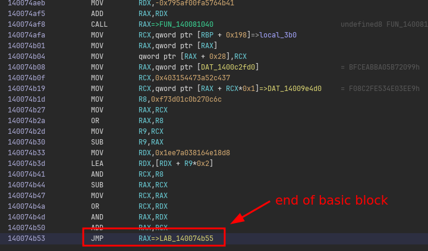

If we can figure out all possible values that `RAX` can take, we know the outgoing edges of this "basic block".
This means we need to figure out all the expression that is responsible for computing the value of `RAX` so that we can emulate this.
Effectively, this means we need to go back up the listing until we find the start of the expression, and then execute the program as normal.

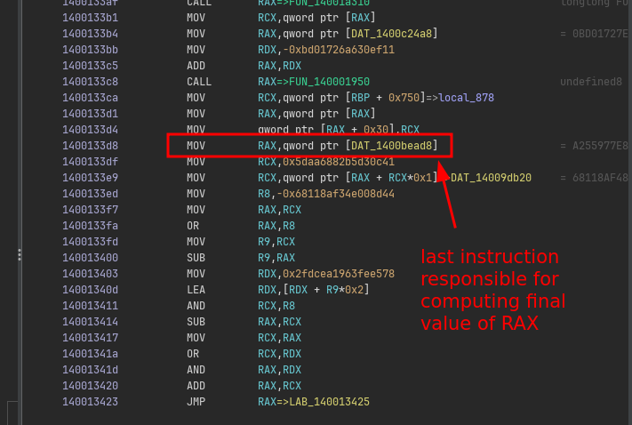

To do this automatically, we can apply some basic version of [liveness analysis](https://en.wikipedia.org/wiki/Live-variable_analysis) on the general purpose registers.
Starting at the address of `JMP RAX`, we can treat `RAX` as an unknown variable and put it in a pool of unknown registers that are still unaccounted for.
Then, going up in the listing, we iteratively update this pool of unaccounted registers based on each instruction's data flow, and continue until all registers are fully accounted for (that is, the unaccounted registers pool is empty):

```java
private FooterInfo findFooterExpression(Address address) throws Exception {
    Address start = null;

    // Move backwards until all registers were accounted for.
    var unboundedRegisters = new HashSet<String>();
    boolean first = true;
    for (var instr: currentProgram.getListing().getInstructions(address /* jmp rax address */, false /* going backwards */)) {
        if (!first && unboundedRegisters.isEmpty()) {
            // All registers were accounted for, we found the start address.
            start = instr.getAddress().add(instr.getLength());
            break;
        }

        // Update current liveness of all registers based on the current instruction.
        first = false;
        updateLiveness(instr, unboundedRegisters);
    }

    // ...
    return new FooterInfo(start, address, ...);
}
```

The nice thing of Ghidra's API is that it can tell you for an arbitrary instruction which _objects_ would be taken in as input and which would be modified after executing the instruction.
This makes the implementation of `updateLiveness` rather trivial.
For every instruction, we can ask Ghidra which result objects are registers, and remove them from the unaccounted register pool.
Similarly, we need to put all input registers back to the unaccounted register pool:

```java
private void updateLiveness(Instruction instr, HashSet<String> unboundedRegisters) {
    for (var obj: instr.getResultObjects()) {
        if (obj instanceof Register reg && GPR.containsKey(reg.getName())) {
            unboundedRegisters.remove(GPR.get(reg.getName()));
        }
    }

    for (var obj: instr.getInputObjects()) {
        if (obj instanceof Register reg && GPR.containsKey(reg.getName())) {
            unboundedRegisters.add(GPR.get(reg.getName()));
        }
    }
}
```

In this implementation, `GPR` is a hash map that only contains the general purpose registers.
This is to limit the "search" to only the registers that are important, and normalize the smaller registers like `AL` to their parent full-width register `RAX`.

```java
private static final HashMap<String, String> GPR = new HashMap<>();

static {
    GPR.put("RAX", "RAX");
    GPR.put("RBX", "RBX");
    // ... (snip) ...
    GPR.put("EAX", "RAX");
    GPR.put("EBX", "RBX");
    // ... (snip) ...
    GPR.put("AL", "RAX");
    GPR.put("BL", "RBX");
    // ... (snip) ...
}
```

Now that we have the start of the expression, we can emulate it to infer the branch target.
We can use Ghidra's built-in emulator for this:

```java
private long inferTarget(FooterInfo footer) throws Exception  {
    var emulator = new EmulatorHelper(currentProgram);

    // Emualte the expression.
    emulator.writeRegister("RIP", footer.start.getOffset());
    while (emulator.getEmulator().getPC() != footer.end.getOffset())  {
        emulator.step(monitor);
    }

    // Read out the computed address.
    return emulator.readRegister("RAX").longValue();
}
```

This gives us the target address:

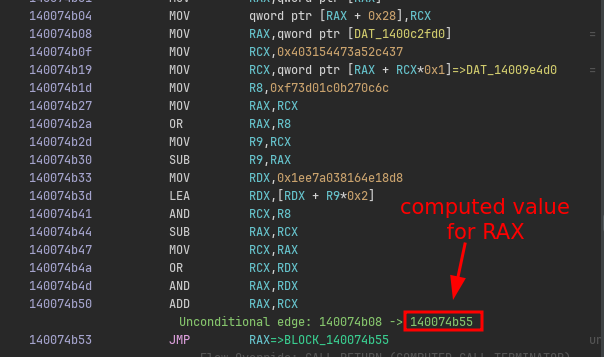

However, this is not the complete picture. because CFGs can also contain conditional branches (e.g., to encode if statements or loops).
This means for some branches there can be multiple targets and thus multiple values for `RAX`.

Conditional branches in x64 depend on the result of flags stored in the `RFLAGS` register.
Many instructions set these flags, but there are only a handful of opcodes that are typically used for implementing comparisons.
It so turns out for this binary we can look for instructions like `SETZ`/`SETNZ`/`SETGE` and `SUB` in our footer expression to identify the type of branch we are dealing with.
Therefore, we can adjust our `findFooterExpression` function slightly to look for exactly these patterns and classify the branch accordingly:

```java
private FooterInfo findFooterExpression(Address address) throws Exception {
    Address start = null;

    /* ... (snip) previous code to infer start of footer ... */

    // Determine exact variant of branch.
    FooterType type = FooterType.UNCONDITIONAL;
    max = 0;
    for (var instr: currentProgram.getListing().getInstructions(start, false)) {
        // If we cant find a special instruction nearby, its likely an unconditional branch.
        if (max++ > 3) {
            break;
        }

        // Determine type based on opcode.
        var formatted = instr.toString();
        if (formatted.startsWith("SETZ")) {
            type = FooterType.CONDITIONAL_SETZ;
            start = instr.getAddress();
            break;
        } else if (formatted.startsWith("SETNZ")) {
            type = FooterType.CONDITIONAL_SETNZ;
            start = instr.getAddress();
            break;
        } else if (formatted.startsWith("SETGE")) {
            type = FooterType.CONDITIONAL_SETGE;
            start = instr.getAddress();
            break;
        } else if (formatted.startsWith("SUB")) {
            type = FooterType.CONDITIONAL_UNKNOWN;
            start = instr.getAddress();
            break;
        } else if (formatted.startsWith("SET")) {
            throw new Exception("Unsupported %s : %s".formatted(instr.getAddress(), formatted));
        }
    }

    return new FooterInfo(start, address, type);
}
```

Based on the type of branch, we can now emulate the expression a couple of times, each with different inputs of flags.
For example, for `SETZ` and `SETNZ` we can emulate the expression twice, first with `ZF = 0` and then with `ZF = 1`.
This will result in two possible branch targets that this expression can compute.
Implement the same for the other types of branches and you can get all branch targets:

```java
private void handleConditional(FooterInfo footer, List<Long> successors) throws Exception {
    long falseTarget = inferTarget(footer, false);
    long trueTarget = inferTarget(footer, true);
    successors.add(falseTarget);
    successors.add(trueTarget);

    // ... (snip) ...
}

private long inferTarget(FooterInfo footer, boolean flag) throws Exception  {
    var emulator = new EmulatorHelper(currentProgram);

    // Set appropriate flags.
    switch (footer.type) {
    case CONDITIONAL_SETZ:
    case CONDITIONAL_SETNZ:
        emulator.writeRegister("ZF", flag ? 1L : 0L);
        break;

    /* ... (snip) handle other types of branches ... */
    }

    // Emulate expression.
    emulator.writeRegister("RIP", footer.start.getOffset());
    while (emulator.getEmulator().getPC() != footer.end.getOffset())  {
        emulator.step(monitor);
    }

    // Read out the computed address.
    return emulator.readRegister("RAX").longValue();
}
```

We now have all ingredients to draw the full CFG.
Start at a function's entry point address, and iteratively process each block while following each of its successors.
I chose to output my CFG as a DOT file so that I can visualize it e.g., with [GraphViz](https://dreampuf.github.io/GraphvizOnline/):
Full source code can be found in `[FlareAuthenticator.java](scripts/FlareAuthenticator.java).
The script gives us nice pictures with all the basic blocks and their offsets:

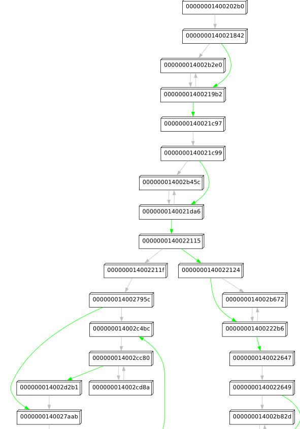

Success!


## Finding the Good Boy/Bad Boy Check

We could decide to now also serialize the CFG back to code, but this is very time consuming, error prone, and probably would require some form of recompilation or transpilation (similar to [last year challenge 09](../../2024/9/)).
Typically, rather than fully deobfuscating everything, what I like to do once I have a CFG, is to just look at a very high level what the CFG is doing.
At this point, I am not really interested in the exact instructions of each block.
Instead, I am kind of looking for good candidate places where the logic may be implemented that ultimately decides to show the good boy or bad boy message.

The nice thing about maintaining your own CFG as opposed to a CFG in a general purpose disassembler program like Ghidra, is that you can add and remove anything you want without really having to worry about the correctness of x86 assembly.
For example, with a few adjustments to the code, and some similar tricks that we did for getting the branch targets, I can also identify each `CALL RAX` instruction and the corresponding value for `RAX`, i.e., the function it targets:

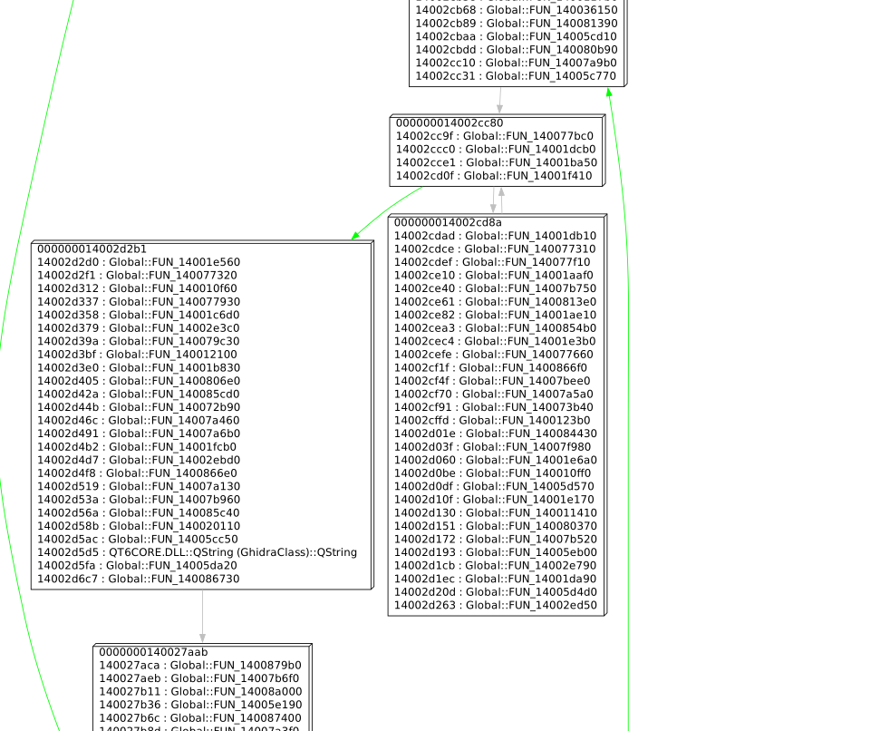

The graph is still too noisy for my liking; we see many calls to unnamed functions in pretty much every node.
However, if we inspect these functions, we can find that many are just small chunks of code that were outlined into a separate function.

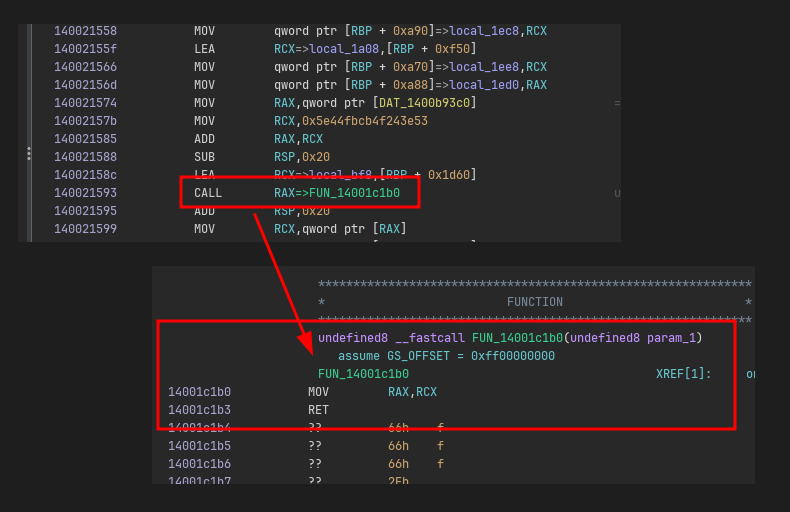

Stripping away any call to an unnamed function that is small (e.g., threshold < 100 instructions) from our CFG reveals very clearly on a high-level what is going on. In particular, function `FUN_1400202b0` immediately reveals a very good candidate place where the bad boy messagebox may be triggered:

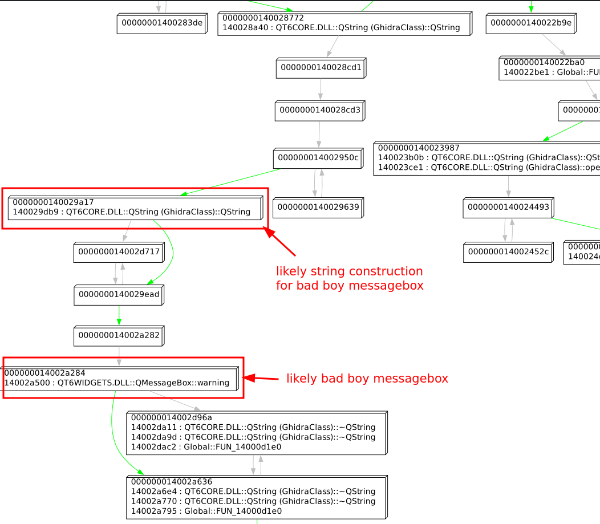

If we zoom out in this CFG and trace back the path towards the beginning of the function, we can see node `140022124` clearly splitting the function into two halves.
On the left, we have a path that ends up in our previously identified `QMessageBox::warning` call, while on the right a completely separate path that eventually ends up in a call to  `QMessageBox::information`.


Looking up this node in Ghidra, we can clearly see an if statement here testing for some flag:

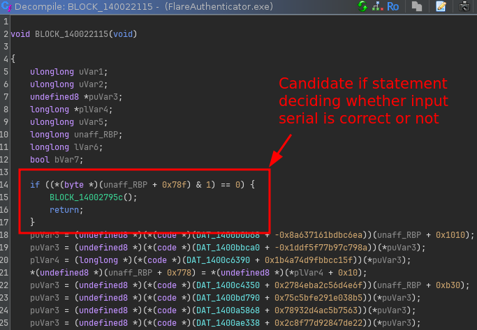

If we type in some random pass code and flip the branch temporarily in x64dbg, we can confirm that this is indeed the if statement that we are after (even though the flag is completely garbled):


If we go up further in the CFG, we can see that the block before the if statement sets this flag by performing a comparison of what looks like some computed value with a hardcoded checksum value:

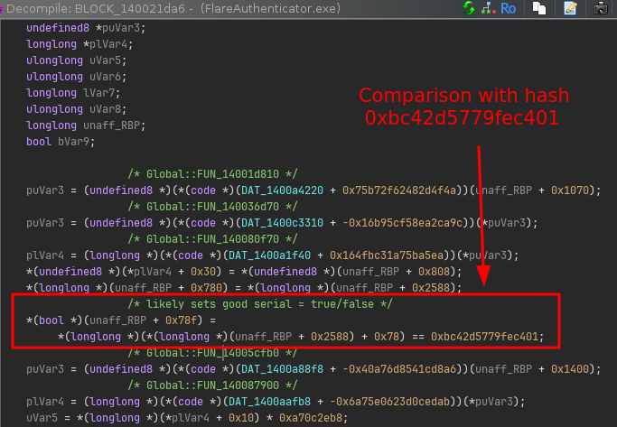

However, tracing back further does not seem to reveal where this hash value is really set (that is, no block in the same function really updates the value at `(RBP+0x2588) + 0x78`).

This must mean the hash is computed somewhere else.


## Finding the Hash Function

Setting a hardware breakpoint on the memory address storing the computed value, reveals that this value is updated on every key press in `FUN_1400202b0`, which seems to be the function that handles click events for every number pad button.
In particular, it is coming from code in block `140016ac2` that seems to sum up "magical input values" that change on every key press:

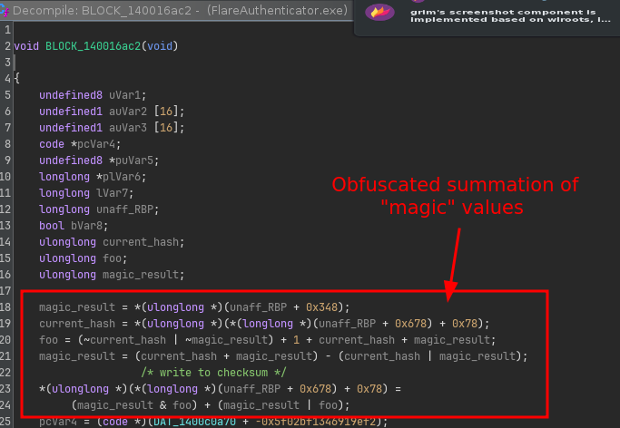

If we look into its CFG and trace back a bit the blocks, we see some interesting things happening:

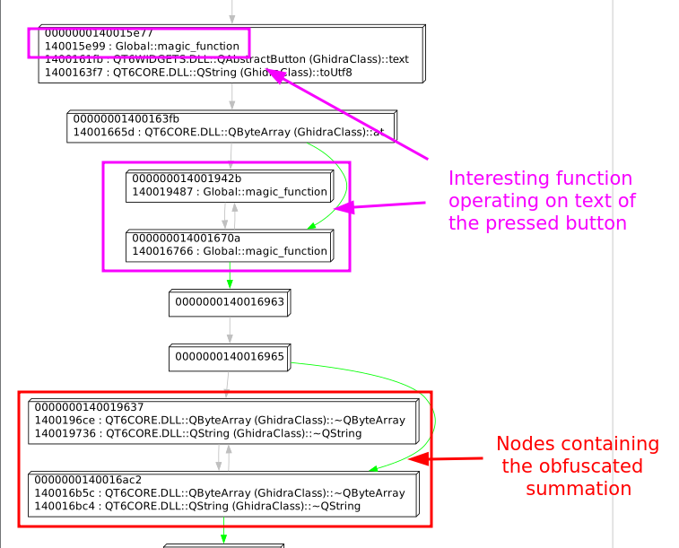

We can see based on the calls that here, the text of the pressed button is clearly obtained.
But then we see some calls to some function `FUN_140081760` (`magic_function` in the picture) that is called right after.
Sadly, looking into the CFG of this function reveals its a bunch of spaghetti with no calls to external functions:

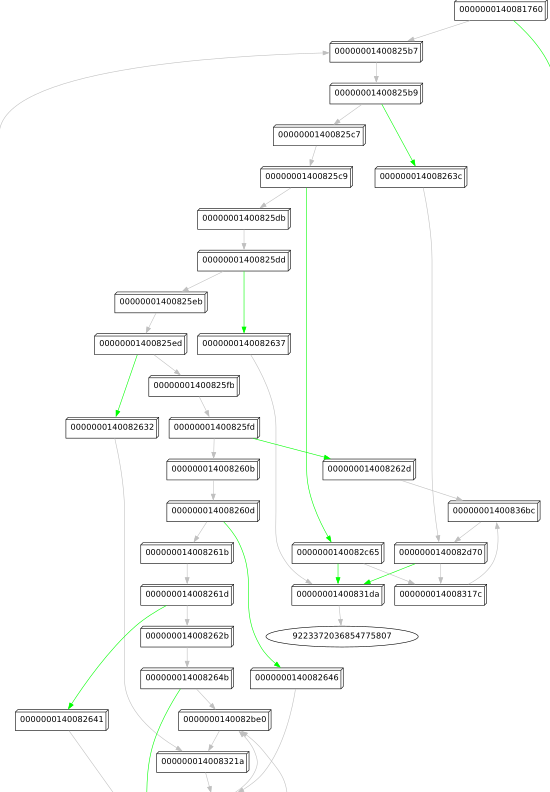

This is bad news, because it means we probably have to dive into the actual code to figure out what's going on.
It is also good news though, because it also likely means it will not be a function that is operating on complex data structures.
Analyzing its behavior of it should therefore be doable.


## Understanding the Hashing Function

Before diving deep into unknown code, I like to get a feeling of how the function is called and how it behaves with different inputs.

From some trial and error in x64dbg, you can easily figure out that the first call to `magic_function` (at `0000000140015E99`) in the button press handler function is simply a call with the current digit index (starting at 1) as argument (Note the last 16 bits of the second argument / RDX as displayed in x64dbg):

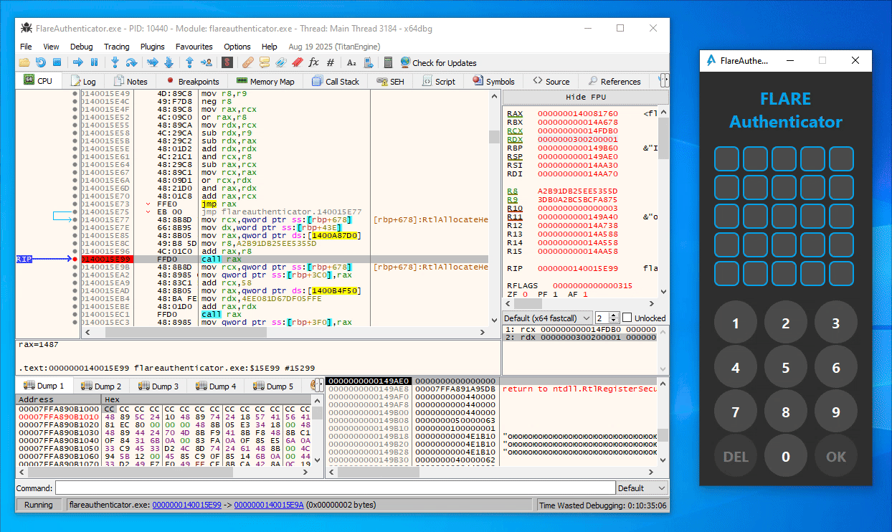

Similarly, in the second `magic_function` call (at `0000000140016766`), the expression `(index << 8 | digit_ascii_char)` is used as argument instead:

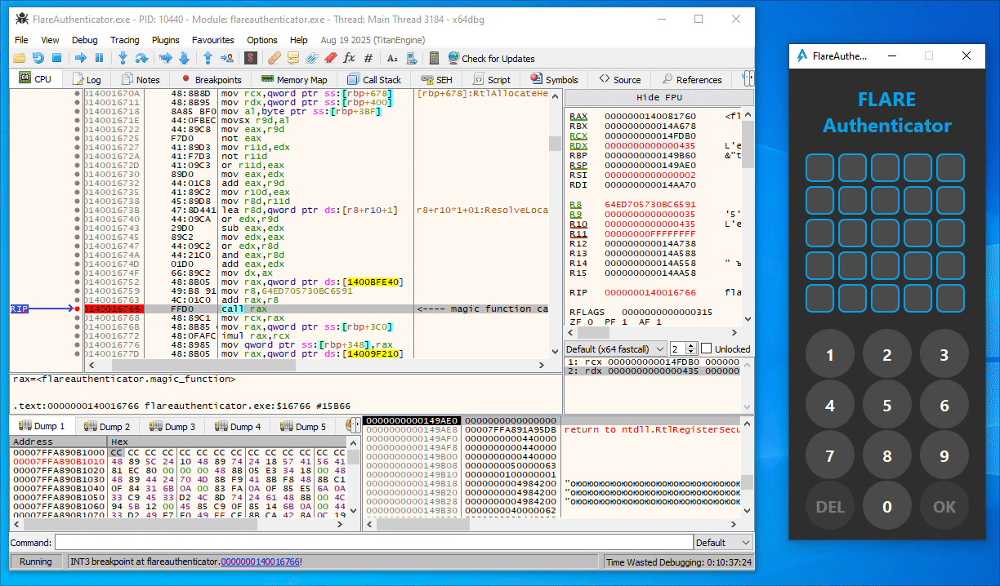

Additionally, the `magic_function` seems to be completely deterministic. That is, the same input number always provides the same output value.

While the code is heavily obfuscated, we can record two instruction traces using x64dbg with two different inputs, and put them side by side to quickly identify the parts that are directly influenced by the input parameter.
Then, for each of these chunks, since all operations in this function are pretty linear, we can infer the underlying tranformation pretty easily with some educated guessing.

For instance, here are parts of two traces with input `0x1337` (left) and `0x1234` (right):

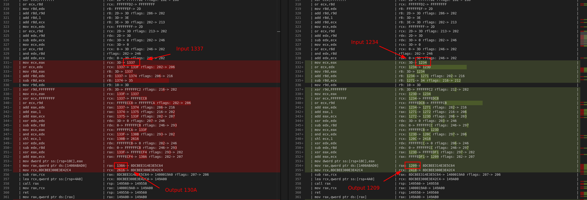

Without trying to understand the instructions one-by-one, we can simply observe the input and output of both two chunks and identify similarities.
Then, we can guess that this operation really encodes the operation:
```
x = (x ^ 0x3d)
```

Repeat this process, and you will find that the entire `magic_function` is actually really simple:

```python
a = (x ^ 0x3d)
b = (a + (a << 3))
c = (b ^ (b >> 4))
d = (c * 0x27D4EB79)
e = (d ^ (d >> 0xf))
f = (e >> 4)
```

The full hash functionality can therefore simply be represented by the following Python code:

```python
def magic(x: int) -> int:
    a = (x ^ 0x3d) & 0xFFFFFFFF
    b = (a + (a << 3)) & 0xFFFFFFFF
    c = (b ^ (b >> 4)) & 0xFFFFFFFF
    d = (c * 0x27D4EB79) & 0xFFFFFFFF
    e = (d ^ (d >> 0xf)) & 0xFFFFFFFF
    f = (e >> 4) & 0xFFFFFFFF
    return f

def checksum(s: bytes) -> int:
    checksum = 0
    for index, c in enumerate(s):
        i = index + 1
        a = magic(i)
        b = magic(i << 8 | c)
        magic_result = (a * b) & 0xFFFFFFFFFFFFFFFF
        checksum = (checksum + magic_result) & 0xFFFFFFFFFFFFFFFF

    return checksum
```


## Getting the Flag

We know the algorithm, we know the expected final value (`0x5b735c36628fcab`), now it is just a matter of finding the right input sequence that results in the right hash value.

To do this, we can observe a couple key insights:
- `magic` is very simple and deterministic.
- All calls to `magic(i)` form a constant sequence independent of the pass code.
- While `magic(i << 8 | c)` is not constant (it depends on the input character), there are only 10 possible digits (`0`-`9`) for each character in the pass code. Furthermore, it also does not depend on any previous characters.
- Finally, the checksum is computed by using 64-bit additions, which has a very low chance for wrapping around given the values that `magic` returns.

As each digit in the checksum is used independently of each other in the final checksum, each digit will have a unique but fixed _contribution_ to the final summation.
This means we can do a very directed search based on a [branch-and-bound](https://en.wikipedia.org/wiki/Branch_and_bound) approach.

The intuition here is that, when adding the contribution of the last digit to the current checksum, the current checksum cannot be too far away from the target sum `0x5b735c36628fcab`.
To be more precise, if `C[24]` is the set of all possible contributions of digit 24 (i.e., the last digit), it must be at least `min(C[24])` away from the target checksum, but no further away than `max(C[24])`.
Similarly, the contribution of the second-to-last digit must be within a certain range (i.e., between `min(C[23])` and `max(C[23])`) of the last tentative checksum.
We can repeat this process until we have all possible bounds for each contribution of each digit in the pass code.
With these ranges, we can start at the first character of the pass code, try all digits 0 to 9 and see which ones would result in a contribution that falls within the expected bounds.
Build a DFS-like search around this, and you will find a solution for the entire pass code.

This logic is implemented in the following Python code:

```python
MASK = 0xFFFFFFFFFFFFFFFF

# Precompute all possible contributions for each character:
A = [magic(i) for i in range(1,26)]
B = [[magic((i<<8)| (0x30+d)) for d in range(10)] for i in range(1,26)]
C = [[(A[i]*B[i][d]) & MASK for d in range(10)] for i in range(25)]

# Determine the valid bounds for each position in the pass code.
ranges = [(0, 0)] * 26 # 25 + 1 (last range contribution 0)
for i in range(24, -1, -1):
    ranges[i] = (
        (ranges[i+1][0] + min(C[i])) & MASK,
        (ranges[i+1][1] + max(C[i])) & MASK
    )

# Define target
target = 0x0bc42d5779fec401

# DFS stack [(position, current_path, tentative_sum)]
agenda = [(0, "", 0)]
while agenda:
    position, current_path, current_sum = agenda.pop()

    if position == 25:
        # Found solution:
        print(current_path)
        continue

    # Try all digits
    for candidate_digit in range(10):
        # Compute the new tentative sum.
        new_sum = (current_sum + C[position][candidate_digit]) & MASK

        # Check if is in within expected range.
        next_range = ranges[position+1]
        low = (next_range[0] + new_sum) & MASK
        high = (next_range[1] + new_sum) & MASK

        possible = low <= target <= high
        if not possible:
            continue

        # This is a potential path, move to the next digit.
        agenda.append((position + 1, current_path + str(candidate_digit), new_sum))

print("Done")
```

The [full script](scripts/solve.py) spits out the right answer almost instantaneously:

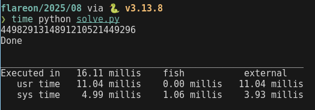

Typing in the passcode reveals the flag:

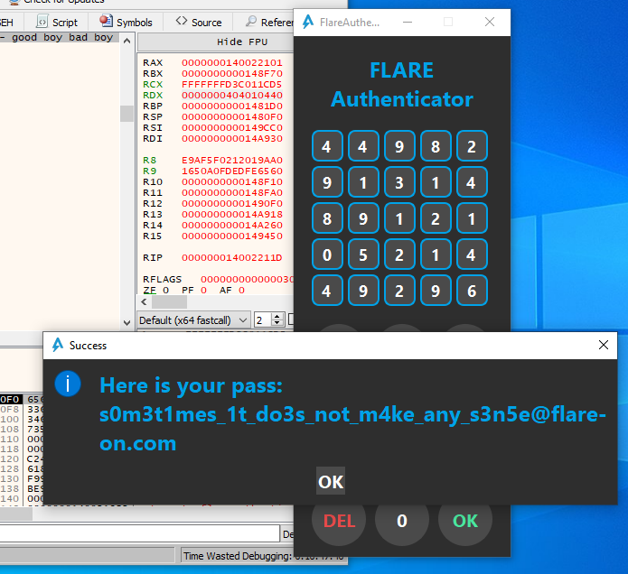
