# 9 - 10000

**Time spent:** ~1.5 day

**Tools used:** Ghidra, GhidraScript, x64dbg, C# (AsmResolver), Python, Sagemath

Challenge 9 is the final end boss of this year, and boy was it an end boss :).

It starts off with the fact that the download is a whopping 1GB single executable file, and quickly brings you into a rabbit hole of pretty complex maths (at least for me!) and a lot of programming to automate the sh-t out of everything.

This challenge is very much one of my favorite challenges in the series. It is incredibly inefficient, incredibly unrealistic, very CTF-y (like DEFCON), but also a lot of fun!

Let's dive in.


## Orientation

The vast majority of the bytes in the file come from the 10,000 resources that are stored in the `.rsrc` section.

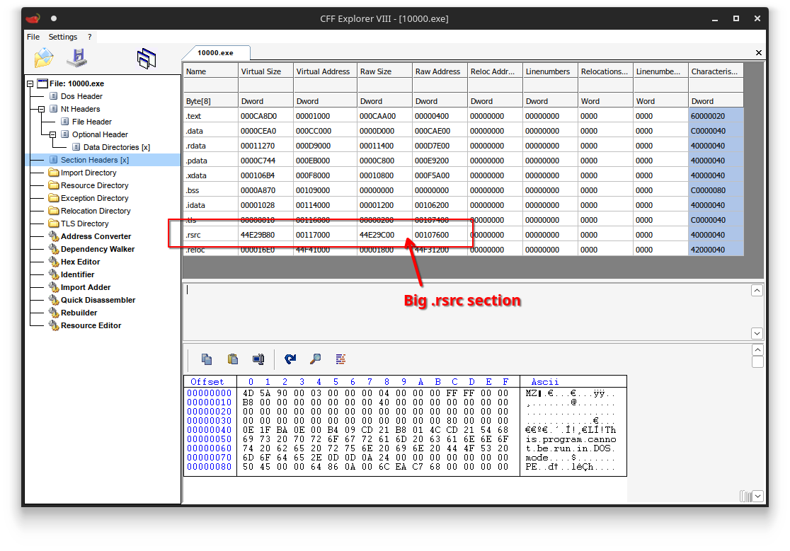

If we look at the resources stored in the PE, we can see there are a whopping 10,000 unique resources in the file, each containing what seems to be some kind of compressed buffer:

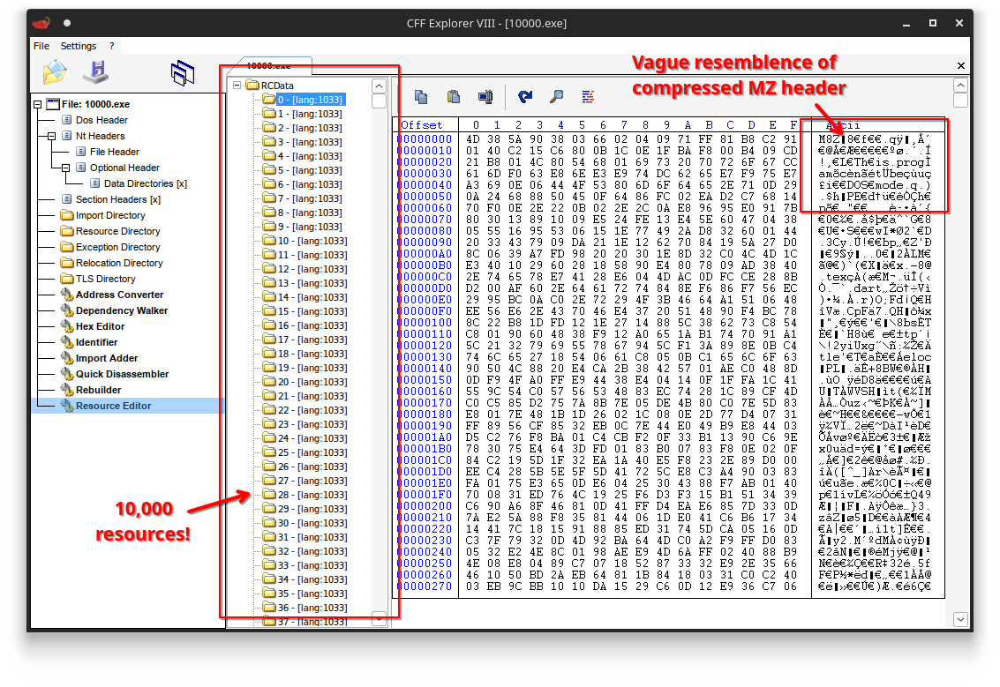

If you squint a little, you can actually see that these buffers seem to contain MZ headers.
This would mean the binary embeds 10,000 PE files.
For the ones that are in the know, this makes it sound a lot like a DEFCON challenge series called `n<challenge>` (e.g., `nfuncs`, `ncuts`, `nloads`), which features a similar construction :).

If we look at the binary in Ghidra, we can see that the main code is really not that complicated:


From this code we can learn the program expects a `license.bin` in the working directory of roughly 330KB, neatly separated into 10,000 chunks equally sized chunks.
Each chunk starts with a 16 bit integer referencing one of the 10,000 resources.
The resource is then decompressed and manually mapped into memory _somehow_, and an exported function called `check` is looked up.
The remaining of the chunk's data (32 bytes) is then passed onto the this `check` function, which seems to return either `true` or `false`.
If it doesn't return `true`, the program exits early, meaning we should make all 10,000 checks complete successfully.


## Dumping all DLLs

Let's start simple and decompress all the embedded DLLs.

Looking into the loader function `load_pe_from_resource` (`FUN_140001482`), we can see a basic construction of loading the resource data, decompressing and finally manual mapping the DLL into memory:

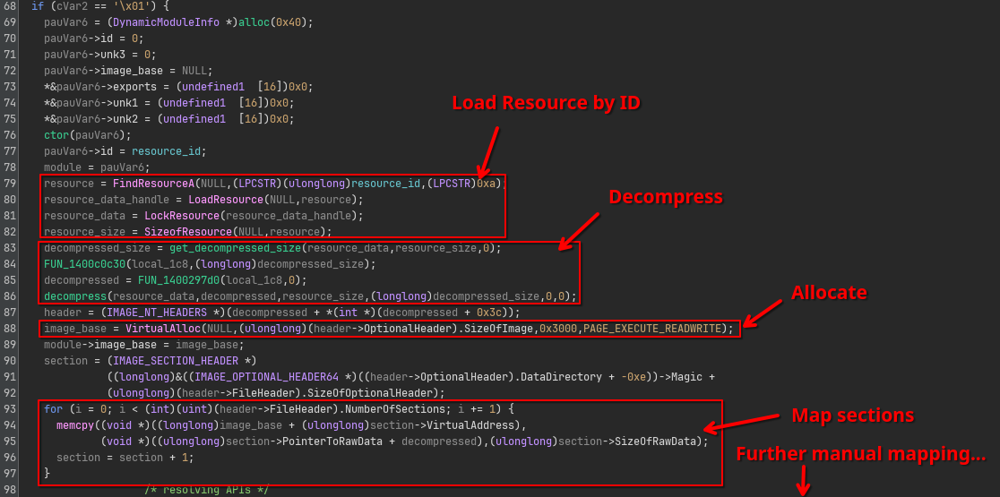

I have no intention of identifying or understanding the algorithm behind the functions `get_decompressed_size` and `decompress` functions themselves.
Instead, I quickly identified that whatever algorithm was used, its implementation did not have any references to external calls or global data.
This makes it very easy to just straight up copy the x86 code and treat it as a blackbox decompressor.
Wrap it up into a couple of C# code and you have a nice and short unpacker script:

```csharp
using System.Runtime.CompilerServices;
using System.Runtime.InteropServices;

namespace Decompressor;

public static class NativeCode
{
    public static readonly byte[] GetDecompressedSizeCode = [ /* ... truncated ... */ ];
    public static readonly byte[] DecompressCode = [ /* ... truncated ... */ ];
}

internal class Program
{
    [DllImport("kernel32.dll")]
    private static extern nint VirtualAlloc(nint lpAddress, nint dwSize, uint flAllocationType, uint flProtect);

    private unsafe delegate nint GetDecompressedSize(byte* data, nint dataLength);
    private unsafe delegate void Decompress(byte* compressed, byte* decompressed, nint compressedSize, nint decompressedSize, int index);

    public static unsafe void Main(string[] args)
    {
        // Copy the two x86 functions into some executable memory.
        nint ptr = VirtualAlloc(0, NativeCode.GetDecompressedSizeCode.Length, 0x3000 /* MEM_COMMIT | MEM_RESERVE */, 0x40 /* PAGE_EXECUTE_READWRITE */);
        Marshal.Copy(NativeCode.GetDecompressedSizeCode, 0, ptr, NativeCode.GetDecompressedSizeCode.Length);
        var getDecompressedSize = Marshal.GetDelegateForFunctionPointer<GetDecompressedSize>(ptr);

        ptr = VirtualAlloc(0, NativeCode.DecompressCode.Length, 0x3000 /* MEM_COMMIT | MEM_RESERVE */, 0x40 /* PAGE_EXECUTE_READWRITE */);
        Marshal.Copy(NativeCode.DecompressCode, 0, ptr, NativeCode.DecompressCode.Length);
        var decompress = Marshal.GetDelegateForFunctionPointer<Decompress>(ptr);

        // Extract all
        for (int i = 0; i < 10000; i++)
        {
            // Read out resource data.
            byte[] compressed = File.ReadAllBytes($@"compressed\resource{i:0000}.bin");
            fixed (byte* pCompressed = compressed)
            {
                // Determine decompressed size.
                nint size = getDecompressedSize(pCompressed, compressed.Length);

                // Decompress.
                byte[] decompressed = new byte[size];
                fixed (byte* pDecompressed = decompressed)
                {
                    decompress(pCompressed, pDecompressed, size, decompressed.Length, 0);
                }

                // Write back to disk.
                File.WriteAllBytes($"decompressed\{i:0000}.dll", decompressed);
            }
        }
        Console.WriteLine("Done!");
    }
}
```

This works great, we now have 10,000 decompressed DLLs.

TODO: image


## Investigating a single DLL

Similar to other challenges in this year, I worked under the assumption that the 10,000 DLLs were probably not written manually.
This means that all DLLs probably look very similar and only differ in some minor ways.
Therefore, let's just zoom in on a single DLL for now (I just grabbed the first one `0000.dll`), and try to extrapolate from a single `check` function.

When we open it in Ghidra, we are greeted with a very long series of function calls to `fXXXXXXX...` at the top of the function:

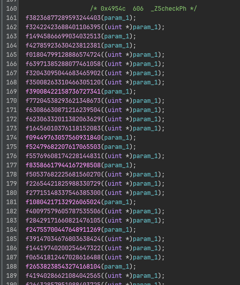

Some of these functions are defined in the current DLL, others are imported from other DLLs also embedded in the main binary:

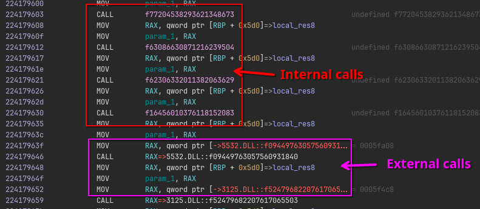

While there are many of them, luckily they all are very similar.
Zooming in, we can identify that there are exactly three "kinds" of these transform functions.
They look like the following:

|-----------------------|-----------------|
| Substitution          | 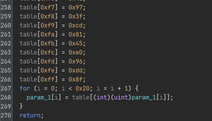 |
| Permutation           |  |
| (Cursed) Binary Exponentiation | 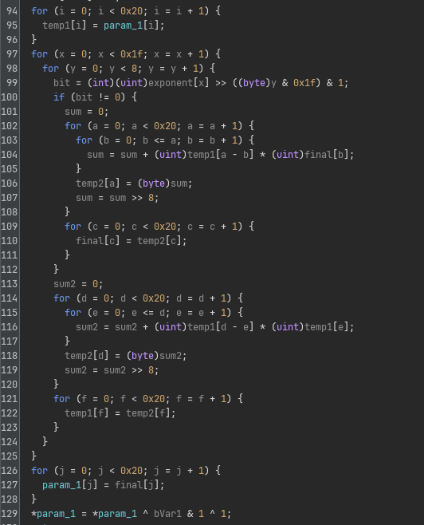 |

Each function call does exactly one of these transformation, with a hardcoded substitution table, permutation table or exponent directly specified in its code itself.

After the long series of hardcoded `f` transforms, the result is XOR'ed into a hardcoded 4x4 matrix:

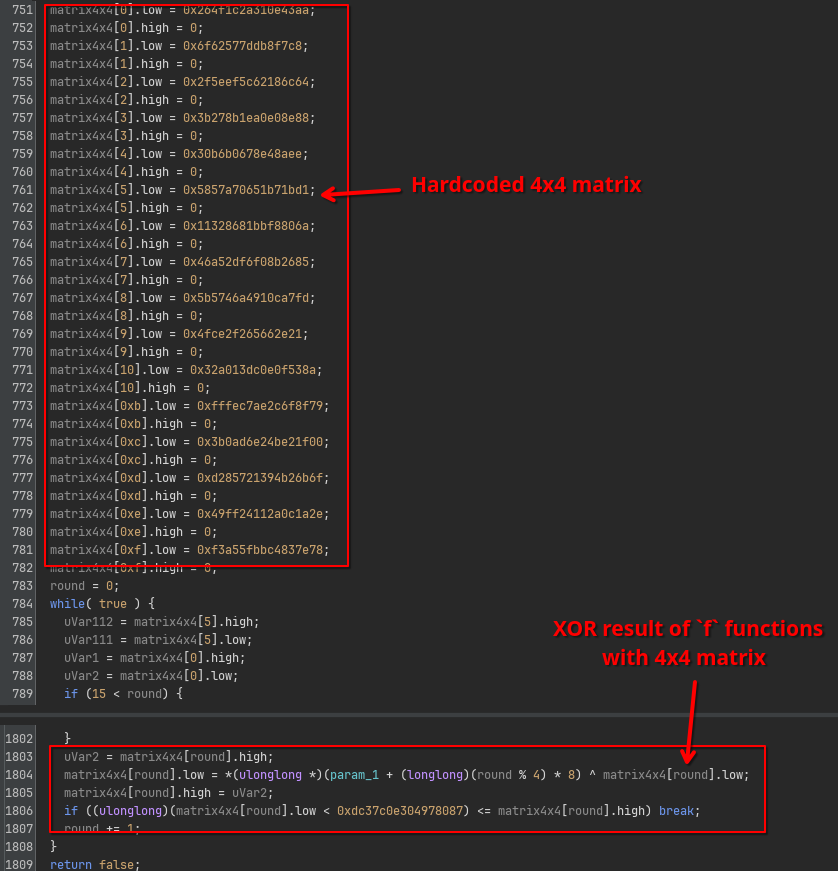

Once the XOR'ing is done, a series of multiplications and additions modulo some constant `N` follow, of which the result needs to equal 0:

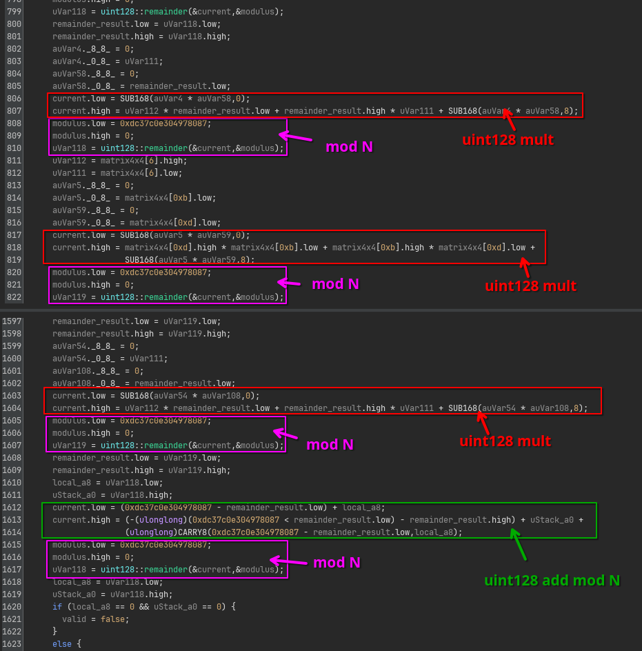

At first I did not recognize what the purpose was of this sanity check, but looking down a bit further, you can see actually an algorithm being implemented that is very similar to the `f` binary exponentiation, but this time applied to the 4x4 matrix instead.

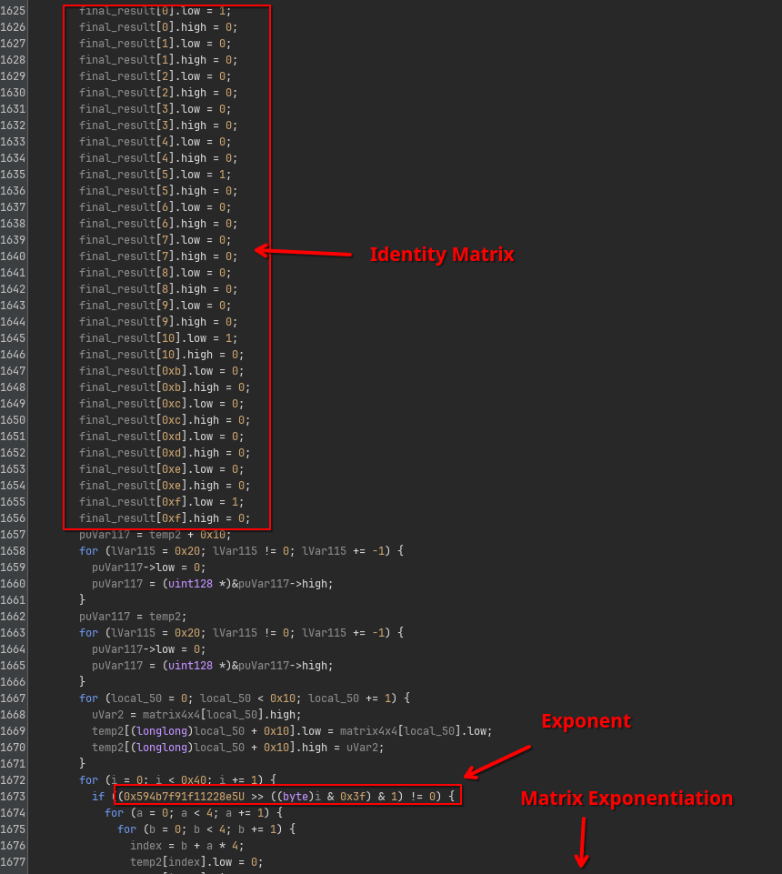

The final result is compared to yet another hardcoded matrix, before it returns `true` or `false`.

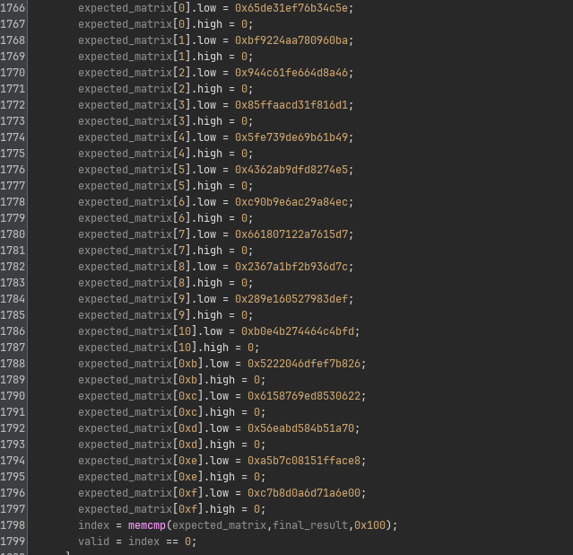

To summarize, each `check` function consists of the following:
- Firstly, it feeds the input through a bunch of substitutions, permutations and exponentiations.
- Secondly, it XOR's the result into a hardcoded 4x4 matrix
- Thirdly, it does some sanity check that we don't quite understand yet.
- Finally, it raises the resulting matrix to the power of some constant, and compares it to some expected result.

This raises the natural question, if we want to make `check` return `true`, we need to come up with an inverse of all these operations.
The `f` functions and the XOR operation seem reversible, since they are all linear operations with hardcoded arguments.
However, not all matrices are created equal, and certainly not all matrices are invertible.
Recall from your linear algebra class (if you had one ;p), a matrix is only invertible if and only if [its determinant is non-zero](https://en.wikipedia.org/wiki/Determinant).
There is a [huge formula for the determinant of a 4x4 matrix](https://semath.info/src/determinant-four-by-four.html), but really it all boils down to just a very long sequence of additions and multiplications...

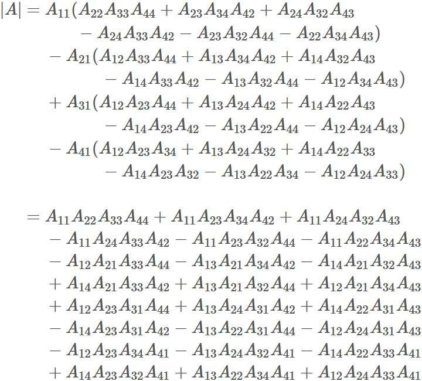

Hmm, multiplications and additions for which the result needs to be 0, similar to that previous sanity check we found earlier!
From here I didn't check all the terms of the formula, the expression looked similar enough that I just assumed that whatever code we saw before, it is the determinant check.

Now we have accounted for everything that is happening in each `check` function.
Time to reverse everything!


## Creating the License.bin

This requires quite a bit of automation.

First, we need to extract the configuration of transforms and constants.
I will not bore you with the exact details for how I did this, but it involves reading out the export tables, disassembling, and a lot of ugly pattern matching on the x86 code.
The full code can be found in Extractor.cs:

- Download: [Extractor.cs](scripts/Extractor.cs)

Now let's get to building the inverse of all operations.

As said before, reversing the `f` functions is relatively easy.
Once you have extracted the substitution and permutation tables, it is trivial to come up with the inverse tables for both.

```python
def invert_subs(output: bytes, substitution_table: bytes) -> bytes:
    result = bytearray()
    for b in output:
        result.append(substitution_table.index(b))
    return result

def invert_perm(output: bytes, permutation_table: bytes) -> bytes:
    perms = {i: v for i,v in enumerate(permutation_table)}
    inverse = {v: i for i, v in perms.items()}
    return perm(output, inverse)
```

The exponentiation is a little trickier: We cannot just solve the discrete log problem and compute `m^(-e)`.
However, we can use the fact that the exponentiation operates in the domain of `uint256`s, or in other words, in the group `Z_n` where `n = 2^256`.
Since the numbers are guaranteed to be made odd before the exponentiation is done, all numbers that we are processing should be invertible in this group.
This means we can do a trick similar to textbook RSA.
Instead of trying to compute `m^(-e)`, we can try to find a `d` that makes `(m^e)^d = m` in the group `Z_n`.
We are therefore looking for a `d` such that `e * d = 1 (mod n)`, or in other words, `d = e^(-1) mod order(Z_n)`:

```python
def invert_exp(output: bytes, exponent: bytes) -> bytes:
    output = int.from_bytes(output, 'little')
    exponent = int.from_bytes(exponent, 'little')

    original_low_bit = output & 1
    output |= 1

    modulus = 1 << 256
    d = pow(exponent, -1, modulus)
    m = pow(output, d, modulus) ^ original_low_bit ^ 1

    return m.to_bytes(32, 'little')
```

Finally, we need to reverse the matrix operations.
The XOR'ing part of the matrix is easy, as the reverse of any XOR is just applying the XOR again.
For the exponentiation, we can almost use the same trick as the normal binary exponentiation, except here we need to make sure we use the right group order.
Instead of operating in the integer group `Z_n`, we are now operating in the **matrix** group `GL(4, n)`, and thus also need the order of `GL(4, n)`.
Lucky for us, sagemath can compute all of this in just a couple lines of code!

```python
def matrix_inverse_exp(matrix, e, N):
    group_order = GL(4, N).order()
    d = int(pow(e, -1, group_order))
    return mat_pow4(matrix, d, N)

def get_transformed_input(initial_matrix, expected_matrix, modulus, exponent) -> bytes:
    # Invert matrix exponentiation
    inverse_exp = matrix_inverse_exp(expected_matrix, exponent, modulus)
    assert mat_pow4(inverse_exp, exponent, modulus) == expected_matrix

    # Recover original output of transform chains
    xored = xor(inverse_exp, initial_matrix)
    assert xored[0] == xored[4]

    return struct.pack("QQQQ", xored[0], xored[1], xored[2], xored[3])
```

We have now all the ingredients to construct an input that makes a single `check` function pass:

```python
def generate_chunk(files, module_id):
    current_file = f"{module_id:04}.dll"
    data = files[current_file]
    transformed = get_transformed_input(data["InitialMatrix"], data["ExpectedMatrix"], data["Modulus"], data["Exponent"])

    for transform_entry in reversed(data["TransformSequence"]):
        module = transform_entry["Module"]
        name = transform_entry["Name"]

        if module is None:
            module = current_file

        transform = files[module]["DeclaredTransforms"][name]
        transform_type = transform["Type"]
        transform_data = base64.b64decode(transform["Data"])
        transform_module_id = int(module[:-4])

        if transform_type == 0:
            transform_type = "substitution"
            new_data = invert_subs(transformed, transform_data)
        elif transform_type == 1:
            transform_type = "permutation"
            new_data = invert_perm(transformed, transform_data)
        elif transform_type == 2:
            transform_type = "exponentiaton"
            new_data = invert_exp(transformed, transform_data)
        else:
            raise KeyError("Unknown transform type " + transform_type)

        new_data = bytearray(new_data)

        transformed = new_data

    return struct.pack("H", module_id) + transformed
```

Wrap this all in a loop...

```python
print("Loading configs...")
files = dict()
for name in tqdm.tqdm(os.listdir("extracted")):
    if not name.endswith(".json"):
        continue

    with open(f"extracted/{name}", "rb") as f:
        files[name[:-5]] = json.load(f)

print("Generating license...")
serial = bytearray()
for iteration in tqdm.tqdm(range(10000)):
    module_id = iteration
    chunk = generate_chunk(files, module_id, counters)
    serial.extend(chunk)
```

... and it should work right?


TODO: image

Hmmm.... let's look into x64dbg and see at which check it fails.

TODO: image

Yikes! It only passes the first 2 checks or so..

Why??!


## Figuring out the Missing Pieces

This stumped me for a very long time.
I thought I had done everything right and any arbitrary chunk that I threw at it was checking out perfectly.
Yet, no matter which individually valid chunks I put into the `license.bin`, the program would always reject the file 2 or 3 chunks in.
This means that something in between each chunk must be happening that makes the chunks dependent on each other.

After painstakingly looking over all code, I finally noticed that the first `f` transform were not exactly as I expected.
They all have one extra XOR operation with some number stored in a table at the very beginning:


I initially thought this was a stack cookie computation, because sometimes Ghidra fails to recognize them and it looked very much like one.
But no, this XOR is very important. Oops, embarrasing! Trust but verify all your findings!

If we track down where this global table is coming from, it is actually exactly the final buffer that is used in the main function of our main executable file.
More specifically, this buffer is updated after every `check` call.

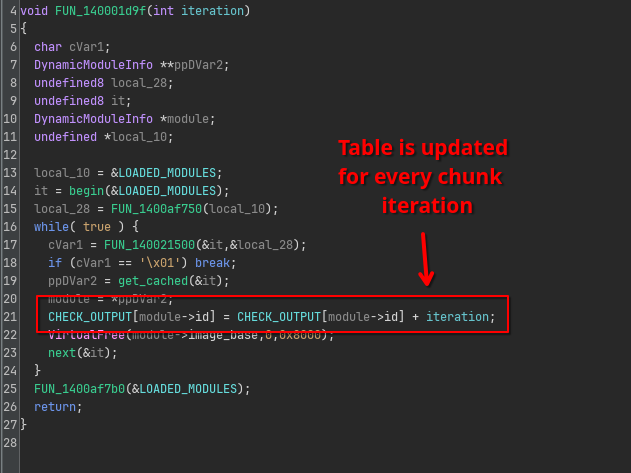

Looking at this code, we see that every slot in the table contains the sum of all indices each module was used.
This tells us the order in which each DLL is invoked is actually important, because it now makes different invocations of a DLLs depend on each other indirectly!

How do we determine the order of execution?

The way I went about it, was to treat the expected buffer as a huge system of equations.
Let's assume we call `x[j]` the index at which module `j` was used.
That means, symbolically, each sum in the table is going to be equal to something like the following:
```
sum[1]     = x[a] + x[b] + ...
sum[2]     = x[a] + x[c] + x[d] + ...
sum[3]     = x[m] + x[n] + x[o] + ...
...
sum[10000] = x[p] + x[q] + ...
```

However, this is kind of annoying to deal with, because different equations may use the same or different values from the vector (i.e., array) `x`.
You can normalize this by having all sums be expressed always in all `x[j]` terms, by adding coefficients `c[i][j]`, where `c[i][j] = 1` if `sum[i]` depends on `x[j]`, and `c[i][j] = 0` if it doesn't.

```
sum[1]     =     c[1][1]*x[1] +     c[1][2]*x[2] + ... + c[1][10000]*x[10000]
sum[2]     =     c[2][1]*x[1] +     c[2][2]*x[2] + ... + c[2][10000]*x[10000]
sum[3]     =     c[3][1]*x[1] +     c[3][2]*x[2] + ... + c[3][10000]*x[10000]
...
sum[10000] = c[10000][1]*x[1] + c[10000][2]*x[2] + ... + c[10000][10000]*x[10000]
```

Now, we have a system of 10,000 equations with 10,000 known sums, 10,000 unknown variables, and 10,000 x 10,000 known coefficients derived from the dependency graph of all embedded DLLs.
The trick is now to treat these 10,000 x 10,000 coefficients as a [coefficient matrix](https://en.wikipedia.org/wiki/Coefficient_matrix).

- Download: [coeffs.zip](dumps/coeffs.zip)

The entire equation can be expressed as a typical matrix * vector multiplication `sum = C * x`.

```
    sum       =             C            *     x

[   sum0   ]     [ 1 0 0 1 0 0 1 0 0 0 ]   [   x0   ]
[   sum0   ]     [ 0 0 0 0 0 0 0 0 0 0 ]   [   x1   ]
[   sum0   ]  =  [ 0 0 0 1 1 0 0 0 1 1 ] * [   x2   ]
[    ..    ]     [         ...         ]   [   ..   ]
[ sum10000 ]     [ 0 0 0 1 0 0 0 0 0 0 ]   [ x10000 ]
```

Why do we do this transformation?

It so turns out that these types of systems of equations can be solved quite efficiently, and [sagemath has an implementation for us](https://doc.sagemath.org/html/en/tutorial/tour_linalg.html) ready to be used:

```python
from sage.all import *

hardcoded_values = [ ... ] # expected values in table.

matrix = Matrix(ZZ, coeffs).transpose()  # transpose not needed unless your dependency graph was inverted like mine :-)
expected = vector(ZZ, hardcoded_values)
solution = matrix.solve_right(expected)

print(solution)
```

Give it a couple minutes to run (and throw a bunch of RAM at it).
Eventually, this yields the following order:

```
7476, 5402, 4885, 5176, 6815, 7764, 9981, 655, 6606, 7019, 4404, ...  6455, 4730, 2880, 1348, 1044, 3998, 1279, 4282
```

- Download: [order.txt](dumps/order.txt)


## Creating the License.bin for Real

Now we just need to slightly adjust our script to have it read in this new data and take into account the order and XOR masks:

```patch
-def generate_chunk(files, module_id):
+def generate_chunk(files, module_id, counters):
     current_file = f"{module_id:04}.dll"
     data = files[current_file]
     transformed = get_transformed_input(data["InitialMatrix"], data["ExpectedMatrix"], data["Modulus"], data["Exponent"])

     for transform_entry in reversed(data["TransformSequence"]):
         module = transform_entry["Module"]
         name = transform_entry["Name"]

         if module is None:
             module = current_file

         transform = files[module]["DeclaredTransforms"][name]
         transform_type = transform["Type"]
         transform_data = base64.b64decode(transform["Data"])
         transform_module_id = int(module[:-4])

         if transform_type == 0:
             transform_type = "substitution"
             new_data = invert_subs(transformed, transform_data)
         elif transform_type == 1:
             transform_type = "permutation"
             new_data = invert_perm(transformed, transform_data)
         elif transform_type == 2:
             transform_type = "exponentiaton"
             new_data = invert_exp(transformed, transform_data)
         else:
             raise KeyError("Unknown transform type " + transform_type)

         new_data = bytearray(new_data)

+        x = struct.unpack_from("I", new_data, offset=0)[0]
+        x ^= counters[transform_module_id]
+        struct.pack_into("I", new_data, 0, x)
+
         transformed = new_data

     return struct.pack("H", module_id) + transformed
```

```patch
 print("Loading configs...")
 files = dict()
 for name in tqdm.tqdm(os.listdir("extracted")):
     if not name.endswith(".json"):
         continue

     with open(f"extracted/{name}", "rb") as f:
         files[name[:-5]] = json.load(f)

+print("Recovering sequence...")
+sequence = eval(open("order.txt", "r").read())
+
+print("Loading coefficients...")
+all_deps = []
+with open("coeffs.txt", "r") as f:
+    while line := f.readline():
+        all_deps.append(eval(line.strip()))
+
 print("Generating license...")
 serial = bytearray()
+
+counters = [0] * 10000
 for iteration in tqdm.tqdm(range(10000)):
-    module_id = iteration
+    module_id = sequence[iteration]
     chunk = generate_chunk(files, module_id, counters)
     serial.extend(chunk)
+
+    # Update counters
+    for dep_module_index, is_dependency in enumerate(all_deps[module_id]):
+        if is_dependency == 1:
+            counters[dep_module_index] = (iteration + counters[dep_module_index]) & 0xFFFFFFFF
```

This generates the final license.

- Download: [license.bin](dumps/license.bin)


## Getting the Flag

At first, I thought to just run the `license.bin` through the application, but then I realized, this program keeps loading and unloading many embedded DLLs on every iteration.
It is going to be so horribly inefficient that I wouldn't be surprised if fully validating takes us to the heath death of the universe itself.
So instead, I decided to take matters in my own hands, and decrypt the flag by myself.

Recall from the `main` function of the original `10000.exe`, the flag is decrypted by first computing the SHA-256 of the entire `license.bin` file, which is then used as a key for an `AES-CBC` decryption of a static buffer with a static IV:

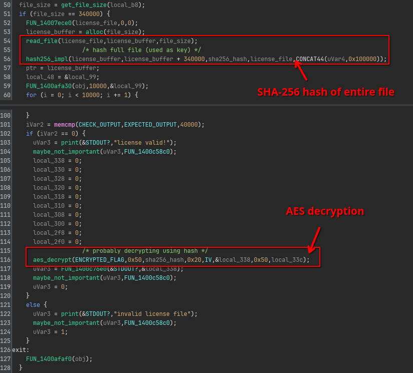

One final Python script to finish it off once and for all:

```python
with open("license.bin", "rb") as f:
    serial = f.read()

encrypted_data = bytes.fromhex("a1 a6 10 48 3e bd 82 5c e1 e0 0d 72 2d f6 8d cf f7 0c ac 1e 64 a4 fc a7 44 0b 5a bc 61 72 59 ce 66 f7 e0 71 7b 57 51 a3 bf 5f 6c 9d ee 1c 17 bc 88 1c 2c 17 a0 d8 03 2f 36 9a 00 ba 32 09 c4 f5 69 d2 cd 47 29 b6 b4 ba bb 6b 35 f0 d5 04 f2 5d")
iv= bytes.fromhex("78 61 53 38 bc b1 f1 80 d3 4e d1 fa 47 a4 1d 3d")

key = hashlib.sha256(serial).digest()
cipher = AES.new(key, AES.MODE_CBC, iv=iv)
print(cipher.decrypt(encrypted_data))
```

This outputs:

```
b'Its_l1ke_10000_spooO0o0O0oOo0o0O0O0OoOoOOO00o0o0Ooons@flare-on.com\x0e\x0e\x0e\x0e\x0e\x0e\x0e\x0e\x0e\x0e\x0e\x0e\x0e\x0e'
```

We're finally there!


## Final Words

What a rollercoaster this was!

This was one of the best challenges of this year, and heavily reminded me of DEFCON CTF ncuts/nlinks/nfuncs (organizers, did you hire Fish :p?).
It is a really fun automation and mathematics problem and I think most of us (me included) were not prepared for it (in a good way!).
My only complaint is that I wish it was a bit more realistic with some more malware in it :), somehow I doubt that FLARE often sees 1GB exe malware samples in the wild :^).
Nonetheless, a great final challenge for this year's Flare-On!
