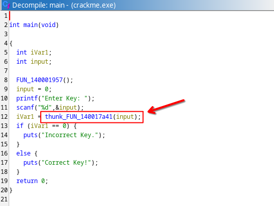
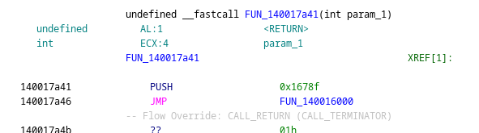
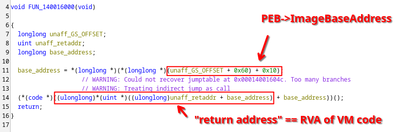
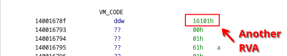
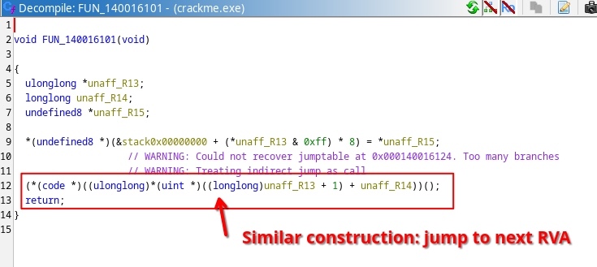
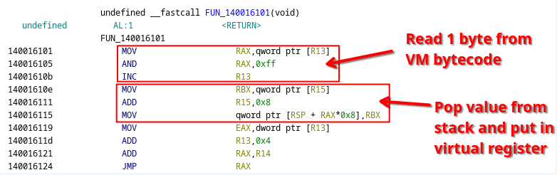
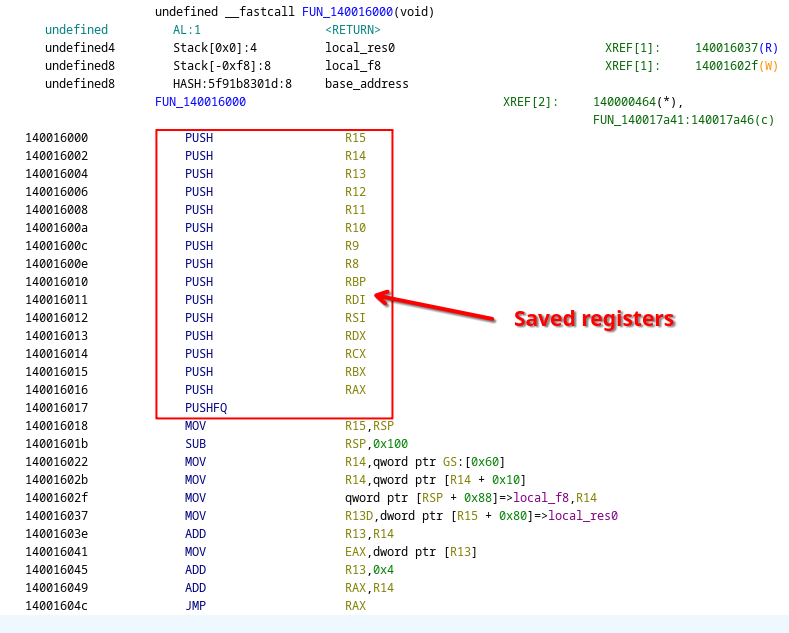
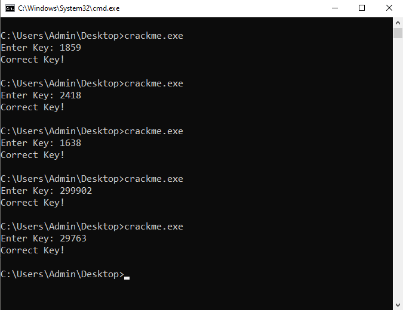

# BinaryShield VM

**Challenge Author:** ra1n

**Challenge Link:** [https://forum.tuts4you.com/topic/45143-binaryshield-custom-vm](https://forum.tuts4you.com/topic/45143-binaryshield-custom-vm)

**Time spent:** About 3 hours

**Tools used:** Ghidra, x64dbg, Python, C

On September 24, 2024, a Windows crackme challenge by ra1n popped up on tuts4you featuring a custom Virtual Machine obfuscation. It came with the following note:

```
GOAL:

- You must find the correct key. Simply patching to get a goodboy message is NOT allowed.
- Bonus points for devirt and explanation of your approach.
- MOST IMPORTANTLY, have fun!
```

I like VMs, so I am definitely gonna have fun with this one.


## Orientation


Main function is at `FUN_14000181f`. It's basic, it asks for an integer input and calls some function `FUN_140017a41` with it. If that call returns 1, we're good to go. `FUN_140017a41` must therefore be where all the magic happens.




However, this function is super barebones, only a push with a hardcoded constant `0x1678f`, followed by a jump to `140016000`:



Decompilation of `140016000` doesn't reveal much either; we're getting an image base address from the Process Environment Block (PEB), and use the return address as a relative virtual address (RVA) to read another RVA, which we then jump to.



Normal functions following normal calling conventions assume that the return address is the value pushed last on the stack. Normally, this would be done implicitly by a `call` instruction, however since we manually pushed the value `0x1678f` explicitly, we now know that this "return address" is not really a return address, but rather an RVA parameter, likely indicating where our virtualized code actually starts. 


Taking a look at address `14001678f` (the VA corresponding to `0x1678f`), we see that it indeed contains another RVA:




Following this RVA (`140016101`), we see that it is a very similar looking function with a very similar construction. First, it performs some operation, and then jumps to yet another relative address. 



Inspecting in a debugger such as x64dbg reveals that `R13` contains the pointer to our VM code, indicating a program counter register, `R14` contains the module base address, and `R15` is a pointer on the stack.

| x86 register | VM register            |
|--------------|------------------------|
| `R13`        | `PC` (Program Counter) |
| `R14`        | Module base address    |
| `R15`        | `SP` (Stack Pointer)   |

In other words, we are dealing with a Virtual Machine here of which the opcode bytes form an RVA to the handler of the function. This handler performs the operation encoded by the opcode, and then jumps to the next opcode handler.


##  Creating a disassembler

We know enough to start building our disassembler for this Virtual Machine.

As every opcode is simply an RVA, we can therefore just start at the beginning of the VM code, decode an RVA, look into Ghidra which function belongs to it, understand its inner workings, and and attach a mnemonic to it.

Looking at our first RVA and the corresponding opcode handler `FUN_140016101`, it looks handcrafted, or at least Ghidra struggles a lot with decompiling it correctly. However, given what we know about the registers `R13`, `R14` and `R15`, the raw disassembly is easy enough to understand:



The first three instructions read an additional byte from the VM bytecode (the operand of the instruction). The following three instructions first read from the virtual stack pointer, then add to our virtual stack pointer, and finally store the value into some memory indexed by our operand. In other words, this is a `pop` instruction that pops a value from the virtual stack and puts it in a virtual register defined by the operand of our instruction.

The last four instructions read the next RVA for the next opcode, advance the program counter by four bytes (the size of the next opcode RVA), and jump to it, effectively dispatching the VM to the next opcode handler.

We can repeat this process to get the shape and meaning of all opcodes used in this virtual machine. The opcodes that are used in the crackme can be summarized by the following table.


| OpCode (RVA) | OpCode Handler  | Mnemonic            |
|--------------|-----------------|---------------------|
| `0x16000`    | `FUN_140016000` | `vmenter`           |
| `0x1604e`    | `FUN_14001604e` | `vmexit`            |
| `0x1606a`    | `FUN_14001606a` | `push64 <register>` |
| `0x16090`    | `FUN_140016090` | `push32 <register>` |
| `0x16101`    | `FUN_140016101` | `pop64 <register>`  |
| `0x16126`    | `FUN_140016126` | `pop32 <register>`  |
| `0x16194`    | `FUN_140016194` | `push64 <immediate>`|
| `0x161b1`    | `FUN_1400161b1` | `push32 <immediate>`|
| `0x1620a`    | `FUN_14001620a` | `push sp`           |
| `0x1626c`    | `FUN_14001626c` | `pop sp`            |
| `0x162b1`    | `FUN_1400162b1` | `add64`             |
| `0x162c9`    | `FUN_1400162c9` | `add32`             |
| `0x1631f`    | `FUN_14001631f` | `sub64`             |
| `0x16337`    | `FUN_140016337` | `sub32`             |
| `0x163a5`    | `FUN_1400163a5` | `xor32`             |
| `0x16413`    | `FUN_140016413` | `and32`             |
| `0x16481`    | `FUN_140016481` | `or32`              |
| `0x16689`    | `FUN_140016689` | `load64`            |
| `0x1669f`    | `FUN_14001669f` | `load32`            |
| `0x16707`    | `FUN_140016707` | `store32`           |
| `0x1676b`    | `FUN_14001676b` | `jnz`               |

There could be more opcode handlers, but they are not used in the actual code, so I didn't bother writing logic for it either.

In any case, here are some downloads:

- [vmcode.bin](dumps/vmcode.bin): Raw binary bytecode.
- [disassembler.py](https://github.com/Washi1337/ctf-writeups/tree/master/writeups/misc/tuts4you/binaryshield/src/disassembler.py): A disassembler that decodes instructions according to the above table.
- [disassembly.asm](dumps/disassembly.asm): The raw disassembly produced by the disassembler.


## Understanding the Code

The disassembled bytecode starts with a long series of `pop` instructions, it looks like registers are being initialized by values pushed onto the stack before the VM code itself was called:

```
L1678f: pop64 r0
L16794: pop64 r1
L16799: pop64 r2
L1679e: pop64 r3
L167a3: pop64 r4
L167a8: pop64 r5
L167ad: pop64 r6
L167b2: pop64 r7
L167b7: pop64 r8
L167bc: pop64 r9
L167c1: pop64 r10
L167c6: pop64 r11
L167cb: pop64 r12
L167d0: pop64 r13
L167d5: pop64 r14
L167da: pop64 r15
L167df: pop64 r16
```

If we go back to our very first VM entry function, we can see exactly which values are stored there:



This tells us, virtual register `r3` holds the value of physical `RCX` which contains our input key.
Additionally, this also tells us that virtual register `r7` is mapped to `RBP`, the base pointer.
This is crucial information for understanding the virtualized code.

After the series of pop instructions and with the help of this register mapping, we can now see that the next few instructions look very much akin to a normal x86 function prologue:

```asm
// push bp
L167e4: push64 r7   

// mov bp, sp 
L167e9: push sp           
L167ed: pop64 r7

// sub sp, 0x10         // 0x10 bytes local space
L167f2: push sp     
L167f6: push64 0x10
L16802: sub64 
L16806: pop64 r0        // <-- discard pushed x86 RFLAGS
L1680b: pop sp          // <-- result of subtraction
```

Interestingly enough, binary opcodes such as the `sub64` instruction expectedly pop two values to perform an operation, but also push two values back on the stack as opposed to just one. Rather than simply pushing the result of the operation, the instruction also pushes the resulting x86 flags containing bits indicating overflow/underflow. This is quite unlike other stack-based machines I have seen, but makes sense in the context of x86.


What follows can essentially be translated to a long series of assignments with seemingly garbage/obfuscated arithmetic code. 
For example, the first compiled "assignment" looks like the following:

```
L1680f: push64 r7           // r16 = bp+(0+0x10)
L16814: push64 0x0          
L16820: push64 0x10
L1682c: add64 
L16830: pop64 r16
L16835: add64 
L16839: pop64 r16
L1683e: pop64 r16

L16843: push32 r3           // *r16 = r3
L16848: push64 r16
L1684d: store32 
```

This roughly translates to:
```c
bp[0x10] = r3; // r3 == input key
```

Another one at offset `L168F0` we see a slightly more interesting one, which combines a negative variable offset (i.e., temporary scratch stack variable, similar as in x86) with an arithmetic operation `and32`:

```
L168f0: push64 r7                   // r16 = bp + (0 + -0x8)
L168f5: push64 0x0
L16901: push64 0xfffffffffffffff8
L1690d: add64 
L16911: pop64 r16
L16916: add64 
L1691a: pop64 r16
L1691f: push sp
L16923: load64 
L16927: pop64 r16

L1692c: load32                      // *r16 = *r16 & 0x23
L16930: push32 0x23
L16938: and32 
L1693c: pop64 r0
L16941: push64 r16
L16946: store32 
```

Which is roughly equivalent to:

```c
bp[-0x8] = bp[-0x8] & 0x23;
```

You can continue this to get a very long list of assignments, until you get to `L16d13`, which uses the `sub32` to set the x86 flags. The flags are then used in a comparison.

```
L16d13: push64 r7           // push bp[0x10]
L16d18: push64 0x0
L16d24: push64 0x10
L16d30: add64 
L16d34: pop64 r16
L16d39: add64 
L16d3d: pop64 r16
L16d42: push sp
L16d46: load64 
L16d4a: pop64 r16
L16d4f: load32  

L16d53: push32 0x743        // 0x743
L16d5b: sub32               // subtraction (== comparison!)
L16d5f: pop64 r0            // save x86 flags
L16d64: pop32 r16           // discard subtraction result

L16d69: push64 r0           // conditional jump
L16d6e: jnz L16dbb
```

This roughly translates to a conditional jump testing for the value 0x743 and jumping to `L16dbb` as opposed to the next instruction if the comparison fails.

```c
if (bp[0x10] != 0x743) goto L16dbb;
```

This way, the VM realizes control-flow, which can be used to build if-statements (and technically also loops, but we don't see them in this virtualized code).

- [disassembly_annotated.asm](dumps/disassembly_annotated.asm): Fully annotated code.


## Fully Devirtualized code and Solving the Crackme

We can now get rid of all the raw VM code disassembly, and do some simple find+replace to obtain the following code implementing a very basic key verification code (full unstripped source in [devirtualized.c](https://github.com/Washi1337/ctf-writeups/tree/master/writeups/misc/tuts4you/binaryshield/src/devirtualized.c)):

```c
#include <stdio.h>

int verify(int input)
{
    int temp1, temp2, result;

    /* .. [snip] bunch of calculations on temp1 .. */

    if (input == 0x743)
    {
        result = 1;
    }

    /* .. [snip] bunch of calculations on temp1 .. */
    
    if (input == 0x972)
    {
        result = 1;
    }

    /* .. [snip] bunch of calculations on temp1 .. */

    if (input != 0x666)
    {
        result = 1;
    }

    /* .. [snip] bunch of calculations on temp1 .. */
    
    if (input != temp1)
    {
        result = 1;
    }

    /* .. [snip] bunch of calculations on temp1 .. */
    
    temp2 = 0x7443;

    /* .. [snip] bunch of calculations on temp1 .. */
    
    if (input != temp2)
    {
        result = 1;
    }
    
    return result;
}
```

All correct keys except one are visible in full plain-text.
The only one that isn't visible is the comparison of `input` with `temp1`, but simply adding a `printf` statement right before this comparison reveals its expected value as well.

In simple terms, these are the valid keys:

```
1859
2418
1638
299902
29763
```

Verifying this indeed reveals this is correct:





## Final Words

This was a fun challenge to do, not too difficult and interesting concept for encoding the instruction bytes and handling certain opcodes. The main two weaknesses in the virtualized bytecode are that, once disassembled, all keys are more or less in plain-text and that most chunks of code could easily be translated back to the same type of assignment. Nonetheless, it is a very nice introduction to Virtual Machines, especially if you haven't got too much experience with them.